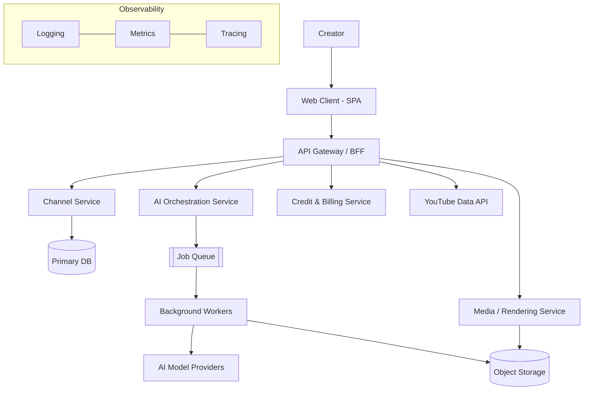
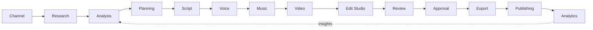

# 00 — Master Product Requirements Document (PRD)

> **Document status:** Source of truth · **Owner:** Product + Architecture · **Audience:** All engineering, design, QA, DevOps
> **Related:** [01_Product_Vision](01_Product_Vision.md) · [02_System_Architecture](02_System_Architecture.md) · [05_AI_Workflow](05_AI_Workflow.md) · [50_IMPLEMENTATION_PLAN](50_IMPLEMENTATION_PLAN.md)

---

## Executive Summary

CreatorForce is an **AI Content Operating System** for creators and content teams. It is *not* a "Shorts generator." It is the platform on which the full content lifecycle runs: from connecting a YouTube channel, through research, analysis, planning, scripting, voice, music, video, professional editing, review and approval, all the way to export, publishing, and analytics.

The product's defining principles are **channel-first organization**, **non-destructive AI assistance**, and **total user control**. Every asset the AI produces remains editable forever, every AI action is reversible, and every AI action is transparent about the model used, the estimated credits, the estimated time, and the estimated cost.

This PRD is the top-level contract. It defines *what* CreatorForce must do and *why*. The numbered specs that follow define *how*. When a downstream spec and this PRD disagree, this PRD wins until it is formally amended.

---

## Purpose

The purpose of this document is to:

1. Establish the single, authoritative definition of the CreatorForce product.
2. Define personas, jobs-to-be-done, and success metrics.
3. Enumerate the functional and non-functional requirements at a level precise enough to plan releases.
4. Fix the architectural stance (channel-first, non-destructive, transparent AI) so that no downstream decision quietly contradicts it.
5. Serve as the acceptance baseline against which every feature is validated.

---

## Goals

**Primary goals**

- Deliver a channel-first workspace where selecting a YouTube channel automatically loads all of its videos, shorts, playlists, assets, drafts, analytics, jobs, and history.
- Provide an end-to-end AI content workflow (Analyse → Suggestion → Script → Voice → Music → Video → Edit Studio → Review → Export → Publish) where every stage is editable and reversible.
- Ship a professional non-destructive Edit Studio with timeline, scene, voice, music, caption, thumbnail, and SEO editing, plus version history and comparison mode.
- Provide a transparent credit system that forecasts, budgets, and explains every AI operation before it runs.
- Guarantee enterprise-grade security, observability, and testing from day one.

**Secondary / later goals**

- Team collaboration (roles, shared review, comments).
- Multi-platform publishing beyond YouTube.
- Marketplace of AI models and templates.

### Success metrics

| Category | Metric | Target (v1 GA) |
|---|---|---|
| Activation | % of new users who connect a channel and complete one AI workflow | ≥ 60% |
| Retention | 4-week retention of activated users | ≥ 40% |
| AI trust | % of AI outputs edited (not discarded) | ≥ 70% |
| Performance | Channel workspace interactive (10k-video library) | ≤ 2.0s p75 |
| Reliability | Core API availability | ≥ 99.9% |
| Cost transparency | % of paid AI operations preceded by an accepted estimate | 100% |

---

## Scope

### In scope (v1)

- Multi-channel management with unlimited YouTube synchronization (full pagination of videos and playlists).
- Background synchronization, infinite scrolling, global search, smart filters.
- Full AI workflow with non-destructive editing and version history.
- Edit Studio (timeline + manual + AI editing).
- Shorts Studio, Playlists & Library, Asset Management, Brand Kit.
- Credit system, AI model management, rendering pipeline, background jobs, notifications.
- Review & approval (single-user approval gates; multi-user collaboration deferred).
- Authentication (Email, Google, Apple, Facebook) with account linking.
- Observability, security hardening, and a full automated test suite.

### Out of scope (v1, tracked in [46_Roadmap](46_Roadmap.md))

- Real-time multi-user co-editing.
- Non-YouTube publishing destinations.
- Native mobile apps (responsive web only in v1).
- User-supplied custom model fine-tuning.

---

## Personas & Jobs-to-be-Done

| Persona | Description | Core JTBD |
|---|---|---|
| **Solo Creator** | Runs 1–3 channels alone | "Turn an idea into a published, on-brand video without hiring an editor." |
| **Content Manager** | Manages channels for clients/brands | "Produce consistent, reviewable content at volume with predictable cost." |
| **Editor** | Focuses on the Edit Studio | "Refine AI drafts with professional, non-destructive tools." |
| **Reviewer/Approver** | Signs off before publish | "See exactly what changed and approve or request changes." |

Each persona maps to one or more workflow stages; the workflow (§ AI Workflow) is designed so any persona can enter at any stage without breaking the others.

---

## Product Pillars

1. **Channel-first.** The channel is the root of all data and navigation. See [04_Channel_Workspace](04_Channel_Workspace.md).
2. **Non-destructive by default.** No AI action overwrites; every action produces a new version with a reversible diff. See [06_Edit_Studio](06_Edit_Studio.md).
3. **Transparent AI.** Every AI action declares model, credits, time, and cost before running. See [10_AI_Credits](10_AI_Credits.md) and [11_AI_Models](11_AI_Models.md).
4. **Assist, never replace.** AI proposes; the user disposes. Suggestions are opt-in, never forced.
5. **Enterprise from day one.** Security, observability, and testing are requirements, not follow-ups.

---

## High-Level Architecture (context)

Detailed component design lives in [02_System_Architecture](02_System_Architecture.md).

---

## End-to-End Content Lifecycle

Every arrow is bidirectional in practice: the user may return to any earlier stage, and the system regenerates **only the changed sections** downstream.

---

## Functional Requirements (summary)

| ID | Requirement | Priority |
|---|---|---|
| FR-1 | Connect and manage multiple YouTube channels | P0 |
| FR-2 | Full paginated sync of all videos and playlists, in background | P0 |
| FR-3 | Channel workspace auto-loads all channel data on selection | P0 |
| FR-4 | AI workflow stages, each independently editable | P0 |
| FR-5 | Non-destructive editing with version history and comparison | P0 |
| FR-6 | Every AI action shows model/credits/time/cost before running | P0 |
| FR-7 | Credit system: usage, forecasting, budgets, optimization tips | P0 |
| FR-8 | Edit Studio (timeline/manual/AI) | P0 |
| FR-9 | Review & approval gates | P1 |
| FR-10 | Export & YouTube publishing | P0 |
| FR-11 | Analytics ingestion and display | P1 |
| FR-12 | Brand Kit & asset management | P1 |
| FR-13 | Auth: Email, Google, Apple, Facebook + linking | P0 |
| FR-14 | Notifications for job/workflow events | P1 |
| FR-15 | Team collaboration | P2 (future) |

Full, testable acceptance criteria for each requirement live in the relevant numbered spec.

---

## Non-Functional Requirements (summary)

| Category | Requirement | Reference |
|---|---|---|
| Performance | 10k+ item libraries via virtual + infinite scroll; workspace ≤ 2s p75 | [13_Performance](13_Performance.md), [44_Performance_Budget](44_Performance_Budget.md) |
| Security | OWASP Top 10, RBAC, audit logging, secret management, prompt-injection defense | [14_Security](14_Security.md) |
| Reliability | 99.9% core availability; graceful job retry | [12_Background_Jobs](12_Background_Jobs.md), [41_Disaster_Recovery](41_Disaster_Recovery.md) |
| Observability | Metrics, logs, traces, health checks, AI-usage monitoring | [20_Observability](20_Observability.md) |
| Accessibility | WCAG 2.2 AA | [42_Accessibility](42_Accessibility.md) |
| Testability | Unit/integration/API/E2E/visual/a11y/perf/security in CI | [21_Testing_Strategy](21_Testing_Strategy.md) |

---

## Business Rules

- **BR-1** Every entity (video, short, asset, draft, job, approval, credit ledger row) belongs to exactly one channel.
- **BR-2** No paid AI operation may execute without a user-accepted cost estimate.
- **BR-3** An AI output is never deleted by a subsequent AI action; it is superseded by a new version.
- **BR-4** Regeneration operates on the smallest changed unit (scene, line, section), never the whole artifact, unless the user explicitly requests a full regenerate.
- **BR-5** Approval is required before publish when an approval gate is enabled for the channel.

---

## Validation Rules

- Channel connection must verify OAuth scopes before enabling sync.
- Credit balance must be checked (and reserved) before a job is enqueued; released on failure.
- All user-supplied text entering an AI prompt must pass prompt-injection sanitization (see [14_Security](14_Security.md)).
- Media uploads validated by type, size, and content scan before storage.

---

## Security (summary)

Security is designed in, not bolted on: least-privilege RBAC, per-channel data isolation, audit logging of every state-changing and AI action, encrypted secrets, and explicit LLM/prompt-injection controls. Full detail in [14_Security](14_Security.md) and [15_Authentication](15_Authentication.md).

---

## Performance (summary)

Libraries are assumed unbounded. The client uses virtualized and infinite scrolling; the server uses cursor pagination, targeted indexes, and caching. Sync runs entirely in the background so the UI is never blocked. See [13_Performance](13_Performance.md) and [36_Caching](36_Caching.md).

---

## Caching (summary)

Channel metadata, library pages, and analytics summaries are cached with explicit invalidation on sync and on edit. See [36_Caching](36_Caching.md).

---

## Background Jobs (summary)

Sync, AI generation, and rendering are asynchronous jobs with progress, retry, and cancellation. Credits are reserved at enqueue and settled at completion. See [12_Background_Jobs](12_Background_Jobs.md) and [34_Background_Workers](34_Background_Workers.md).

---

## Error Handling (summary)

Errors are typed, user-actionable, and never silently swallowed. AI failures roll back credit reservations and preserve the last good version. See [32_Error_Handling](32_Error_Handling.md).

---

## Logging (summary)

Structured, correlation-ID'd logs across gateway, services, and workers; AI actions logged with model, tokens, credits, and latency. See [38_Logging](38_Logging.md).

---

## Testing

Every feature ships with unit, integration, API, E2E (Playwright), accessibility, cross-browser, visual-regression, performance, and security tests, runnable in CI with clear pass/fail gates. See [21_Testing_Strategy](21_Testing_Strategy.md).

---

## Acceptance Criteria (PRD-level)

- [ ] A new user can connect a YouTube channel and see all videos/playlists sync in the background.
- [ ] Selecting a channel auto-loads its full workspace within the performance budget.
- [ ] A user can run the full AI workflow and edit the output of every stage.
- [ ] Every paid AI action shows model, credits, time, and cost, and requires acceptance.
- [ ] Every AI action can be undone/reverted via version history.
- [ ] Publishing succeeds to YouTube and analytics appear in the workspace.
- [ ] All P0 requirements have passing automated tests in CI.

---

## Edge Cases

- Channel with zero videos; channel with 100k+ videos.
- YouTube API quota exhaustion mid-sync (must resume, not restart).
- Credit balance depleted mid-workflow.
- AI provider timeout/partial output.
- Concurrent edits to the same draft (single-user: last-writer-wins with version; multi-user deferred).
- Revoked OAuth token during background sync.

---

## Risks

| Risk | Impact | Mitigation |
|---|---|---|
| YouTube API quota limits | Sync delays | Backoff, resumable pagination, quota budgeting |
| AI provider variability/cost | Unpredictable UX & spend | Model abstraction, estimates, budgets, caching |
| Scope creep from "OS" framing | Delivery risk | Strict P0/P1/P2 gating in [50_IMPLEMENTATION_PLAN](50_IMPLEMENTATION_PLAN.md) |
| Non-destructive storage growth | Cost | Version pruning policy, object-storage tiering |

Full register: [47_Risk_Register](47_Risk_Register.md).

---

## Future Improvements

- Real-time collaboration and commenting.
- Multi-platform publishing (TikTok, Instagram, LinkedIn).
- Model marketplace and user templates.
- On-device/edge rendering acceleration.

---

## Implementation Checklist

- [ ] Personas, metrics, and scope ratified by stakeholders.
- [ ] Channel-first data model approved ([03_Database_Architecture](03_Database_Architecture.md)).
- [ ] AI workflow contract approved ([05_AI_Workflow](05_AI_Workflow.md)).
- [ ] Credit/transparency contract approved ([10_AI_Credits](10_AI_Credits.md)).
- [ ] NFR budgets approved ([44_Performance_Budget](44_Performance_Budget.md)).
- [ ] Release plan sequenced ([50_IMPLEMENTATION_PLAN](50_IMPLEMENTATION_PLAN.md)).

---

## References

- [01_Product_Vision](01_Product_Vision.md), [02_System_Architecture](02_System_Architecture.md), [04_Channel_Workspace](04_Channel_Workspace.md), [05_AI_Workflow](05_AI_Workflow.md), [06_Edit_Studio](06_Edit_Studio.md), [10_AI_Credits](10_AI_Credits.md), [14_Security](14_Security.md), [21_Testing_Strategy](21_Testing_Strategy.md), [46_Roadmap](46_Roadmap.md), [50_IMPLEMENTATION_PLAN](50_IMPLEMENTATION_PLAN.md).
