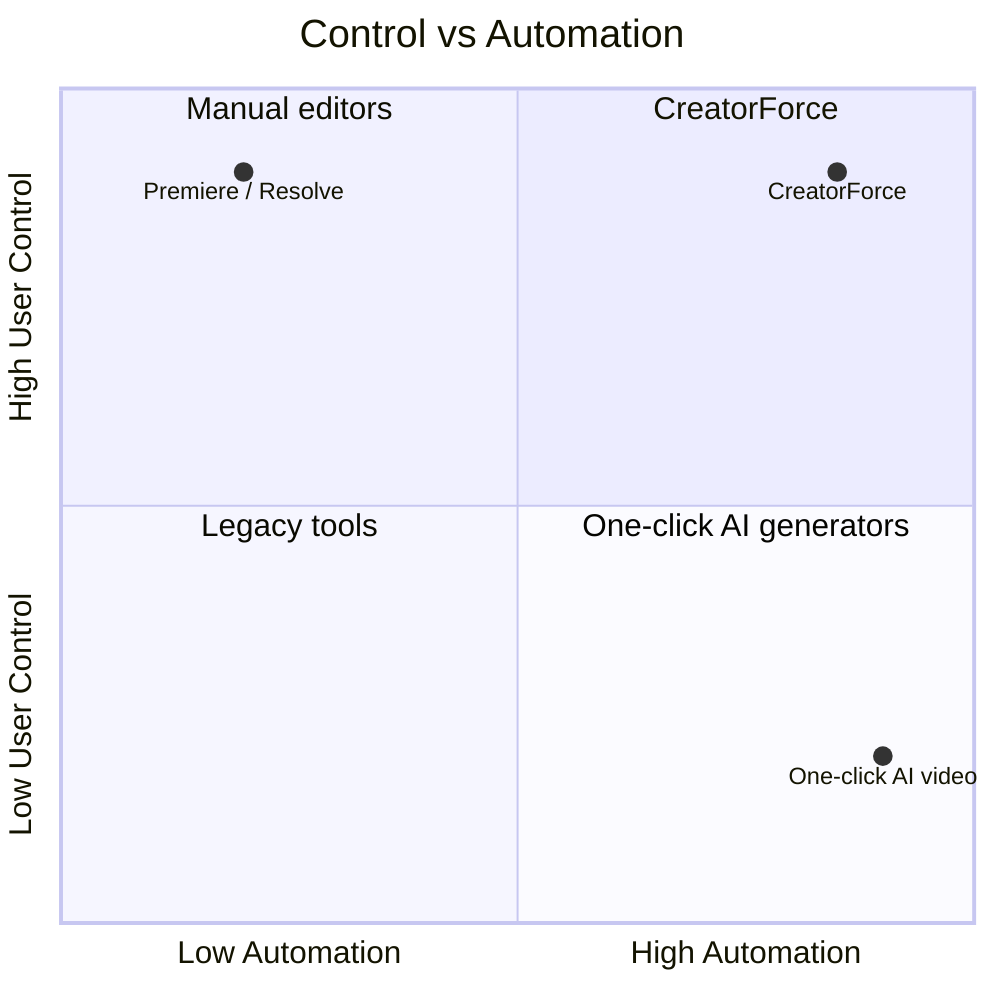
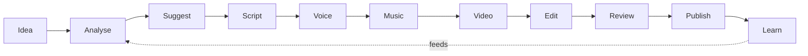

# 01 — Product Vision

> **Owner:** Product · **Audience:** All teams, stakeholders, new hires
> **Related:** [00_Master_PRD](00_Master_PRD.md) · [46_Roadmap](46_Roadmap.md) · [05_AI_Workflow](05_AI_Workflow.md)

---

## Executive Summary

CreatorForce exists to make a single creator as capable as a full production studio, without taking away the creator's authorship. The vision is an **AI Content Operating System**: a durable home for every channel's content where AI accelerates the boring, repeatable, and technical parts of production while the human keeps taste, judgment, and final say.

The differentiator is not "AI that makes videos." It is **AI you can trust and undo**: channel-first organization, non-destructive editing, and radical cost/model transparency. Where competitors hide the machine, CreatorForce shows it.

---

## Purpose

To articulate the long-term "why" that keeps every feature decision coherent. When two designs are technically equal, the one more aligned with this vision wins. This document is intentionally stable; specifics live in the PRD and numbered specs.

---

## Goals

- Define the mission, the change we want in the world, and the principles that constrain how we build.
- Give every contributor a mental model for judging whether a feature "belongs."
- Set the multi-year direction that the roadmap sequences.

---

## Scope

In scope: mission, vision, principles, target market, positioning, north-star metric, anti-goals. Out of scope: implementation detail (see downstream specs) and dated commitments (see [46_Roadmap](46_Roadmap.md)).

---

## Mission

> **Give every creator the power of a studio and the control of an author.**

## Vision (3–5 year)

CreatorForce becomes the default operating layer for content teams: you connect your channels once, and everything — research, drafts, edits, approvals, publishing, and analytics — lives and flows there. AI is ambient and honest; nothing it does is opaque or irreversible.

---

## The Change We Want

| From (today) | To (with CreatorForce) |
|---|---|
| Tools scattered across scripts, editors, uploaders | One channel-first workspace |
| AI as a black box that "just generates" | AI that shows model, cost, time — and can be undone |
| Destructive editing, lost drafts | Non-destructive, versioned, comparable |
| Project-centric chaos | Channel as the durable root of truth |
| Fear of runaway AI spend | Forecasts, budgets, and pre-run estimates |

---

## Positioning

CreatorForce deliberately occupies the rare quadrant: **high automation AND high control**. That tension is the product.

---

## Target Market

- **Primary:** solo creators and small teams producing recurring short/long-form video for YouTube.
- **Secondary:** agencies and content managers running channels for clients.
- **Tertiary (future):** in-house brand/marketing teams needing review and approval.

---

## Product Principles

1. **Channel-first.** Organization mirrors how creators actually think: by channel.
2. **Non-destructive always.** Nothing the AI or user does is unrecoverable.
3. **Transparent AI.** Every action states model, credits, time, and cost.
4. **Assist, never replace.** Suggestions, never forced actions.
5. **Editable forever.** Any AI output can be refined by hand or by AI at any time.
6. **Enterprise-grade from day one.** Security, observability, testing are table stakes.
7. **Fast and calm.** Speed and predictability over flashy complexity.

---

## North-Star Metric

**Number of published, human-approved videos produced through the full workflow per active channel per month.** It captures value only when a creator both *used* the AI and *kept control* (approval) through to *outcome* (publish).

Supporting metrics: activation rate, % of AI outputs edited (trust), and cost-estimate acceptance rate.

---

## Anti-Goals

- We will **not** ship AI that acts without a visible estimate.
- We will **not** make editing destructive to save engineering effort.
- We will **not** copy competitor editor UIs; we take inspiration, not layouts.
- We will **not** organize around ephemeral "projects" instead of durable channels.
- We will **not** optimize engagement at the expense of user trust or wellbeing.

---

## Strategic Bets

| Bet | Why it matters | Where it lives |
|---|---|---|
| Channel-first data model | Everything else composes cleanly on top | [03_Database_Architecture](03_Database_Architecture.md) |
| Model abstraction layer | Lets us swap/compare providers, keep transparency | [11_AI_Models](11_AI_Models.md), [33_AI_Agent_Architecture](33_AI_Agent_Architecture.md) |
| Non-destructive versioning | Trust + differentiation | [06_Edit_Studio](06_Edit_Studio.md) |
| Credit transparency engine | Removes fear of AI spend | [10_AI_Credits](10_AI_Credits.md) |

---

## Workflow (vision framing)

The loop, not the line, is the point: analytics feed back into analysis so each cycle is better than the last.

---

## Security, Performance, Testing (vision level)

These are not features to be prioritized against user value — they *are* user value. A creator's channel credentials, drafts, and spend are sensitive; trust is the product. Detailed treatment: [14_Security](14_Security.md), [13_Performance](13_Performance.md), [21_Testing_Strategy](21_Testing_Strategy.md).

---

## Acceptance Criteria

- [ ] Every proposed feature can be mapped to at least one product principle.
- [ ] No shipped feature violates an anti-goal.
- [ ] The north-star metric is instrumented and visible on a dashboard.

---

## Edge Cases (vision-level tensions)

- **Speed vs. transparency:** never remove estimates to feel faster; make estimates fast instead.
- **Automation vs. control:** default to a reviewable draft, not an auto-publish.
- **Growth vs. trust:** never adopt dark patterns to inflate the north-star metric.

---

## Risks

- Vision-as-slogan without teeth → mitigate by tying principles to acceptance criteria in every spec.
- "Operating System" framing invites unbounded scope → the roadmap and implementation plan enforce sequencing.

---

## Future Improvements

- Expand from YouTube-first to multi-platform while keeping channel-first semantics.
- Introduce collaborative authorship without sacrificing individual control.
- Community templates and shared brand kits.

---

## Implementation Checklist

- [ ] Vision reviewed and signed off by founders/stakeholders.
- [ ] Principles embedded into design review checklist.
- [ ] North-star + supporting metrics instrumented ([20_Observability](20_Observability.md)).

---

## References

[00_Master_PRD](00_Master_PRD.md) · [03_Database_Architecture](03_Database_Architecture.md) · [05_AI_Workflow](05_AI_Workflow.md) · [10_AI_Credits](10_AI_Credits.md) · [11_AI_Models](11_AI_Models.md) · [46_Roadmap](46_Roadmap.md)
