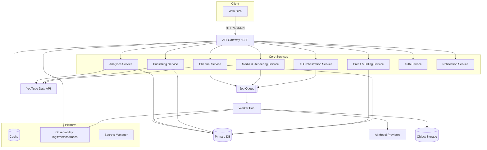
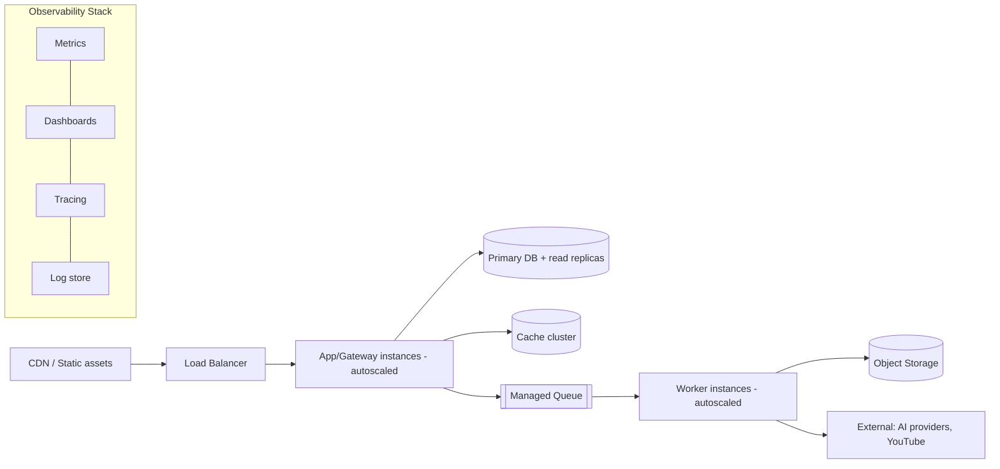
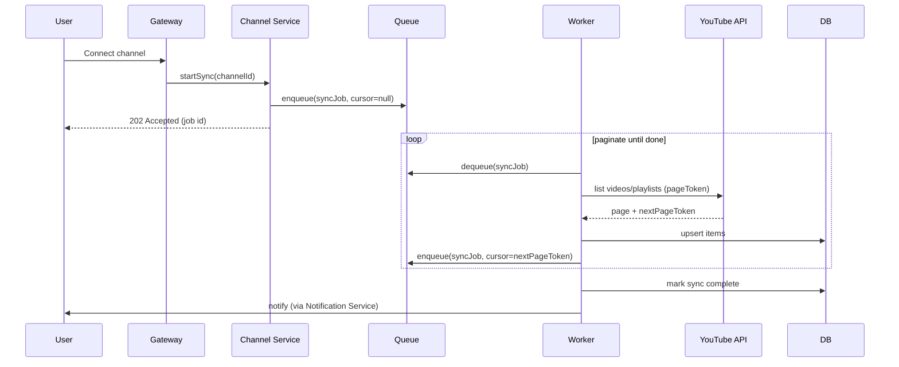
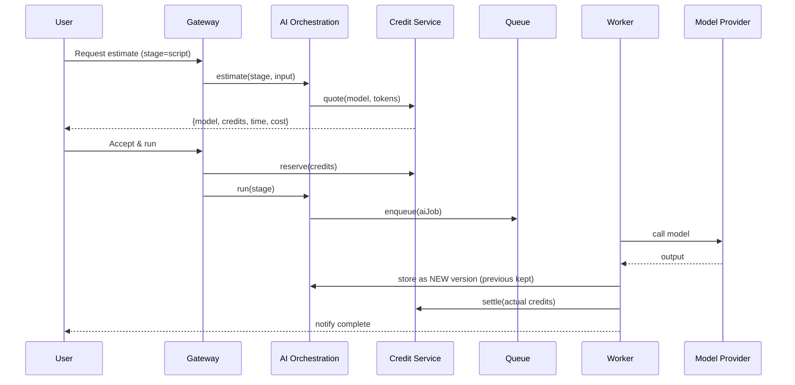

# 02 — System Architecture

> **Owner:** Architecture · **Audience:** Backend, frontend, DevOps, security
> **Related:** [03_Database_Architecture](03_Database_Architecture.md) · [16_API_Architecture](16_API_Architecture.md) · [33_AI_Agent_Architecture](33_AI_Agent_Architecture.md) · [12_Background_Jobs](12_Background_Jobs.md)

---

## Executive Summary

CreatorForce is a **modular, service-oriented** system organized around the channel as the primary aggregate. A single-page web client talks to a **Backend-for-Frontend (BFF) / API gateway**, which fans out to domain services: Channel, AI Orchestration, Credit & Billing, Media/Rendering, Publishing, and Analytics. Long-running work (sync, AI generation, rendering) runs asynchronously through a **job queue and worker pool**. State lives in a primary relational database plus object storage for media, with a cache layer for hot reads.

The architecture is deliberately **loosely coupled** (services own their data, communicate via well-defined contracts) and **evolvable** (start as a modular monolith with clean module boundaries, split into services where scale demands). It is designed to eventually serve millions of users without a rewrite.

---

## Purpose

Define the components, their responsibilities, their boundaries, how they communicate, how data flows, and how the system scales — precise enough that a senior engineer can implement each part without guessing.

---

## Goals

- Establish clear service boundaries aligned to domain aggregates.
- Define synchronous vs asynchronous paths.
- Specify cross-cutting concerns: auth, caching, observability, security.
- Provide a scaling path from launch to millions of users.

---

## Scope

In scope: logical and deployment architecture, component contracts, data-flow, scaling. Out of scope: schema detail ([03_Database_Architecture](03_Database_Architecture.md)), endpoint detail ([16_API_Architecture](16_API_Architecture.md)), agent internals ([33_AI_Agent_Architecture](33_AI_Agent_Architecture.md)).

---

## Architectural Principles

1. **Channel is the aggregate root.** Services partition data by channel for isolation and scaling.
2. **Modular monolith first, services when justified.** Enforce module boundaries in code so extraction is mechanical, not heroic.
3. **Async by default for expensive work.** The UI never blocks on sync, AI, or render.
4. **Contracts over shared state.** Modules/services interact through typed APIs and events, not shared tables.
5. **Everything observable.** Every request and job carries a correlation ID.
6. **Fail safe.** Credit reservations, retries, and rollbacks make partial failures recoverable.

---

## Logical Architecture



---

## Component Responsibilities

| Component | Owns | Key responsibilities |
|---|---|---|
| **API Gateway / BFF** | Request routing, auth enforcement, response shaping | AuthN/Z checks, rate limiting, request validation, aggregation for the SPA, cache reads |
| **Auth Service** | Identity, sessions, OAuth links | Email/Google/Apple/Facebook OIDC, account linking, tokens, RBAC claims ([15_Authentication](15_Authentication.md)) |
| **Channel Service** | Channels, videos, shorts, playlists, drafts, assets | YouTube sync orchestration, library queries, workspace assembly |
| **AI Orchestration Service** | Workflow stages, agents, prompts | Enqueue AI jobs, manage stage state, versioning, model selection ([33_AI_Agent_Architecture](33_AI_Agent_Architecture.md)) |
| **Credit & Billing Service** | Credit ledger, estimates, budgets | Reserve/settle credits, forecasting, budget enforcement ([10_AI_Credits](10_AI_Credits.md)) |
| **Media & Rendering Service** | Media assets, render pipeline | Transcode, compose timeline, produce exports |
| **Publishing Service** | Publish/export | Upload to YouTube, schedule, status tracking |
| **Analytics Service** | Metrics ingestion | Pull YouTube analytics, aggregate, expose summaries |
| **Notification Service** | User notifications | Job/workflow event delivery (in-app, email) |
| **Worker Pool** | Async execution | Runs sync, AI, render jobs with retry/cancellation |

---

## Deployment Architecture



- **Stateless app tier** behind a load balancer; horizontal autoscaling.
- **Primary DB with read replicas** for read-heavy library/analytics queries.
- **Managed queue** decouples request tier from workers; workers autoscale on queue depth.
- **Object storage** for all media and rendered outputs; served via CDN with signed URLs.

---

## Data Flow — Channel Sync (async)



Sync is **resumable**: the cursor (pageToken) is persisted so quota exhaustion or restarts continue rather than restart.

---

## Data Flow — AI Generation (async, transparent, non-destructive)



---

## Communication Patterns

- **Sync (request/response):** client ↔ gateway ↔ services for reads and quick mutations.
- **Async (queue):** sync, AI, render — anything > ~1s or externally dependent.
- **Events:** domain events (e.g., `sync.completed`, `version.created`, `publish.succeeded`) drive notifications and analytics without tight coupling.

Contracts are versioned; see [16_API_Architecture](16_API_Architecture.md).

---

## Cross-Cutting Concerns

| Concern | Approach | Reference |
|---|---|---|
| AuthN/Z | OIDC + JWT/session at gateway; RBAC claims per channel | [15_Authentication](15_Authentication.md), [14_Security](14_Security.md) |
| Caching | Read-through cache for channel meta, library pages, analytics summaries | [36_Caching](36_Caching.md) |
| Observability | Correlation IDs, structured logs, metrics, traces | [20_Observability](20_Observability.md), [38_Logging](38_Logging.md) |
| Secrets | Central secrets manager; no secrets in code/env dumps | [14_Security](14_Security.md) |
| Rate limiting | Per-user/per-IP at gateway; per-provider at workers | [14_Security](14_Security.md) |
| Error handling | Typed errors, rollback on AI/credit failure | [32_Error_Handling](32_Error_Handling.md) |

---

## Folder Structure (modular monolith, service-ready)

```
creatorforce/
├── apps/
│   ├── web/                 # SPA client
│   └── api/                 # gateway + service modules
├── services/
│   ├── channel/
│   ├── ai-orchestration/
│   ├── credit/
│   ├── media/
│   ├── publishing/
│   ├── analytics/
│   ├── auth/
│   └── notification/
├── workers/                 # queue consumers
├── packages/
│   ├── domain/              # shared domain types & events
│   ├── db/                  # data access, migrations
│   ├── contracts/           # API/DTO schemas
│   ├── observability/       # logging/metrics/tracing utils
│   └── config/              # typed config loader
├── infra/                   # IaC, CI/CD, deploy
└── tests/                   # cross-cutting e2e/perf/security
```

Each `services/*` module exposes a typed interface and owns its tables; extraction to a standalone service means moving the folder and swapping in-process calls for network calls.

---

## Database Design (architecture view)

- One logical primary DB; **channel_id is the partition/tenant key** on every domain table.
- Read replicas absorb library/analytics reads.
- Object storage referenced by key from DB rows (never blobs in DB).
- Full schema in [03_Database_Architecture](03_Database_Architecture.md).

---

## API Design (architecture view)

- BFF exposes resource-oriented endpoints scoped by channel (`/channels/:id/...`).
- Estimates and runs are distinct calls (estimate → accept → run) to guarantee transparency.
- Long operations return `202` + job id; progress via polling or events.
- Detail in [16_API_Architecture](16_API_Architecture.md).

---

## UI Design (architecture view)

- SPA with channel-scoped routing; workspace shell loads channel context once, lazy-loads panels.
- Optimistic UI for quick edits; job-backed UI for AI/render. See [17_Frontend_UI_UX](17_Frontend_UI_UX.md) and [37_State_Management](37_State_Management.md).

---

## Component Design

Reusable, loosely coupled UI + service components; dependency injection for providers (model clients, storage, YouTube client) so they are mockable in tests. See [18_Component_Guidelines](18_Component_Guidelines.md).

---

## Business Rules

- Every service call is channel-scoped and authorization-checked.
- No expensive operation runs synchronously in the request path.
- AI writes create versions; they never mutate prior versions.

---

## Validation Rules

- Gateway validates all inbound payloads against contract schemas before dispatch.
- Workers validate provider outputs before persisting.

---

## Security

Defense in depth: gateway auth/rate-limit, per-channel isolation, least-privilege service credentials, encrypted secrets, prompt-injection sanitization at the AI boundary. See [14_Security](14_Security.md).

---

## Performance

Stateless autoscaled app tier, read replicas, cache layer, queue-driven workers scaling on depth, CDN for media. Targets in [44_Performance_Budget](44_Performance_Budget.md).

---

## Caching

Read-through with explicit invalidation on sync/edit events; per-channel cache keys. See [36_Caching](36_Caching.md).

---

## Background Jobs

Queue + worker pool with retry, backoff, cancellation, resumable cursors, and credit reservation. See [12_Background_Jobs](12_Background_Jobs.md), [34_Background_Workers](34_Background_Workers.md), [35_Queues](35_Queues.md).

---

## Error Handling

Typed errors propagate to the gateway and map to user-actionable responses; AI/render failures trigger credit rollback and preserve last good version. See [32_Error_Handling](32_Error_Handling.md).

---

## Logging

Structured JSON logs with correlation IDs from gateway through workers; AI logs include model, tokens, credits, latency. See [38_Logging](38_Logging.md).

---

## Testing

Contract tests between modules, integration tests per service, E2E across the gateway, chaos/perf tests on the queue and workers. See [21_Testing_Strategy](21_Testing_Strategy.md).

---

## Acceptance Criteria

- [ ] Every domain table carries channel_id and is queried with it.
- [ ] All expensive operations run via the queue, not the request path.
- [ ] Estimate/accept/run separation enforced for paid AI actions.
- [ ] Sync is resumable across restarts and quota errors.
- [ ] Correlation IDs traverse gateway → service → worker.

---

## Edge Cases

- Queue backlog spike → autoscale workers, apply backpressure, surface delay to UI.
- Provider outage → circuit-break, queue-and-retry, notify user, no credit charge.
- Replica lag → route critical reads to primary; tolerate eventual consistency elsewhere.
- Object storage failure on render → job retriable; no partial version persisted.

---

## Risks

| Risk | Mitigation |
|---|---|
| Premature microservices | Start modular monolith with strict boundaries |
| Cross-service data coupling | Contracts + events, no shared tables |
| Hot channel (huge library) | Cursor pagination, cache, replica reads, per-channel limits |
| Provider lock-in | Model abstraction layer ([11_AI_Models](11_AI_Models.md)) |

---

## Future Improvements

- Extract highest-load modules (AI orchestration, media) into independent services.
- Introduce a read-optimized projection store for analytics.
- Regional deployment for latency and data residency.

---

## Implementation Checklist

- [ ] Module boundaries and contracts defined in `packages/contracts`.
- [ ] Queue + worker skeleton with retry/cancel/resume.
- [ ] Gateway auth, validation, rate limiting in place.
- [ ] Cache layer with invalidation events.
- [ ] Observability wired end-to-end.

---

## References

[00_Master_PRD](00_Master_PRD.md) · [03_Database_Architecture](03_Database_Architecture.md) · [12_Background_Jobs](12_Background_Jobs.md) · [16_API_Architecture](16_API_Architecture.md) · [33_AI_Agent_Architecture](33_AI_Agent_Architecture.md) · [36_Caching](36_Caching.md) · [44_Performance_Budget](44_Performance_Budget.md)
