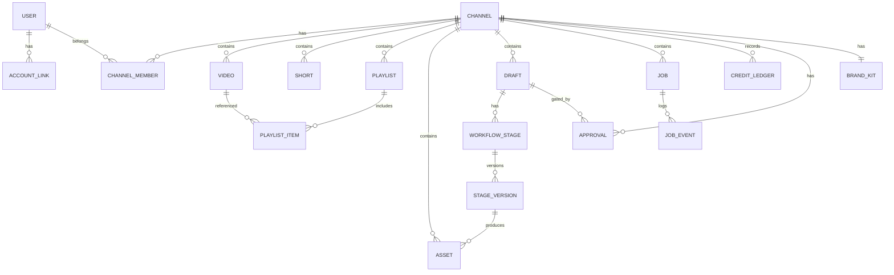
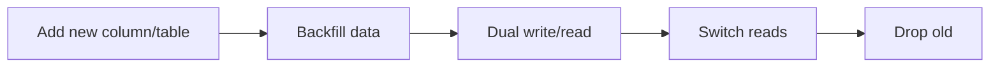

# 03 — Database Architecture

> **Owner:** Backend / Data · **Audience:** Backend, data, DevOps
> **Related:** [02_System_Architecture](02_System_Architecture.md) · [04_Channel_Workspace](04_Channel_Workspace.md) · [06_Edit_Studio](06_Edit_Studio.md) · [10_AI_Credits](10_AI_Credits.md)

---

## Executive Summary

The data model is **channel-first**: `channel_id` is the tenant/partition key on every domain table, giving natural isolation, cache keying, and a future sharding boundary. The store is a **relational primary database** for structured, transactional data (channels, media metadata, versions, credits, jobs), with **object storage** for binary media referenced by key. AI outputs are stored as **immutable versions** to guarantee non-destructive editing; edits create new versions and diffs, never overwrites.

The schema is normalized for correctness, with targeted denormalized read paths (cached summaries, projection tables) where library and analytics performance demands it.

---

## Purpose

Define entities, relationships, keys, indexes, versioning strategy, and data-lifecycle rules precisely enough to implement migrations without guessing.

---

## Goals

- Enforce channel-first isolation on every table.
- Support unlimited libraries with efficient cursor pagination.
- Guarantee non-destructive, versioned AI content.
- Provide an auditable, reservable credit ledger.
- Model background jobs with resumable state.

---

## Scope

In scope: logical schema, keys, indexes, versioning, migrations, retention. Out of scope: physical tuning specifics per engine (see DBA runbooks) and API shapes ([16_API_Architecture](16_API_Architecture.md)).

---

## Design Principles

1. **Tenant key everywhere.** Every domain row has `channel_id`; queries always filter on it.
2. **Immutable AI versions.** Content artifacts append versions; prior versions are never mutated.
3. **Ledger, not balance-in-a-column.** Credits are an append-only ledger; balance is derived/materialized.
4. **Keys reference storage.** Binary media lives in object storage; DB holds keys + metadata.
5. **Cursor pagination.** All large lists paginate by stable cursors, not offsets.
6. **Auditable.** State-changing actions leave an audit trail.

---

## Entity-Relationship Overview



---

## Core Tables

### `users`
| Column | Type | Notes |
|---|---|---|
| id | uuid PK | |
| email | citext unique | |
| display_name | text | |
| status | enum(active,suspended) | |
| created_at / updated_at | timestamptz | |

### `account_links` (OAuth providers)
| Column | Type | Notes |
|---|---|---|
| id | uuid PK | |
| user_id | uuid FK → users | |
| provider | enum(email,google,apple,facebook) | |
| provider_subject | text | unique per provider |
| linked_at | timestamptz | |
| UNIQUE(provider, provider_subject) | | account linking key |

### `channels`
| Column | Type | Notes |
|---|---|---|
| id | uuid PK | tenant root |
| owner_user_id | uuid FK → users | |
| youtube_channel_id | text unique | |
| title | text | |
| oauth_token_ref | text | secret manager reference, **not** the token |
| sync_status | enum(idle,syncing,error,complete) | |
| sync_cursor | jsonb | resumable pageTokens |
| created_at / updated_at | timestamptz | |

### `channel_members` (RBAC; single-user now, team-ready)
| Column | Type | Notes |
|---|---|---|
| channel_id | uuid FK | |
| user_id | uuid FK | |
| role | enum(owner,editor,reviewer,viewer) | |
| PK(channel_id, user_id) | | |

### `videos` / `shorts`
| Column | Type | Notes |
|---|---|---|
| id | uuid PK | |
| channel_id | uuid FK | **tenant key** |
| youtube_video_id | text | nullable until published |
| title / description | text | |
| status | enum(draft,rendering,ready,published,archived) | |
| duration_s | int | |
| thumbnail_key | text | object storage key |
| published_at | timestamptz | |
| created_at / updated_at | timestamptz | |
| INDEX(channel_id, created_at DESC) | | cursor pagination |
| INDEX(channel_id, status) | | smart filters |

### `playlists` / `playlist_items`
`playlists(id, channel_id, youtube_playlist_id, title, item_count, ...)`
`playlist_items(playlist_id, video_id, position, PK(playlist_id, position))`

### `assets`
| Column | Type | Notes |
|---|---|---|
| id | uuid PK | |
| channel_id | uuid FK | tenant key |
| kind | enum(voice,music,video_clip,image,thumbnail,caption,other) | |
| storage_key | text | object storage |
| meta | jsonb | duration, codec, dimensions |
| source_version_id | uuid FK → stage_versions | if AI-produced |
| created_at | timestamptz | |
| INDEX(channel_id, kind, created_at DESC) | | |

### `brand_kits`
`brand_kits(id, channel_id UNIQUE, palette jsonb, fonts jsonb, logo_key, voice_profile jsonb, ...)`

---

## Workflow & Versioning Tables

### `drafts`
| Column | Type | Notes |
|---|---|---|
| id | uuid PK | a unit of content in production |
| channel_id | uuid FK | tenant key |
| title | text | |
| current_stage | enum(research,analysis,planning,script,voice,music,video,edit,review,approved,exported,published) | |
| created_at / updated_at | timestamptz | |

### `workflow_stages`
| Column | Type | Notes |
|---|---|---|
| id | uuid PK | |
| draft_id | uuid FK | |
| channel_id | uuid FK | tenant key (denormalized for isolation) |
| stage | enum(...) | one row per stage per draft |
| current_version_id | uuid FK → stage_versions | pointer to active version |
| UNIQUE(draft_id, stage) | | |

### `stage_versions` (immutable, non-destructive core)
| Column | Type | Notes |
|---|---|---|
| id | uuid PK | |
| stage_id | uuid FK | |
| channel_id | uuid FK | tenant key |
| version_no | int | monotonically increasing per stage |
| origin | enum(ai,manual) | |
| model_id | uuid FK → ai_models | null if manual |
| content | jsonb | structured stage content (script lines, timeline, etc.) |
| content_key | text | object storage for large payloads |
| parent_version_id | uuid FK → stage_versions | for diff/lineage |
| diff | jsonb | changed sections vs parent |
| credits_spent | numeric | actual settled |
| created_by | uuid FK → users | |
| created_at | timestamptz | |
| UNIQUE(stage_id, version_no) | | |

> **Non-destructive guarantee:** rows in `stage_versions` are never updated except to be superseded by a new row; `current_version_id` moves the pointer. Undo = repoint to an earlier version.

---

## Credit & Billing Tables

### `credit_ledger` (append-only)
| Column | Type | Notes |
|---|---|---|
| id | uuid PK | |
| channel_id | uuid FK | tenant key |
| user_id | uuid FK | actor |
| type | enum(grant,reserve,settle,refund,adjustment) | |
| amount | numeric | signed |
| job_id | uuid FK → jobs | nullable |
| model_id | uuid FK → ai_models | nullable |
| tokens | int | nullable |
| balance_after | numeric | materialized running balance |
| created_at | timestamptz | |
| INDEX(channel_id, created_at DESC) | | usage history |

**Balance** = latest `balance_after` per channel (also cached). **Reservation** writes a `reserve` row at enqueue; **settle** writes the actual on completion; **refund** on failure.

### `budgets`
`budgets(channel_id PK, monthly_limit numeric, alert_threshold numeric, hard_cap boolean)`

### `ai_models`
| Column | Type | Notes |
|---|---|---|
| id | uuid PK | |
| provider | text | |
| name | text | |
| capability | enum(text,voice,music,video,image) | |
| unit_cost | numeric | credits per unit (token/second/frame) |
| enabled | boolean | |
| meta | jsonb | context window, limits |

---

## Jobs & Events Tables

### `jobs`
| Column | Type | Notes |
|---|---|---|
| id | uuid PK | |
| channel_id | uuid FK | tenant key |
| kind | enum(sync,ai_generate,render,publish,analytics) | |
| status | enum(queued,running,succeeded,failed,cancelled) | |
| progress | int | 0–100 |
| cursor | jsonb | resumable state |
| reserved_credit_ledger_id | uuid FK | reservation to settle/refund |
| attempts | int | retry count |
| error | jsonb | typed error on failure |
| created_at / updated_at | timestamptz | |
| INDEX(channel_id, status) | | |
| INDEX(status, kind) | | worker dispatch |

### `job_events`
`job_events(id, job_id, ts, level, message, data jsonb)` — progress + audit stream.

### `notifications`
`notifications(id, user_id, channel_id, type, payload jsonb, read_at, created_at)`

### `approvals`
`approvals(id, channel_id, draft_id, requested_by, decided_by, decision enum(pending,approved,changes_requested), comment, created_at, decided_at)`

### `audit_log`
`audit_log(id, channel_id, user_id, action, entity, entity_id, before jsonb, after jsonb, created_at)` — every state-changing + AI action.

### `analytics_snapshots`
`analytics_snapshots(id, channel_id, video_id, period, metrics jsonb, captured_at)` — projection for fast reads.

---

## Indexing Strategy

| Access pattern | Index |
|---|---|
| Library page (channel, recent) | `(channel_id, created_at DESC)` on videos/shorts/assets |
| Smart filters | `(channel_id, status)`, partial indexes on common filters |
| Version lookup | `(stage_id, version_no)` |
| Credit history | `(channel_id, created_at DESC)` on ledger |
| Worker dispatch | `(status, kind)` on jobs |
| Global search | full-text index on `(title, description)` scoped by channel |

All list queries use **keyset/cursor pagination** (`WHERE (created_at, id) < (:cursor)`), never `OFFSET`, for stable performance on huge libraries.

---

## Data Lifecycle & Retention

| Data | Policy |
|---|---|
| `stage_versions` | Keep all; prune to milestones after N days per channel policy (configurable), never auto-delete current or approved versions |
| Rendered media | Tiered storage; cold-tier after inactivity |
| `job_events` | Retain 90 days, then aggregate |
| `audit_log` | Retain per compliance (default 1 year) |
| Deleted channel | Soft-delete + purge job after grace period ([40_Backup_Recovery](40_Backup_Recovery.md)) |

---

## Migrations

- Versioned, forward-only migrations in `packages/db/migrations`.
- Expand-then-contract for zero-downtime schema changes (add column → backfill → switch → drop).
- Every migration reviewed and tested against a production-like dataset.



---

## Multi-Tenancy & Sharding Path

- v1: single primary DB, all rows keyed by `channel_id`.
- Scale: shard by `channel_id` hash; because every query already filters on it, sharding is mechanical.
- Read replicas absorb library/analytics reads before sharding is needed.

---

## Sample Queries

**Cursor page of a channel's videos:**
```sql
SELECT id, title, status, thumbnail_key, created_at
FROM videos
WHERE channel_id = :cid
  AND (created_at, id) < (:cursor_ts, :cursor_id)
ORDER BY created_at DESC, id DESC
LIMIT 50;
```

**Reserve credits (transaction):**
```sql
BEGIN;
INSERT INTO credit_ledger(channel_id, user_id, type, amount, job_id, balance_after)
VALUES (:cid, :uid, 'reserve', -:amount, :job, (SELECT balance_after FROM credit_ledger WHERE channel_id=:cid ORDER BY created_at DESC LIMIT 1) - :amount);
-- enqueue job referencing this ledger row
COMMIT;
```

**Undo a stage (repoint to prior version):**
```sql
UPDATE workflow_stages
SET current_version_id = :prev_version_id
WHERE id = :stage_id AND channel_id = :cid;
```

---

## Security

- Row access always filtered by `channel_id` + RBAC role from [15_Authentication](15_Authentication.md).
- No secrets/tokens in tables — only secret-manager references.
- Parameterized queries only (SQL-injection defense, [14_Security](14_Security.md)).
- `audit_log` is append-only and tamper-evident.

---

## Performance

Keyset pagination, per-tenant indexes, read replicas, cached balances and summaries. Large content payloads offloaded to object storage. See [13_Performance](13_Performance.md), [36_Caching](36_Caching.md).

---

## Caching

Materialized credit balance and analytics snapshots cached with invalidation on ledger insert / snapshot capture. Library page caches keyed by `(channel_id, cursor, filter)`.

---

## Background Jobs

`jobs` + `job_events` model resumable, retriable work with credit reservation linkage. See [12_Background_Jobs](12_Background_Jobs.md).

---

## Error Handling

Failed jobs write typed `error` jsonb and trigger credit `refund` ledger rows in the same transaction where possible. See [32_Error_Handling](32_Error_Handling.md).

---

## Logging

Data-access layer logs slow queries and every write with correlation IDs. See [38_Logging](38_Logging.md).

---

## Testing

Migration tests, constraint tests (tenant key present, ledger balances reconcile), pagination correctness tests, and version-immutability tests. See [21_Testing_Strategy](21_Testing_Strategy.md).

---

## Acceptance Criteria

- [ ] Every domain table has `channel_id` and an index leading with it.
- [ ] `stage_versions` rows are immutable; undo repoints, never deletes.
- [ ] Credit balance reconciles from ledger at all times.
- [ ] All list endpoints use cursor pagination.
- [ ] Migrations run zero-downtime via expand/contract.

---

## Edge Cases

- Concurrent reservations → serialize per channel or use conditional balance check.
- Duplicate YouTube IDs on re-sync → upsert on `(channel_id, youtube_video_id)`.
- Orphaned assets when a version is pruned → GC job respects references.
- Clock skew on cursors → cursors use (timestamp, id) tuple for stability.

---

## Risks

| Risk | Mitigation |
|---|---|
| Version storage growth | Pruning policy + object-storage tiering |
| Ledger drift | Periodic reconciliation job; materialized balance verified |
| Hot channel contention | Sharding path + replicas |
| Offset pagination creeping in | Lint/review rule banning OFFSET on large tables |

---

## Future Improvements

- CQRS read models for analytics.
- Per-region data residency.
- Time-travel queries over version lineage.

---

## Implementation Checklist

- [ ] Core tables + tenant-key constraints migrated.
- [ ] Version immutability enforced (triggers/tests).
- [ ] Credit ledger + reservation flow implemented.
- [ ] Cursor pagination helpers in `packages/db`.
- [ ] Audit log wired to state-changing actions.

---

## References

[02_System_Architecture](02_System_Architecture.md) · [04_Channel_Workspace](04_Channel_Workspace.md) · [06_Edit_Studio](06_Edit_Studio.md) · [10_AI_Credits](10_AI_Credits.md) · [12_Background_Jobs](12_Background_Jobs.md) · [14_Security](14_Security.md) · [36_Caching](36_Caching.md)
