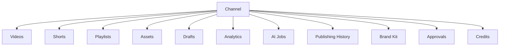
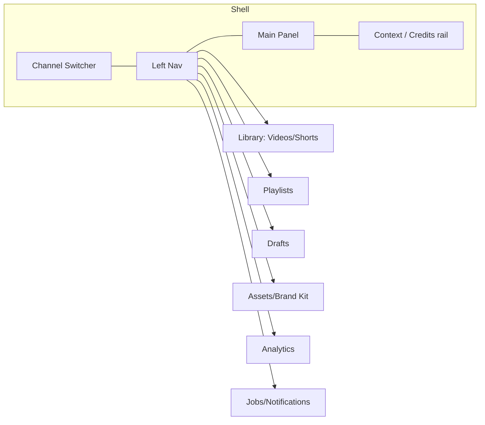
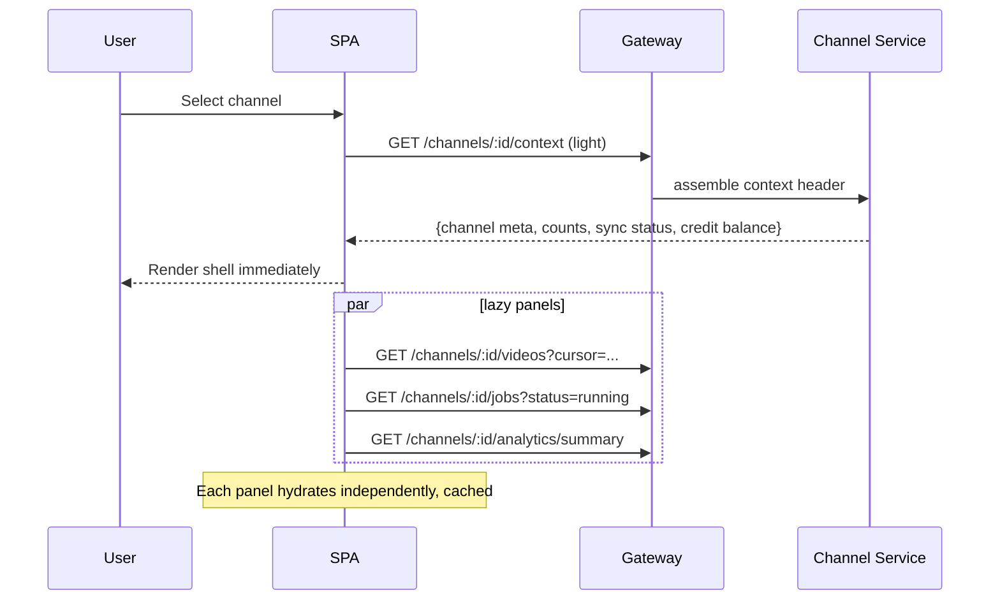
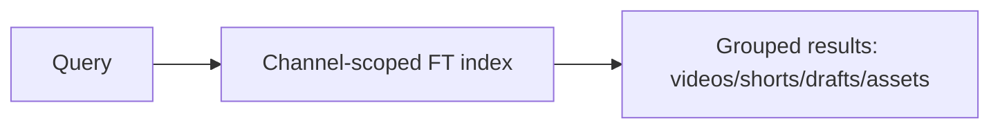

# 04 — Channel Workspace

> **Owner:** Product + Frontend + Backend · **Audience:** Full stack
> **Related:** [03_Database_Architecture](03_Database_Architecture.md) · [08_Playlists_and_Library](08_Playlists_and_Library.md) · [13_Performance](13_Performance.md) · [37_State_Management](37_State_Management.md)

---

## Executive Summary

The Channel Workspace is the heart of CreatorForce and the concrete expression of the **channel-first** architecture. When a user selects a connected YouTube channel, the workspace becomes the durable home for everything that channel owns: videos, shorts, playlists, assets, drafts, analytics, AI jobs, publishing history, brand kit, approvals, and credits. Selecting a channel **auto-loads** its context; panels lazy-load their data so the shell is interactive fast even for enormous libraries.

The workspace replaces the old project-centric model entirely. There is no "project" root — the channel is the root.

---

## Purpose

Specify the structure, data loading, navigation, and behavior of the channel workspace so it feels fast, predictable, and complete, and so it scales to unlimited content.

---

## Goals

- One selection loads a complete, coherent channel context.
- Instant shell, progressive panel hydration.
- Unlimited-scale library browsing (virtual + infinite scroll).
- Global search and smart filters scoped to the channel.
- Seamless entry into any workflow stage or the Edit Studio.

---

## Scope

In scope: workspace shell, channel switching, data loading, panels, search/filter, navigation. Out of scope: library internals ([08_Playlists_and_Library](08_Playlists_and_Library.md)), edit tools ([06_Edit_Studio](06_Edit_Studio.md)), workflow logic ([05_AI_Workflow](05_AI_Workflow.md)).

---

## Channel-First Model



Every entity above is scoped by `channel_id` ([03_Database_Architecture](03_Database_Architecture.md)). Switching channels swaps the entire context.

---

## Workspace Layout



- **Channel Switcher:** top-level; switching triggers context load.
- **Left Nav:** channel-scoped sections.
- **Main Panel:** the active section (library grid, drafts board, analytics, etc.).
- **Context rail:** credit balance/forecast, running jobs, quick actions.

---

## Data Loading Strategy



- **Context header** is small and fast: counts, sync status, credit balance, brand summary.
- **Panels** fetch their own paginated/cached data on first view.
- **Background sync** may still be running; the workspace shows live progress and streams in new items.

---

## Channel Switching

- Switching is **instant to shell**; previous channel's data is cached and can be restored.
- In-flight jobs are per-channel and continue regardless of which channel is active.
- Unsaved local edits are preserved per channel (see [37_State_Management](37_State_Management.md)).

---

## Auto-Load & Auto-Focus (UX requirements)

- Selecting a channel **auto-loads** its workspace (no extra click to "open").
- Opening an Agent/stage triggers **automatic scroll** to the relevant panel and **workspace auto-focus** on the primary input.
- Transitions are smooth; no jarring full-page reloads.

---

## Global Search

- Channel-scoped full-text search across videos, shorts, playlists, drafts, assets.
- Debounced, cursor-paginated results; keyboard-navigable.
- Backed by the channel-scoped full-text index ([03_Database_Architecture](03_Database_Architecture.md)).



---

## Smart Filters

| Filter | Backed by |
|---|---|
| Status (draft/rendering/ready/published/archived) | `(channel_id, status)` index |
| Type (video/short) | table + type |
| Date range | `created_at` keyset |
| Has draft / AI-generated | join to drafts/versions |
| Playlist membership | playlist_items |

Filters compose and are reflected in the URL for shareable/bookmarkable state.

---

## Infinite & Virtual Scrolling

- **Virtual scrolling** renders only visible rows for huge lists.
- **Infinite scrolling** fetches next cursor page as the user nears the end.
- Combined, the library handles unlimited items at constant client memory. See [13_Performance](13_Performance.md).

---

## Live Sync Integration

While background sync runs, the workspace:
- shows sync status and progress in the context header;
- streams newly synced items into the current view (respecting active filters);
- never blocks interaction.

Sync flow: [02_System_Architecture](02_System_Architecture.md); resumable cursor: [03_Database_Architecture](03_Database_Architecture.md).

---

## Folder Structure (frontend)

```
apps/web/src/features/workspace/
├── ChannelSwitcher/
├── WorkspaceShell/
├── panels/
│   ├── LibraryPanel/
│   ├── DraftsPanel/
│   ├── AssetsPanel/
│   ├── AnalyticsPanel/
│   └── JobsPanel/
├── search/
├── filters/
├── hooks/            # useChannelContext, useChannelSwitch, useLibraryQuery
└── state/            # per-channel cache slices
```

---

## Database Design (workspace view)

Reads from channel-scoped tables via cursor pagination; context header aggregates counts (cached). No new tables beyond [03_Database_Architecture](03_Database_Architecture.md); relies on its indexes.

---

## API Design (workspace view)

| Endpoint | Purpose |
|---|---|
| `GET /channels/:id/context` | Light workspace header |
| `GET /channels/:id/videos?cursor=&filter=` | Paginated library |
| `GET /channels/:id/playlists?cursor=` | Playlists |
| `GET /channels/:id/drafts?cursor=` | Drafts |
| `GET /channels/:id/assets?cursor=&kind=` | Assets |
| `GET /channels/:id/analytics/summary` | Summary metrics |
| `GET /channels/:id/jobs?status=` | Jobs |
| `GET /channels/:id/search?q=` | Global search |

Detail: [16_API_Architecture](16_API_Architecture.md).

---

## UI Design

Fast, minimal, professional shell; content-forward panels; persistent credit/job rail. Follows [17_Frontend_UI_UX](17_Frontend_UI_UX.md) and [19_Design_System](19_Design_System.md).

---

## Component Design

Reusable virtualized list, filter bar, search box, channel switcher, job/credit widgets — all channel-context-aware via a `useChannelContext` provider (dependency-injected data source for testing). See [18_Component_Guidelines](18_Component_Guidelines.md).

---

## State Management

- Per-channel cache slices; switching restores from cache and revalidates.
- URL is the source of truth for filters/search.
- Optimistic updates for quick actions; job-backed updates for AI/render. See [37_State_Management](37_State_Management.md).

---

## Business Rules

- No data is shown outside the selected channel's scope.
- Auto-load on select; auto-focus/scroll on agent open.
- Jobs and edits persist per channel across switches.

---

## Validation Rules

- Channel must be connected and authorized before workspace loads.
- Filter/search inputs validated and sanitized (prompt-injection not applicable here, but XSS defense yes — [14_Security](14_Security.md)).

---

## Security

RBAC role per channel gates visible sections/actions; all requests channel-scoped and authorized at the gateway. See [14_Security](14_Security.md), [15_Authentication](15_Authentication.md).

---

## Performance

Instant shell, lazy panels, virtual + infinite scroll, cached header, cursor pagination. Budgets in [44_Performance_Budget](44_Performance_Budget.md).

---

## Caching

Context header, library pages, and analytics summary cached per channel with invalidation on sync/edit/publish events. See [36_Caching](36_Caching.md).

---

## Background Jobs

Workspace surfaces job progress and streams sync results; jobs run regardless of active channel. See [12_Background_Jobs](12_Background_Jobs.md).

---

## Error Handling

Panel-level error boundaries; a failed panel does not break the shell; retry affordances per panel. See [32_Error_Handling](32_Error_Handling.md).

---

## Logging

Client logs channel-switch and panel-load timings for performance monitoring; correlation IDs on all requests. See [38_Logging](38_Logging.md).

---

## Testing

E2E: connect channel → auto-load → scroll large library → filter → search → switch channel. Performance tests on 10k+ item libraries. Visual regression on shell. See [21_Testing_Strategy](21_Testing_Strategy.md), [22_Playwright_Testing](22_Playwright_Testing.md).

---

## Acceptance Criteria

- [ ] Selecting a channel renders the shell within the performance budget.
- [ ] Library scrolls smoothly at 10k+ items (virtual + infinite).
- [ ] Filters and search are channel-scoped and URL-reflected.
- [ ] Background sync streams new items into the active view.
- [ ] Switching channels swaps context without losing in-flight jobs or local edits.

---

## Edge Cases

- Empty channel (no videos) → helpful empty states, sync prompt.
- Huge channel (100k items) → constant-memory virtual scroll, resumable sync.
- Sync error mid-load → header shows error + resume; panels show partial data.
- Rapid channel switching → cancel stale panel fetches; restore from cache.

---

## Risks

| Risk | Mitigation |
|---|---|
| Slow header aggregation | Cache counts; compute async |
| Memory blowup on large lists | Strict virtualization |
| Filter/search on huge tables | Proper indexes; cursor pagination |

---

## Future Improvements

- Saved filter views per channel.
- Cross-channel search (with explicit scope switch).
- Customizable workspace panel layout.

---

## Implementation Checklist

- [ ] Workspace shell + channel switcher.
- [ ] Context header endpoint + cache.
- [ ] Virtualized/infinite library panel.
- [ ] Global search + smart filters (URL-synced).
- [ ] Live sync progress integration.

---

## References

[02_System_Architecture](02_System_Architecture.md) · [03_Database_Architecture](03_Database_Architecture.md) · [05_AI_Workflow](05_AI_Workflow.md) · [08_Playlists_and_Library](08_Playlists_and_Library.md) · [13_Performance](13_Performance.md) · [17_Frontend_UI_UX](17_Frontend_UI_UX.md) · [37_State_Management](37_State_Management.md)
