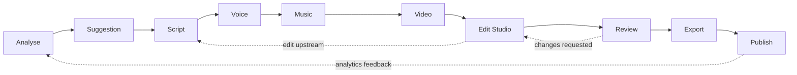
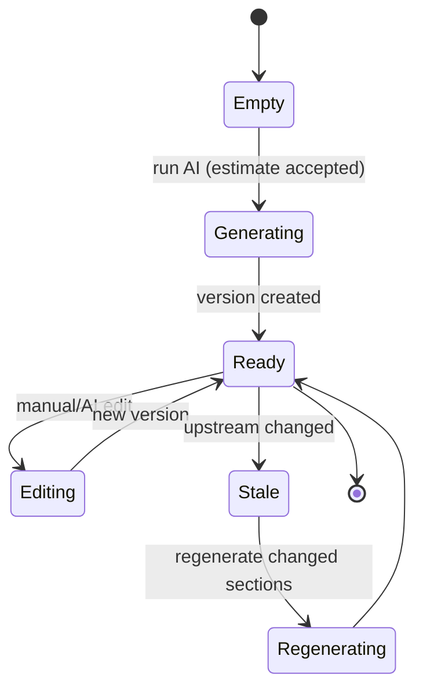
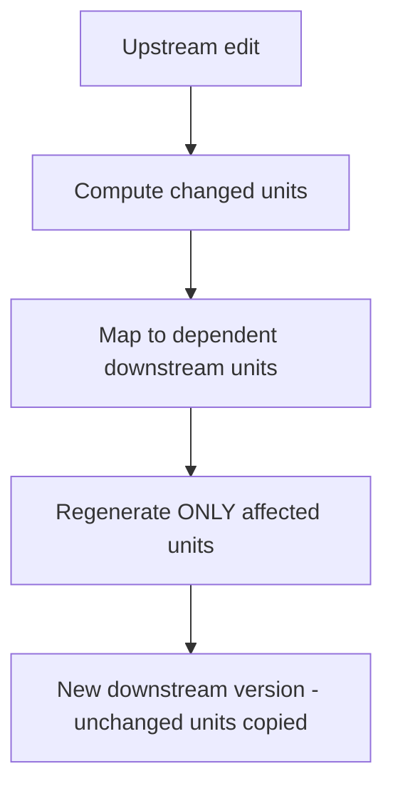
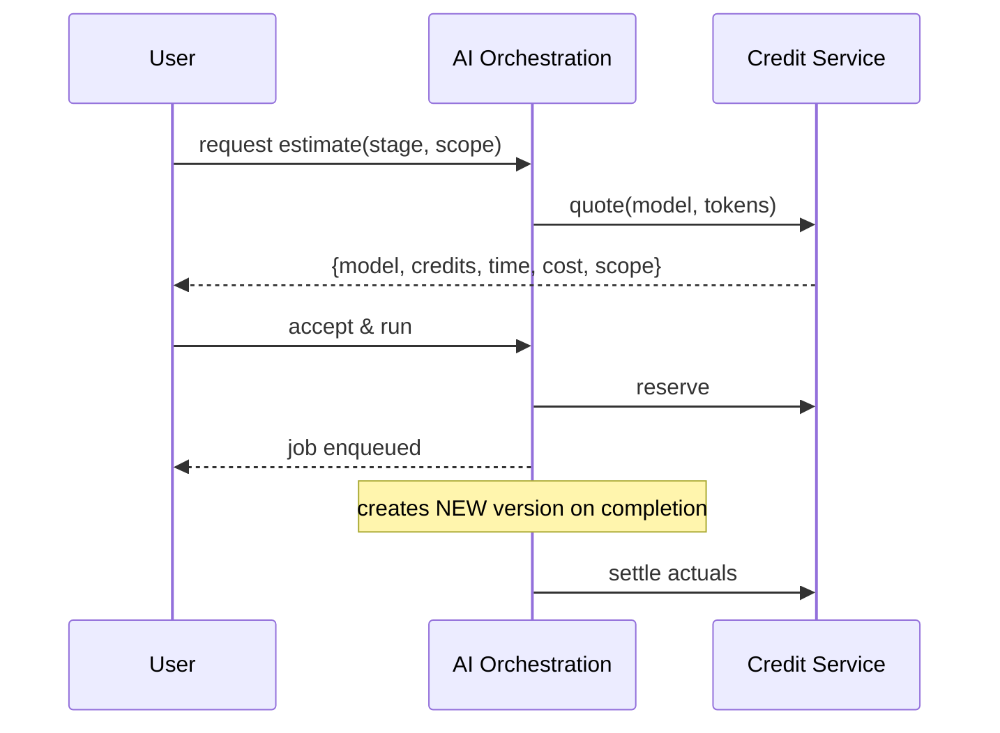
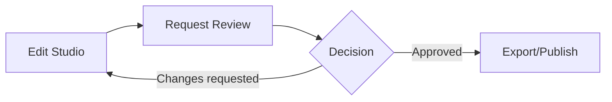

# 05 — AI Workflow

> **Owner:** AI + Product · **Audience:** AI engineers, backend, frontend
> **Related:** [33_AI_Agent_Architecture](33_AI_Agent_Architecture.md) · [06_Edit_Studio](06_Edit_Studio.md) · [10_AI_Credits](10_AI_Credits.md) · [11_AI_Models](11_AI_Models.md)

---

## Executive Summary

The AI Workflow is the guided, stage-based pipeline that turns a channel and an idea into a finished, publishable video: **Analyse → Suggestion → Script → Voice → Music → Video → Edit Studio → Review → Export → Publish**. Each stage is an editable, versioned artifact. AI **assists** at every stage but never seizes control: every AI action shows model, credits, time, and cost before running, produces a new version (non-destructive), and can be reverted. Crucially, when a user changes an upstream stage, the system **regenerates only the changed sections downstream**, not the entire artifact.

---

## Purpose

Define the workflow stages, their contracts, state transitions, editability, regeneration semantics, and transparency guarantees precisely enough to implement.

---

## Goals

- A coherent, resumable, editable multi-stage pipeline.
- Non-destructive versioning at every stage.
- Transparent, opt-in AI actions with pre-run estimates.
- Selective regeneration of only changed sections.
- Free entry/exit at any stage.

---

## Scope

In scope: stage definitions, transitions, editability, regeneration, transparency, review/approval hooks. Out of scope: agent internals ([33_AI_Agent_Architecture](33_AI_Agent_Architecture.md)), editor UI ([06_Edit_Studio](06_Edit_Studio.md)), credit math ([10_AI_Credits](10_AI_Credits.md)).

---

## Workflow Overview



Each arrow is traversable in both directions; the pipeline is a loop, not a one-way line.

---

## Stages

| Stage | Input | AI role | Output artifact (versioned) | Editable |
|---|---|---|---|---|
| **Analyse** | Channel data, past performance | Summarize channel, audience, trends | Analysis report | Yes |
| **Suggestion** | Analysis | Propose topics/angles/hooks | Ranked suggestions | Yes (pick/edit) |
| **Script** | Chosen suggestion + brand kit | Draft script (scenes/lines) | Structured script (scenes → lines) | Yes (manual/AI per line) |
| **Voice** | Script | Generate narration | Voice track asset | Yes (re-voice per segment) |
| **Music** | Script mood/brand | Generate/select music bed | Music asset | Yes |
| **Video** | Script + assets | Generate/assemble visuals | Video clips/scenes | Yes |
| **Edit Studio** | All above | AI + manual timeline editing | Timeline/composition | Yes (fully) |
| **Review** | Composition | — (human) | Review notes | — |
| **Export** | Approved composition | Render | Export file | — |
| **Publish** | Export | Upload | Published video + metadata | Metadata editable |

Each artifact is a `workflow_stage` with `stage_versions` ([03_Database_Architecture](03_Database_Architecture.md)).

---

## Stage State Machine



A stage becomes **Stale** when an upstream stage it depends on produces a new version; the UI flags it and offers **selective regeneration**.

---

## Selective Regeneration (only changed sections)



- Artifacts are structured into **units** (script → scenes/lines; voice → segments; video → scenes).
- On upstream change, only downstream units whose inputs changed are regenerated.
- Unchanged units are carried forward verbatim into the new version, preserving edits.
- Full regenerate is available but always explicit and separately estimated.

**Example:** editing line 4 of the script re-voices only segment 4 and re-renders only scene 4; the rest of the voice/video versions are reused.

---

## Transparency Contract (every AI action)

Before any paid AI action runs, the user sees and accepts:

```json
{
  "stage": "script",
  "model": { "id": "...", "provider": "...", "name": "..." },
  "estimatedCredits": 42,
  "estimatedTimeSeconds": 18,
  "estimatedCost": "0.42",
  "scope": "regenerate 1 of 12 scenes"
}
```

Flow: **estimate → accept → run**. No estimate, no run. Actuals are settled after. See [10_AI_Credits](10_AI_Credits.md).



---

## Non-Destructive Guarantee

- Every AI/manual change creates a new `stage_version` with a diff vs its parent.
- Undo/redo = repoint `current_version_id`.
- Comparison mode diffs any two versions. See [06_Edit_Studio](06_Edit_Studio.md).

---

## Entry & Exit Flexibility

- A user may start at any stage (e.g., paste an existing script and jump to Voice).
- A user may stop at any stage; drafts persist per channel.
- Approval gates ([00_Master_PRD](00_Master_PRD.md) BR-5) sit before Publish when enabled.

---

## Review & Approval Hooks



Reviewers see a diff-driven summary of what changed. Approval writes to `approvals` ([03_Database_Architecture](03_Database_Architecture.md)).

---

## Folder Structure

```
services/ai-orchestration/
├── workflow/
│   ├── stages/            # analyse, suggestion, script, voice, music, video
│   ├── state-machine/
│   ├── regeneration/      # diff + selective regen
│   ├── estimates/         # estimate builder (calls credit service)
│   └── versions/          # version create/repoint
├── agents/                # see 33_AI_Agent_Architecture
└── contracts/
```

---

## Database Design (workflow view)

Uses `drafts`, `workflow_stages`, `stage_versions` (immutable, diff-carrying), `jobs`, `credit_ledger`, `approvals` from [03_Database_Architecture](03_Database_Architecture.md).

---

## API Design (workflow view)

| Endpoint | Purpose |
|---|---|
| `POST /channels/:id/drafts` | Create draft |
| `POST /drafts/:id/stages/:stage/estimate` | Get model/credits/time/cost |
| `POST /drafts/:id/stages/:stage/run` | Run (after accept) → job |
| `POST /drafts/:id/stages/:stage/edit` | Manual edit → new version |
| `POST /drafts/:id/stages/:stage/regenerate` | Selective regen (scope) |
| `POST /drafts/:id/stages/:stage/revert` | Repoint to a version |
| `GET /drafts/:id/stages/:stage/versions` | Version list + diffs |
| `POST /drafts/:id/review` / `POST /drafts/:id/approve` | Review/approval |

Detail: [16_API_Architecture](16_API_Architecture.md).

---

## UI Design

Guided stage rail with clear status (Empty/Generating/Ready/Stale). Opening a stage auto-scrolls and focuses its editor. Estimates shown in a modal before run. Stale stages show a "regenerate changed sections" prompt. See [17_Frontend_UI_UX](17_Frontend_UI_UX.md).

---

## Component Design

Stage components share a common `StageShell` (status, versions, estimate modal, editor slot). Regeneration logic lives server-side; the client only requests scopes. See [18_Component_Guidelines](18_Component_Guidelines.md).

---

## Business Rules

- No paid AI action without accepted estimate (BR-2).
- AI never overwrites a version (BR-3).
- Regeneration targets smallest changed unit (BR-4).
- Downstream marked Stale on upstream change; never auto-regenerated silently.

---

## Validation Rules

- Stage inputs validated (e.g., script requires a chosen suggestion or manual seed).
- All user text entering prompts sanitized for prompt injection ([14_Security](14_Security.md)).
- Scope of regeneration validated against artifact unit structure.

---

## Security

Prompt-injection defenses at the AI boundary; model credentials via secrets manager; per-channel authorization on every stage action; audit-logged AI actions. See [14_Security](14_Security.md).

---

## Performance

Stages run async as jobs; estimates are fast synchronous quotes; selective regeneration minimizes token spend and latency. See [13_Performance](13_Performance.md).

---

## Caching

Estimates for identical inputs may be cached briefly; analysis of unchanged channel data reused. Invalidate on channel sync/edit. See [36_Caching](36_Caching.md).

---

## Background Jobs

Every `run`/`regenerate` is a job with progress, retry, cancellation, and credit reservation/settlement. See [12_Background_Jobs](12_Background_Jobs.md).

---

## Error Handling

AI failure → refund reservation, keep last good version, surface typed error and retry. Partial provider output rejected before versioning. See [32_Error_Handling](32_Error_Handling.md).

---

## Logging

Each AI action logs model, tokens, credits, latency, scope, version id, correlation id. See [38_Logging](38_Logging.md).

---

## Testing

Unit: diff/selective-regen logic. Integration: estimate→reserve→run→settle. E2E: full workflow with edits proving unchanged units are preserved. See [21_Testing_Strategy](21_Testing_Strategy.md).

---

## Acceptance Criteria

- [ ] Each stage produces an editable, versioned artifact.
- [ ] Every paid AI action shows model/credits/time/cost and requires acceptance.
- [ ] Editing an upstream unit regenerates only affected downstream units.
- [ ] Any version can be reverted; nothing is overwritten.
- [ ] User can enter/exit at any stage; drafts persist per channel.
- [ ] Review/approval gates function before publish.

---

## Edge Cases

- Upstream edited while downstream job running → mark result stale, offer re-run.
- User declines estimate → nothing runs, no charge.
- Provider returns fewer units than requested → error, no partial version.
- Circular dependency between stages → prevented by DAG validation.
- Manual edit to a unit that upstream later changes → conflict flagged, user chooses keep/regenerate.

---

## Risks

| Risk | Mitigation |
|---|---|
| Over-regeneration cost | Strict unit-level diffing; explicit full-regen only |
| Estimate inaccuracy | Calibrate against actuals; show ranges |
| Stale-state confusion | Clear UI status + guided regen |
| Prompt injection via channel content | Sanitize + isolate untrusted input |

---

## Future Improvements

- Auto-suggested regeneration scope with preview.
- Multi-variant generation with side-by-side compare.
- Learned per-channel style from approved versions.

---

## Implementation Checklist

- [ ] Stage state machine + Stale detection.
- [ ] Estimate/accept/run contract wired to credits.
- [ ] Unit-level diff + selective regeneration.
- [ ] Version create/repoint + comparison.
- [ ] Review/approval hooks.

---

## References

[00_Master_PRD](00_Master_PRD.md) · [03_Database_Architecture](03_Database_Architecture.md) · [06_Edit_Studio](06_Edit_Studio.md) · [10_AI_Credits](10_AI_Credits.md) · [11_AI_Models](11_AI_Models.md) · [12_Background_Jobs](12_Background_Jobs.md) · [33_AI_Agent_Architecture](33_AI_Agent_Architecture.md)
