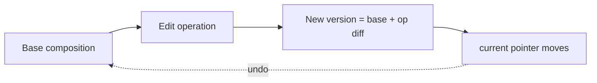
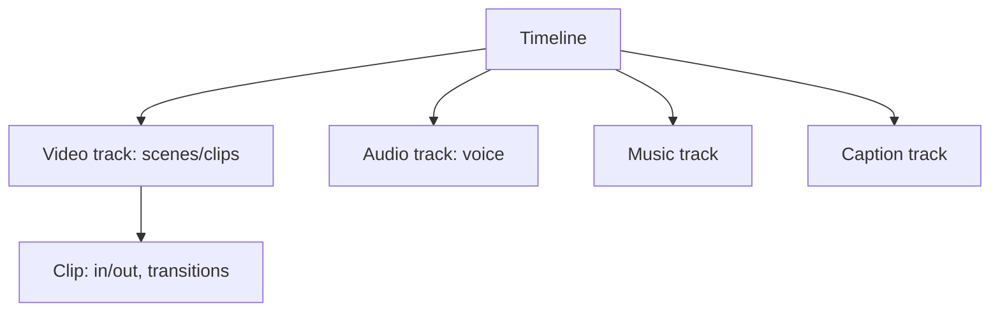
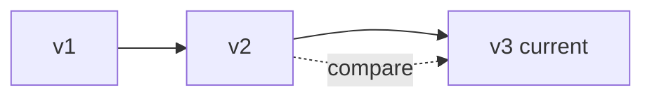
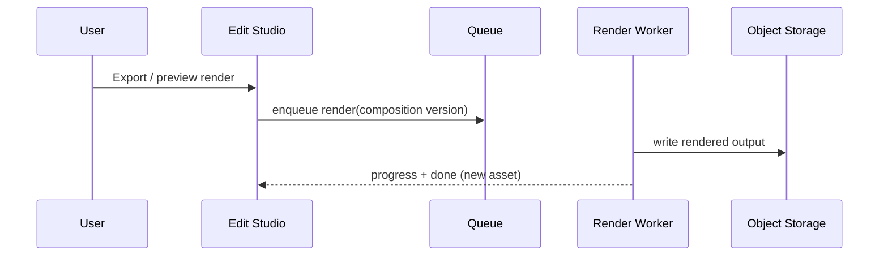

# 06 — Edit Studio

> **Owner:** Product + Frontend + Media · **Audience:** Frontend, media, AI engineers
> **Related:** [05_AI_Workflow](05_AI_Workflow.md) · [09_Asset_Management](09_Asset_Management.md) · [34_Background_Workers](34_Background_Workers.md) · [17_Frontend_UI_UX](17_Frontend_UI_UX.md)

---

## Executive Summary

The Edit Studio is CreatorForce's professional, **non-destructive** editor. It unifies manual editing, AI editing, and timeline editing over scenes, voice, music, captions, thumbnails, and SEO. It draws inspiration from Premiere Pro, DaVinci Resolve, CapCut, and Final Cut **without copying their UI**. Every change — human or AI — creates a new version; nothing is ever overwritten. It provides full undo/redo, version history, comparison mode, and **selective regeneration** so that changing one section re-renders only that section.

---

## Purpose

Specify the Edit Studio's capabilities, editing model, timeline, versioning, and rendering integration precisely enough to build a professional-grade editor.

---

## Goals

- Non-destructive editing across every content dimension.
- Timeline + scene + manual + AI editing in one place.
- Version history, comparison mode, unlimited undo/redo.
- Regenerate only changed sections.
- Smooth, professional, accessible UX.

---

## Scope

In scope: editor model, timeline, editing modes, versioning, comparison, render hooks. Out of scope: workflow orchestration ([05_AI_Workflow](05_AI_Workflow.md)), asset storage internals ([09_Asset_Management](09_Asset_Management.md)), render pipeline internals ([34_Background_Workers](34_Background_Workers.md)).

---

## Editing Model (non-destructive)



- The composition is a **document of units** (scenes, tracks, clips, captions).
- Each edit is an **operation** that yields a new immutable version with a diff.
- Undo/redo/revert move the current pointer; originals persist.
- Backed by `stage_versions` ([03_Database_Architecture](03_Database_Architecture.md)).

---

## Editing Modes

| Mode | What it does |
|---|---|
| **Manual editing** | Direct edits to text, timing, clips, captions |
| **AI editing** | AI proposes edits (trim, re-voice, re-style) with estimate → accept → run |
| **Timeline editing** | Drag/trim/reorder clips and tracks on a timeline |
| **Scene editing** | Edit an individual scene (visual + script + voice) |
| **Voice editing** | Re-voice segments, adjust pacing |
| **Music editing** | Swap/trim/duck music bed |
| **Caption editing** | Edit text, timing, styling |
| **Thumbnail editing** | Generate/edit thumbnail |
| **SEO editing** | Title, description, tags, chapters |

All modes produce versions; all are reversible.

---

## Timeline



- Multi-track (video, voice, music, captions).
- Frame-accurate in/out points, transitions, reorder.
- Snapping, zoom, scrubbing; keyboard shortcuts.
- Edits are operations on the composition document (non-destructive).

---

## Version History & Comparison



- Linear + branchable version list per stage/composition.
- **Comparison mode:** side-by-side or overlay diff of any two versions (text diff for scripts/captions/SEO; A/B preview for media).
- One-click revert to any version.

---

## Selective Regeneration in the Studio

Editing one unit (e.g., scene 3's script line) marks dependent units stale and offers to regenerate **only** scene 3's voice/visuals, carrying the rest forward unchanged (see [05_AI_Workflow](05_AI_Workflow.md) regeneration semantics). Each regeneration shows an estimate first.

---

## Rendering Integration



Renders are async jobs; previews may use fast/low-res paths. See [34_Background_Workers](34_Background_Workers.md).

---

## Folder Structure

```
apps/web/src/features/edit-studio/
├── Timeline/
├── Preview/
├── panels/
│   ├── ScenePanel/
│   ├── VoicePanel/
│   ├── MusicPanel/
│   ├── CaptionPanel/
│   ├── ThumbnailPanel/
│   └── SeoPanel/
├── versioning/        # history, compare, revert
├── operations/        # edit ops -> diffs
├── ai/                # AI edit estimate/run hooks
└── state/             # composition document store
```

---

## Database Design (studio view)

Composition stored as structured `content` in `stage_versions` (large media referenced by `assets` keys). Version lineage via `parent_version_id` + `diff`. See [03_Database_Architecture](03_Database_Architecture.md).

---

## API Design (studio view)

| Endpoint | Purpose |
|---|---|
| `POST /drafts/:id/composition/edit` | Apply manual op → new version |
| `POST /drafts/:id/composition/ai-edit/estimate` | Estimate AI edit |
| `POST /drafts/:id/composition/ai-edit/run` | Run AI edit → job |
| `GET /drafts/:id/composition/versions` | History + diffs |
| `POST /drafts/:id/composition/revert` | Repoint |
| `POST /drafts/:id/composition/render` | Enqueue render |

Detail: [16_API_Architecture](16_API_Architecture.md).

---

## UI Design

Professional but original layout: preview + timeline + contextual side panels. Smooth transitions, auto-focus on active panel, keyboard-first editing, accessible controls. Inspired-not-copied from pro editors. See [17_Frontend_UI_UX](17_Frontend_UI_UX.md), [19_Design_System](19_Design_System.md).

---

## Component Design

Timeline, track, clip, preview, version-history, compare, and estimate-modal components; composition state via a document store with operation-based updates (undo/redo built in). See [18_Component_Guidelines](18_Component_Guidelines.md), [37_State_Management](37_State_Management.md).

---

## Business Rules

- Every edit (manual or AI) creates a new version; no overwrite (BR-3).
- AI edits require accepted estimate (BR-2).
- Regeneration targets smallest changed unit (BR-4).
- Revert never deletes later versions (they remain in history).

---

## Validation Rules

- Timeline operations validated (no negative durations, overlapping constraints per track rules).
- AI edit scope validated against composition units.
- Media inputs validated before render.

---

## Security

Per-channel authorization on all edit/render actions; signed URLs for media; prompt-injection defense on AI-edit text inputs; audit logging of edits. See [14_Security](14_Security.md).

---

## Performance

Operation-based edits are cheap and local; previews use fast render paths; timeline uses virtualization for long compositions; large media streamed via CDN. See [13_Performance](13_Performance.md).

---

## Caching

Preview renders cached by composition-version hash; asset thumbnails cached. Invalidate on new version. See [36_Caching](36_Caching.md).

---

## Background Jobs

Renders and AI edits run as jobs with progress/cancel/retry and credit reservation. See [12_Background_Jobs](12_Background_Jobs.md).

---

## Error Handling

Failed render/AI edit → last good version preserved, credits refunded, typed error + retry. Autosave of in-progress operations prevents loss. See [32_Error_Handling](32_Error_Handling.md).

---

## Logging

Edit operations and renders logged with version ids, correlation ids; AI edits log model/tokens/credits. See [38_Logging](38_Logging.md).

---

## Testing

Unit: operation → diff → version correctness; undo/redo invariants. E2E: multi-track edit, AI edit with estimate, compare, revert, render. Visual regression on timeline/preview. Accessibility of editor controls. See [21_Testing_Strategy](21_Testing_Strategy.md).

---

## Acceptance Criteria

- [ ] All editing modes present and non-destructive.
- [ ] Timeline supports multi-track, frame-accurate editing.
- [ ] Version history + comparison + revert work for text and media.
- [ ] Unlimited undo/redo.
- [ ] Editing one section regenerates/re-renders only that section.
- [ ] Every AI edit shows estimate and is reversible.

---

## Edge Cases

- Very long compositions → virtualized timeline.
- Concurrent edits (single-user) → last-writer-wins with version; conflicts flagged.
- Render fails at 90% → retriable, no partial asset committed.
- Revert after several AI edits → credits already settled remain in history; no refund on revert (only on failure).
- Missing/expired asset reference → surfaced clearly, re-generate option.

---

## Risks

| Risk | Mitigation |
|---|---|
| Editor complexity/perf | Operation-based model + virtualization |
| Storage growth from versions | Pruning policy + tiering ([03_Database_Architecture](03_Database_Architecture.md)) |
| UI accidentally mimics competitors | Original layout review; design system ([19_Design_System](19_Design_System.md)) |
| Preview latency | Fast low-res preview path |

---

## Future Improvements

- Real-time collaborative editing.
- AI "auto-cut" suggestions with preview.
- Effect/transition marketplace.
- Branching version trees with merge.

---

## Implementation Checklist

- [ ] Composition document store + operation model (undo/redo).
- [ ] Multi-track timeline component.
- [ ] Version history + comparison + revert.
- [ ] AI-edit estimate/run hooks.
- [ ] Render enqueue + progress + preview path.

---

## References

[03_Database_Architecture](03_Database_Architecture.md) · [05_AI_Workflow](05_AI_Workflow.md) · [09_Asset_Management](09_Asset_Management.md) · [12_Background_Jobs](12_Background_Jobs.md) · [17_Frontend_UI_UX](17_Frontend_UI_UX.md) · [34_Background_Workers](34_Background_Workers.md) · [37_State_Management](37_State_Management.md)
