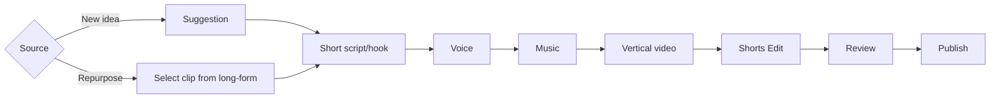
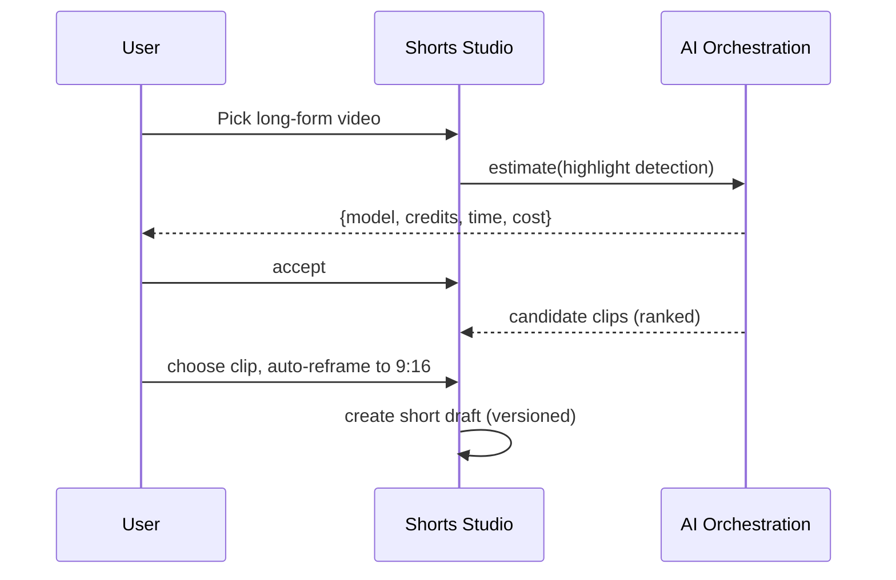

# 07 — Shorts Studio

> **Owner:** Product + Frontend + AI · **Audience:** Full stack, AI
> **Related:** [05_AI_Workflow](05_AI_Workflow.md) · [06_Edit_Studio](06_Edit_Studio.md) · [04_Channel_Workspace](04_Channel_Workspace.md)

---

## Executive Summary

The Shorts Studio is a specialized, vertical-format (9:16) production surface for short-form content. It reuses the AI Workflow and Edit Studio foundations but optimizes for speed, hooks, captions, and pacing appropriate to Shorts. Like everything in CreatorForce, it is channel-first, non-destructive, transparent about AI cost, and fully editable. Shorts can be created from scratch, generated from a suggestion, or **repurposed from existing long-form videos** in the channel.

---

## Purpose

Define the Shorts-specific workflow, format constraints, repurposing flow, and UI so short-form production is fast without sacrificing control or transparency.

---

## Goals

- Fast vertical short creation with strong hooks and captions.
- Repurpose long-form videos into shorts (clip selection + reframe).
- Reuse workflow/edit foundations; add short-form-specific tooling.
- Maintain non-destructive editing and AI transparency.

---

## Scope

In scope: shorts creation, repurposing, vertical timeline, hook/caption tooling. Out of scope: general editor internals ([06_Edit_Studio](06_Edit_Studio.md)), workflow contract ([05_AI_Workflow](05_AI_Workflow.md)).

---

## Shorts Workflow



Repurposing lets creators mine their existing library (a channel-first advantage).

---

## Format Constraints

| Property | Value |
|---|---|
| Aspect ratio | 9:16 vertical |
| Duration | typically ≤ 60s (configurable) |
| Captions | on by default, styled, timed |
| Hook | first 1–3s emphasized in tooling |
| Safe zones | UI overlays for platform-safe areas |

---

## Repurposing Long-Form → Short



Highlight detection is an AI action with a pre-run estimate; results are suggestions the user can override.

---

## Vertical Timeline & Tooling

- Vertical preview with safe-zone overlays.
- Hook editor emphasizing the opening seconds.
- Caption styling presets (channel brand kit aware).
- Reuses the multi-track, non-destructive timeline from [06_Edit_Studio](06_Edit_Studio.md).

---

## Folder Structure

```
apps/web/src/features/shorts-studio/
├── SourcePicker/       # new vs repurpose
├── HighlightPicker/    # AI clip candidates
├── VerticalTimeline/
├── HookEditor/
├── CaptionStyler/
└── state/
```

---

## Database Design

Shorts are `shorts` rows + a `draft` with workflow stages; repurposed shorts reference the source `video_id`. Versions via `stage_versions`. See [03_Database_Architecture](03_Database_Architecture.md).

---

## API Design

| Endpoint | Purpose |
|---|---|
| `POST /channels/:id/shorts` | Create short draft |
| `POST /channels/:id/shorts/from-video/:videoId/estimate` | Estimate highlight detection |
| `POST /channels/:id/shorts/from-video/:videoId/run` | Run detection → candidates |
| Reuses `/drafts/:id/stages/...` | Workflow + edit |

Detail: [16_API_Architecture](16_API_Architecture.md).

---

## UI Design

Speed-first, vertical-first UI; auto-scroll/focus on stage open; brand-aware caption presets; clear hook emphasis. See [17_Frontend_UI_UX](17_Frontend_UI_UX.md).

---

## Component Design

Reuses timeline/version/estimate components; adds SourcePicker, HighlightPicker, HookEditor, CaptionStyler, safe-zone overlay. See [18_Component_Guidelines](18_Component_Guidelines.md).

---

## Business Rules

- Repurposed shorts must reference their source video.
- Highlight detection is opt-in with an estimate (BR-2).
- Non-destructive versioning applies (BR-3).

---

## Validation Rules

- Enforce vertical aspect + max duration on export.
- Validate clip in/out points within source bounds.

---

## Security

Per-channel authorization; signed media URLs; prompt-injection defense on any AI text inputs. See [14_Security](14_Security.md).

---

## Performance

Fast previews, low-res highlight scanning where possible, cached candidate results. See [13_Performance](13_Performance.md).

---

## Caching

Highlight candidates cached by (video, model) until source changes. See [36_Caching](36_Caching.md).

---

## Background Jobs

Highlight detection and vertical render run as jobs with estimate/reservation. See [12_Background_Jobs](12_Background_Jobs.md).

---

## Error Handling

Detection failure → refund, retry, no partial short. See [32_Error_Handling](32_Error_Handling.md).

---

## Logging

Detection and render logged with model/tokens/credits/correlation id. See [38_Logging](38_Logging.md).

---

## Testing

E2E: new short and repurposed short end-to-end; vertical export validation; caption timing. Visual regression on vertical preview. See [21_Testing_Strategy](21_Testing_Strategy.md).

---

## Acceptance Criteria

- [ ] Create a short from scratch and from an existing video.
- [ ] Highlight detection shows an estimate and is overridable.
- [ ] Vertical timeline with safe zones, hook, and captions works.
- [ ] Non-destructive versioning and transparency preserved.
- [ ] Export enforces 9:16 and duration constraints.

---

## Edge Cases

- Very long source video → chunked highlight scanning.
- No strong highlights found → graceful message, manual selection.
- Source video deleted after short created → short retains its clip asset.

---

## Risks

| Risk | Mitigation |
|---|---|
| Highlight cost on long videos | Low-res/chunked scanning; estimates |
| Caption timing drift | Frame-accurate timeline |
| Format violations | Export-time validation |

---

## Future Improvements

- Auto multi-short generation from one long-form video.
- Trend-aware hook suggestions.
- Per-platform short variants.

---

## Implementation Checklist

- [ ] Source picker (new vs repurpose).
- [ ] Highlight detection estimate/run + candidates UI.
- [ ] Vertical timeline + safe zones + hook editor.
- [ ] Caption styler (brand-aware).
- [ ] Vertical export validation.

---

## References

[04_Channel_Workspace](04_Channel_Workspace.md) · [05_AI_Workflow](05_AI_Workflow.md) · [06_Edit_Studio](06_Edit_Studio.md) · [12_Background_Jobs](12_Background_Jobs.md) · [16_API_Architecture](16_API_Architecture.md)
