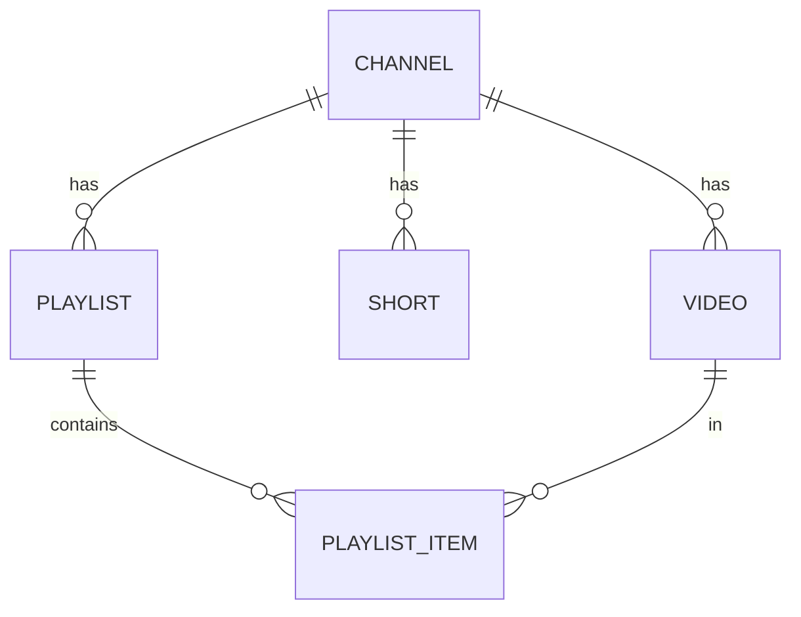
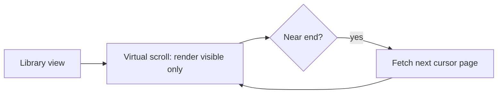
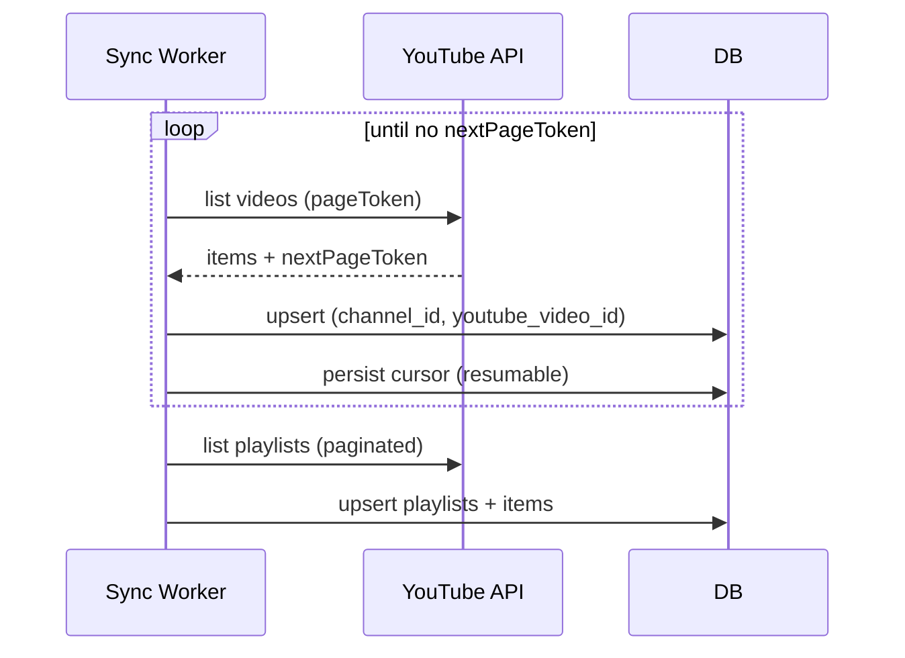

# 08 — Playlists & Library

> **Owner:** Frontend + Backend · **Audience:** Full stack
> **Related:** [04_Channel_Workspace](04_Channel_Workspace.md) · [03_Database_Architecture](03_Database_Architecture.md) · [13_Performance](13_Performance.md)

---

## Executive Summary

The Library is the channel's complete, unlimited catalog of videos, shorts, and playlists — fully synced from YouTube via pagination and kept current by background sync. It must remain fast and fluid at any scale using virtual and infinite scrolling, cursor pagination, global search, and smart filters. Playlists mirror YouTube playlists and support local organization. Everything is channel-scoped.

---

## Purpose

Define the library and playlist data access, browsing, search, filtering, and sync behaviors so creators can navigate unlimited content instantly.

---

## Goals

- Unlimited videos/shorts/playlists per channel.
- Constant-performance browsing via virtual + infinite scroll.
- Fast channel-scoped search and smart filters.
- Accurate, resumable sync of all items and playlists.

---

## Scope

In scope: library/playlist browsing, search, filters, sync surfacing. Out of scope: workspace shell ([04_Channel_Workspace](04_Channel_Workspace.md)), sync internals ([12_Background_Jobs](12_Background_Jobs.md)).

---

## Data Model (recap)

`videos`, `shorts`, `playlists`, `playlist_items` — all channel-scoped with cursor-friendly indexes ([03_Database_Architecture](03_Database_Architecture.md)).



---

## Browsing at Scale



- **Virtual scrolling:** only visible rows are in the DOM.
- **Infinite scrolling:** next page fetched near the end.
- **Cursor pagination:** stable keyset cursors, never OFFSET.
- Result: constant client memory and query cost regardless of library size.

---

## Full Sync (all items, all playlists)



Sync is background, paginated, resumable on quota/restart ([12_Background_Jobs](12_Background_Jobs.md)); the library streams in new items live.

---

## Global Search

Channel-scoped full-text over title/description; debounced; grouped, cursor-paginated results; keyboard navigable. Backed by FT index ([03_Database_Architecture](03_Database_Architecture.md)).

---

## Smart Filters

| Filter | Notes |
|---|---|
| Type | video / short |
| Status | draft/rendering/ready/published/archived |
| Date range | keyset on created_at/published_at |
| Playlist | membership |
| AI-generated | has draft/version |
| Sort | recent, title, duration, performance |

Filters compose; state lives in the URL for shareability.

---

## Playlists

- Mirror YouTube playlists (read/sync).
- Local ordering and organization.
- Drag-to-reorder writes `playlist_items.position`.
- Create/edit playlists that can later be published to YouTube (via Publishing).

---

## Folder Structure

```
apps/web/src/features/library/
├── LibraryGrid/        # virtualized/infinite
├── PlaylistView/
├── FilterBar/
├── SearchBox/
├── hooks/useLibraryQuery.ts
└── state/
```

---

## API Design

| Endpoint | Purpose |
|---|---|
| `GET /channels/:id/videos?cursor=&filter=&sort=` | Paginated videos |
| `GET /channels/:id/shorts?cursor=&filter=` | Paginated shorts |
| `GET /channels/:id/playlists?cursor=` | Playlists |
| `GET /channels/:id/playlists/:pid/items?cursor=` | Playlist items |
| `PATCH /channels/:id/playlists/:pid/order` | Reorder |
| `GET /channels/:id/search?q=&cursor=` | Search |

Detail: [16_API_Architecture](16_API_Architecture.md).

---

## UI Design

Content-forward grid/list, fast filter bar, prominent search, live sync indicator. Smooth, minimal, accessible. See [17_Frontend_UI_UX](17_Frontend_UI_UX.md).

---

## Component Design

Virtualized grid, filter bar, search box, playlist reorder list — all channel-context aware. See [18_Component_Guidelines](18_Component_Guidelines.md).

---

## Business Rules

- Only the selected channel's items are shown.
- Sync upserts on `(channel_id, youtube_video_id)` to avoid duplicates.
- Reorder persists position; conflicts resolved last-writer-wins.

---

## Validation Rules

- Cursors validated; invalid cursor → first page.
- Filter/sort params whitelisted.
- Search input sanitized (XSS) ([14_Security](14_Security.md)).

---

## Security

Channel-scoped authorization on every query; parameterized queries; signed URLs for thumbnails. See [14_Security](14_Security.md).

---

## Performance

Virtual + infinite scroll, cursor pagination, indexed filters, cached pages, CDN thumbnails. Budgets in [44_Performance_Budget](44_Performance_Budget.md).

---

## Caching

Library pages cached by `(channel_id, cursor, filter, sort)`; invalidated on sync/edit/publish. See [36_Caching](36_Caching.md).

---

## Background Jobs

Full sync runs as resumable jobs; library reflects progress live. See [12_Background_Jobs](12_Background_Jobs.md).

---

## Error Handling

Page fetch failure → retry affordance; sync error → resume; partial data still browsable. See [32_Error_Handling](32_Error_Handling.md).

---

## Logging

Page-load and search timings logged; sync progress logged with correlation ids. See [38_Logging](38_Logging.md).

---

## Testing

Performance tests on 10k–100k item libraries; pagination correctness; filter/search correctness; visual regression on grid. See [21_Testing_Strategy](21_Testing_Strategy.md).

---

## Acceptance Criteria

- [ ] Library scrolls smoothly at 100k items (virtual + infinite).
- [ ] All videos and playlists fully sync (paginated, resumable).
- [ ] Search and filters are channel-scoped, fast, URL-reflected.
- [ ] Playlist reorder persists.
- [ ] No duplicate items on re-sync.

---

## Edge Cases

- Empty library → empty state + sync prompt.
- Quota exhaustion mid-sync → resume, partial library usable.
- Deleted-on-YouTube items → mark archived, not shown by default.
- Very large playlist → paginated items.

---

## Risks

| Risk | Mitigation |
|---|---|
| Slow queries at scale | Indexes + keyset pagination |
| Client memory on huge lists | Strict virtualization |
| Duplicate sync rows | Upsert on natural key |

---

## Future Improvements

- Cross-channel library view.
- Saved smart-filter views.
- Bulk actions (tag, archive, add to playlist).

---

## Implementation Checklist

- [ ] Virtualized/infinite library grid.
- [ ] Cursor-paginated endpoints + indexes.
- [ ] Search + smart filters (URL-synced).
- [ ] Playlist view + reorder.
- [ ] Live sync surfacing.

---

## References

[03_Database_Architecture](03_Database_Architecture.md) · [04_Channel_Workspace](04_Channel_Workspace.md) · [12_Background_Jobs](12_Background_Jobs.md) · [13_Performance](13_Performance.md) · [16_API_Architecture](16_API_Architecture.md) · [36_Caching](36_Caching.md)
