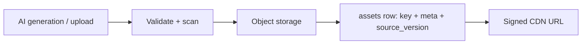
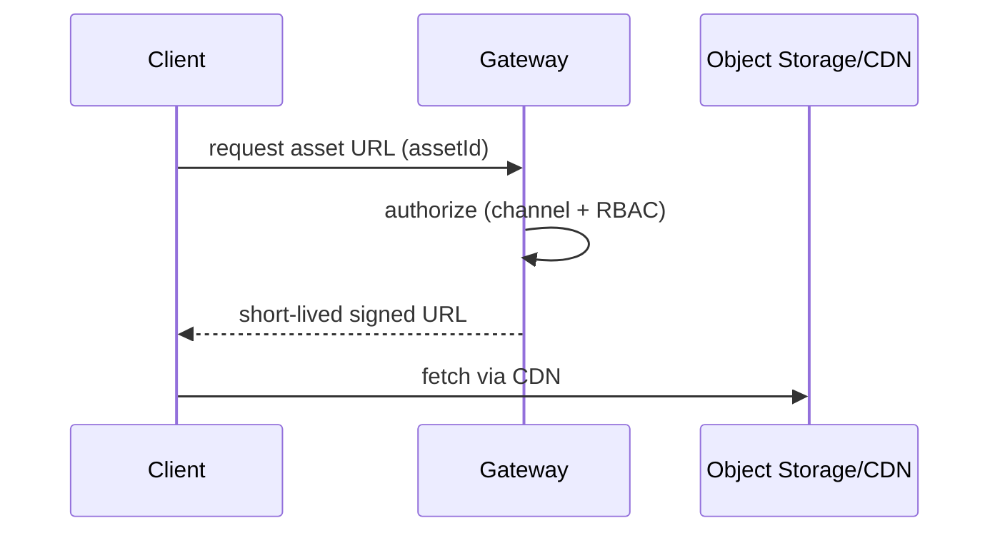

# 09 — Asset Management

> **Owner:** Media + Backend · **Audience:** Backend, media, frontend
> **Related:** [03_Database_Architecture](03_Database_Architecture.md) · [06_Edit_Studio](06_Edit_Studio.md) · [14_Security](14_Security.md)

---

## Executive Summary

Asset Management is the channel-scoped store for every reusable media artifact: voice tracks, music beds, video clips, images, thumbnails, captions, and brand assets. Binary media lives in **object storage**, referenced by key from the database, with rich metadata for search and reuse. Assets are versioned via their producing `stage_version` and served through **signed URLs** over a CDN. The **Brand Kit** is a first-class channel asset that other stages consume.

---

## Purpose

Define asset storage, metadata, lifecycle, delivery, and the Brand Kit so assets are reusable, secure, performant, and traceable.

---

## Goals

- Central, channel-scoped asset store with rich metadata.
- Secure, fast delivery via signed CDN URLs.
- Traceability from asset → producing AI version.
- Brand Kit consumed across the workflow.
- Lifecycle management (tiering, GC).

---

## Scope

In scope: asset model, upload/generation ingest, delivery, Brand Kit, lifecycle. Out of scope: render pipeline ([34_Background_Workers](34_Background_Workers.md)), editing ([06_Edit_Studio](06_Edit_Studio.md)).

---

## Asset Model

`assets(id, channel_id, kind, storage_key, meta, source_version_id, created_at)` ([03_Database_Architecture](03_Database_Architecture.md)).



| Kind | Meta examples |
|---|---|
| voice | duration, language, voice profile |
| music | duration, bpm, mood, license |
| video_clip | duration, resolution, codec |
| image | dimensions, format |
| thumbnail | dimensions |
| caption | language, format, timing |

---

## Ingest (upload & generation)

- **Uploads:** validated by type/size, content-scanned, then stored; a row is created.
- **Generated:** worker writes output to storage, creates an asset row linked to `source_version_id`.
- Deduplicate by content hash where useful.

---

## Delivery



Signed, short-lived URLs prevent unauthorized access; CDN provides speed.

---

## Brand Kit

`brand_kits(channel_id, palette, fonts, logo_key, voice_profile, ...)`.

- One per channel; consumed by Script (tone), Voice (profile), Video/Thumbnail (palette/fonts/logo), Captions (styling).
- Editing the brand kit can mark dependent artifacts stale (offer selective regeneration per [05_AI_Workflow](05_AI_Workflow.md)).

---

## Lifecycle

| Stage | Policy |
|---|---|
| Hot | Recently used assets on fast tier + CDN |
| Cold | Inactive assets moved to cheaper tier |
| GC | Unreferenced assets (no version/composition reference) collected after grace period |
| Delete | Channel deletion purges assets after grace ([40_Backup_Recovery](40_Backup_Recovery.md)) |

---

## Folder Structure

```
services/media/assets/
├── ingest/         # upload + validation + scan
├── delivery/       # signed URL issuance
├── brand-kit/
├── lifecycle/      # tiering + GC
└── contracts/
```

---

## Database Design

`assets`, `brand_kits`, references from `stage_versions`/composition. Indexes: `(channel_id, kind, created_at DESC)`. See [03_Database_Architecture](03_Database_Architecture.md).

---

## API Design

| Endpoint | Purpose |
|---|---|
| `POST /channels/:id/assets` | Upload (multipart/presigned) |
| `GET /channels/:id/assets?kind=&cursor=` | List assets |
| `GET /assets/:id/url` | Signed delivery URL |
| `GET/PUT /channels/:id/brand-kit` | Read/update brand kit |
| `DELETE /assets/:id` | Soft-delete |

Detail: [16_API_Architecture](16_API_Architecture.md).

---

## UI Design

Asset browser with kind filters and previews; Brand Kit editor (palette/fonts/logo/voice). See [17_Frontend_UI_UX](17_Frontend_UI_UX.md).

---

## Component Design

Asset grid, preview, uploader (presigned), brand-kit editor. See [18_Component_Guidelines](18_Component_Guidelines.md).

---

## Business Rules

- Assets are channel-scoped; never cross channels.
- Generated assets link to their producing version.
- Brand Kit changes may mark dependents stale, not auto-regenerate.

---

## Validation Rules

- Upload type/size whitelist; content scan; reject on failure.
- Storage keys are opaque and unguessable.
- Signed URLs short-lived.

---

## Security

Signed URLs, content scanning, upload validation, per-channel authorization, no public buckets. File-upload risks and SSRF addressed in [14_Security](14_Security.md).

---

## Performance

CDN delivery, tiered storage, dedupe, cached metadata/thumbnails. See [13_Performance](13_Performance.md), [36_Caching](36_Caching.md).

---

## Caching

Asset metadata and thumbnails cached; signed URLs cached only for their short lifetime. See [36_Caching](36_Caching.md).

---

## Background Jobs

Ingest scanning, tiering, and GC run as jobs. See [12_Background_Jobs](12_Background_Jobs.md).

---

## Error Handling

Failed upload/scan → clear error, no orphan row; failed generation → no asset committed. See [32_Error_Handling](32_Error_Handling.md).

---

## Logging

Asset create/delete/deliver logged with correlation ids; scan results logged. See [38_Logging](38_Logging.md).

---

## Testing

Upload validation/scan tests, signed-URL authorization tests, GC correctness, brand-kit propagation tests. See [21_Testing_Strategy](21_Testing_Strategy.md).

---

## Acceptance Criteria

- [ ] Assets are channel-scoped and traceable to source versions.
- [ ] Delivery uses short-lived signed CDN URLs.
- [ ] Uploads validated and content-scanned.
- [ ] Brand Kit is editable and consumed by workflow stages.
- [ ] Unreferenced assets are GC'd after grace period.

---

## Edge Cases

- Large uploads → presigned multipart.
- Malicious file → rejected by scan.
- Asset referenced by multiple versions → not GC'd until all references gone.
- Expired signed URL → re-issue on demand.

---

## Risks

| Risk | Mitigation |
|---|---|
| Storage cost growth | Tiering + GC + dedupe |
| Unauthorized access | Signed URLs, no public buckets |
| Malware uploads | Content scanning |

---

## Future Improvements

- Shared brand kits across a team.
- Asset tagging + AI auto-tagging/search.
- Stock/library integrations.

---

## Implementation Checklist

- [ ] Object-storage integration + key model.
- [ ] Upload validation + content scan.
- [ ] Signed URL delivery.
- [ ] Brand Kit CRUD + propagation.
- [ ] Tiering + GC jobs.

---

## References

[03_Database_Architecture](03_Database_Architecture.md) · [06_Edit_Studio](06_Edit_Studio.md) · [12_Background_Jobs](12_Background_Jobs.md) · [14_Security](14_Security.md) · [34_Background_Workers](34_Background_Workers.md) · [36_Caching](36_Caching.md)
