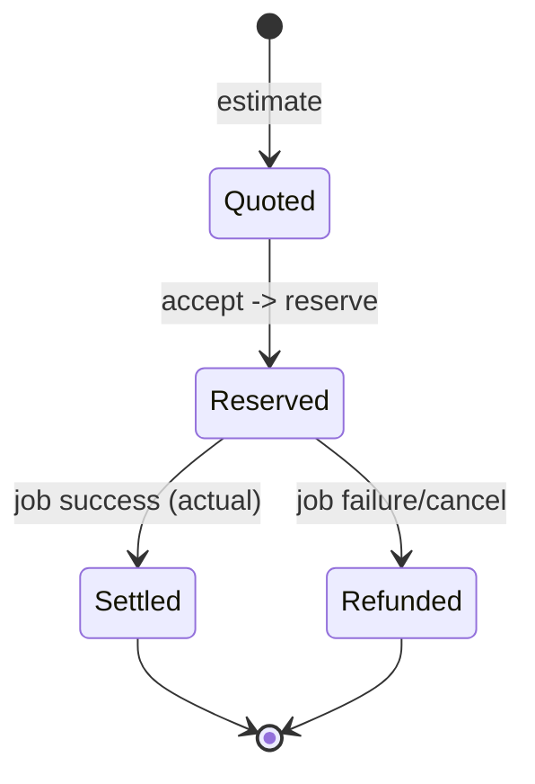
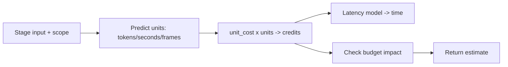
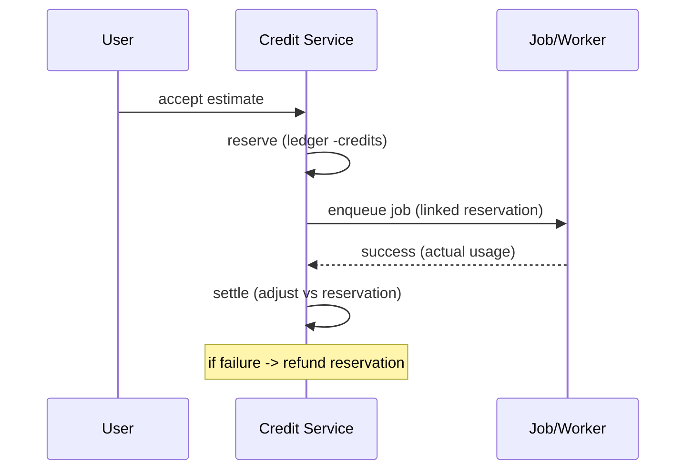
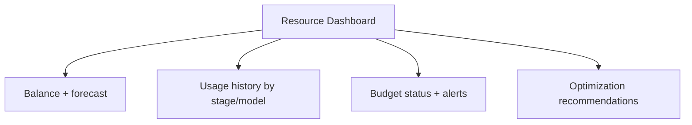

# 10 — AI Credits

> **Owner:** Billing + AI + Product · **Audience:** Backend, AI, frontend
> **Related:** [03_Database_Architecture](03_Database_Architecture.md) · [05_AI_Workflow](05_AI_Workflow.md) · [11_AI_Models](11_AI_Models.md) · [12_Background_Jobs](12_Background_Jobs.md)

---

## Executive Summary

The AI Credit system makes AI spend **transparent, predictable, and controllable**. Credits are tracked in an append-only ledger; every paid AI action follows an **estimate → accept → reserve → settle** cycle so users always see model, credits, time, and cost *before* running, and never get surprised. The system provides usage history, forecasting, budgets (with alerts and optional hard caps), a resource dashboard, and optimization recommendations. This is a core trust pillar of CreatorForce.

---

## Purpose

Define credit accounting, estimation, reservation, budgets, forecasting, and the transparency contract precisely enough to implement without ambiguity.

---

## Goals

- Never run a paid AI action without a user-accepted estimate.
- Accurate, auditable, reconcilable credit accounting.
- Budgets with alerts and optional hard caps.
- Forecasting and optimization guidance.
- Full usage history and a resource dashboard.

---

## Scope

In scope: ledger, estimates, reservations, budgets, forecasting, dashboard, optimization. Out of scope: model catalog details ([11_AI_Models](11_AI_Models.md)), job mechanics ([12_Background_Jobs](12_Background_Jobs.md)).

---

## Credit Lifecycle



- **Quote/estimate:** compute expected credits/cost/time from model unit cost and predicted usage.
- **Reserve:** at enqueue, write a `reserve` ledger row (holds balance).
- **Settle:** on success, write actual `settle`; adjust vs reservation.
- **Refund:** on failure/cancel, write `refund` releasing the reservation.

Backed by the append-only `credit_ledger` ([03_Database_Architecture](03_Database_Architecture.md)); balance = latest `balance_after` (materialized + cached).

---

## Transparency Contract

Every paid AI action shows, before running:

```json
{
  "model": { "id": "...", "name": "...", "provider": "..." },
  "estimatedCredits": 42,
  "estimatedCost": "0.42",
  "estimatedTimeSeconds": 18,
  "scope": "regenerate 1 of 12 scenes",
  "budgetImpact": { "monthlyRemaining": 358, "willExceed": false }
}
```

No estimate → no run. This is enforced server-side, not just in UI. See [05_AI_Workflow](05_AI_Workflow.md).

---

## Estimation



- Unit prediction per model capability (text tokens, voice seconds, video frames).
- Calibrated against historical actuals per model to keep estimates honest.
- Estimates may be shown as a range with a confidence note.

---

## Reservation & Settlement



Reservation prevents overspend and races; settlement reconciles estimate vs actual.

---

## Budgets

| Feature | Behavior |
|---|---|
| Monthly limit | Per channel |
| Alert threshold | Notify at e.g. 80% |
| Hard cap | Optionally block new paid actions when exceeded |
| Warnings | Warn before expensive operations |

`budgets(channel_id, monthly_limit, alert_threshold, hard_cap)` ([03_Database_Architecture](03_Database_Architecture.md)).

---

## Forecasting

- Project month-end spend from recent usage trend.
- Show "at this rate you'll reach your budget on <date>."
- Surface in the resource dashboard.

---

## Resource Dashboard

Shows: current balance, month-to-date spend, forecast, usage by stage/model, recent operations, budget status, and optimization tips.



---

## Optimization Recommendations

- Suggest cheaper models for suitable tasks.
- Recommend selective regeneration over full regenerate.
- Flag repeated identical generations (cacheable).
- Highlight the most expensive recent operations.

---

## Folder Structure

```
services/credit/
├── ledger/          # append-only writes, balance materialization
├── estimates/       # unit prediction + quoting
├── reservations/    # reserve/settle/refund
├── budgets/
├── forecasting/
├── recommendations/
└── contracts/
```

---

## Database Design

`credit_ledger` (append-only, materialized balance), `budgets`, `ai_models` (unit costs). See [03_Database_Architecture](03_Database_Architecture.md).

---

## API Design

| Endpoint | Purpose |
|---|---|
| `POST /channels/:id/credits/estimate` | Quote an action |
| `POST /channels/:id/credits/reserve` | Reserve (usually internal to run) |
| `GET /channels/:id/credits/balance` | Current balance |
| `GET /channels/:id/credits/history?cursor=` | Ledger history |
| `GET/PUT /channels/:id/budget` | Budget config |
| `GET /channels/:id/credits/forecast` | Forecast |
| `GET /channels/:id/credits/recommendations` | Optimization tips |

Detail: [16_API_Architecture](16_API_Architecture.md).

---

## UI Design

Estimate modal before every paid action; persistent balance in the context rail; full resource dashboard; budget config with alerts; pre-run warnings for expensive ops. See [17_Frontend_UI_UX](17_Frontend_UI_UX.md).

---

## Component Design

Estimate modal, balance widget, usage charts, budget editor, recommendations list. See [18_Component_Guidelines](18_Component_Guidelines.md).

---

## Business Rules

- BR-2: no paid action without accepted estimate.
- Reserve before enqueue; settle on success; refund on failure/cancel.
- Hard cap (if enabled) blocks new paid actions when exceeded.
- Ledger is append-only; balance always reconciles.

---

## Validation Rules

- Estimate must precede run; server rejects run without a matching accepted estimate.
- Reservation requires sufficient balance (unless allowed negative per plan).
- Budget values validated (non-negative, threshold ≤ limit).

---

## Security

Per-channel authorization; ledger tamper-evident; no pricing/secret leakage; audit-logged. See [14_Security](14_Security.md).

---

## Performance

Materialized + cached balance; fast estimate path (no model call needed); async settlement. See [13_Performance](13_Performance.md), [36_Caching](36_Caching.md).

---

## Caching

Balance and forecast cached with invalidation on ledger insert. See [36_Caching](36_Caching.md).

---

## Background Jobs

Settlement/refund tied to job completion; reconciliation job verifies ledger integrity. See [12_Background_Jobs](12_Background_Jobs.md).

---

## Error Handling

Job failure → automatic refund; reservation leaks detected and reconciled; typed errors on insufficient balance/cap. See [32_Error_Handling](32_Error_Handling.md).

---

## Logging

Every ledger row and estimate logged with correlation id, model, tokens. See [38_Logging](38_Logging.md).

---

## Testing

Unit: reserve/settle/refund math; balance reconciliation. Integration: estimate→run→settle and failure→refund. E2E: user sees estimate, budget alert, hard cap. See [21_Testing_Strategy](21_Testing_Strategy.md).

---

## Acceptance Criteria

- [ ] Every paid AI action shows model/credits/time/cost and requires acceptance.
- [ ] Balance always reconciles from the ledger.
- [ ] Reservations settle on success, refund on failure/cancel.
- [ ] Budgets alert and (optionally) hard-cap.
- [ ] Dashboard shows history, forecast, and recommendations.

---

## Edge Cases

- Concurrent reservations draining balance → serialized/conditional check.
- Actual usage exceeds estimate → settle actual; warn if over budget.
- Job cancelled mid-run → refund unused portion.
- Estimate stale (inputs changed) → require fresh estimate.

---

## Risks

| Risk | Mitigation |
|---|---|
| Estimate vs actual drift | Calibration + ranges |
| Ledger drift | Reconciliation job + materialized balance checks |
| Overspend races | Reservation with conditional balance |
| Surprise cost | Mandatory pre-run estimate + warnings |

---

## Future Improvements

- Team-level budgets and cost allocation.
- Predictive per-workflow cost before starting.
- Auto-select cheapest capable model (opt-in).

---

## Implementation Checklist

- [ ] Append-only ledger + materialized balance.
- [ ] Estimate engine calibrated to actuals.
- [ ] Reserve/settle/refund lifecycle.
- [ ] Budgets + alerts + hard cap.
- [ ] Forecast + recommendations + dashboard.

---

## References

[03_Database_Architecture](03_Database_Architecture.md) · [05_AI_Workflow](05_AI_Workflow.md) · [11_AI_Models](11_AI_Models.md) · [12_Background_Jobs](12_Background_Jobs.md) · [14_Security](14_Security.md) · [16_API_Architecture](16_API_Architecture.md) · [36_Caching](36_Caching.md)
