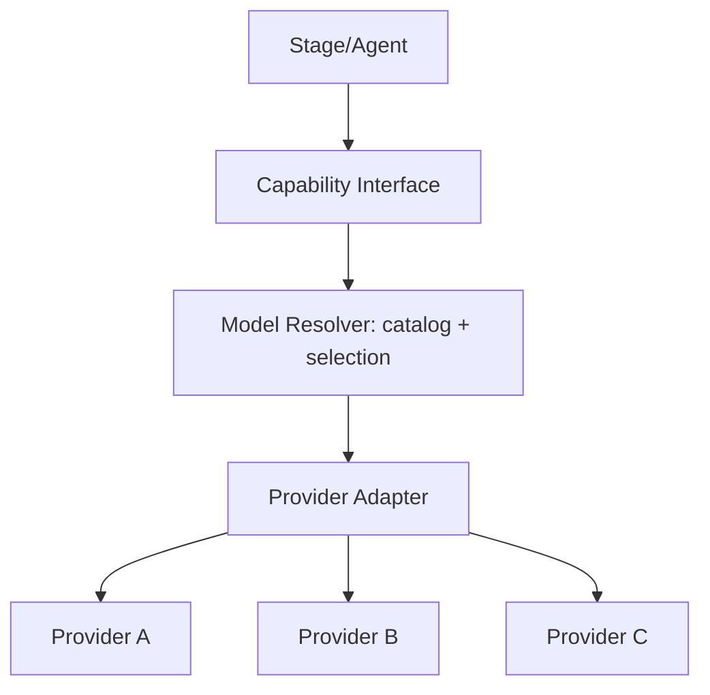
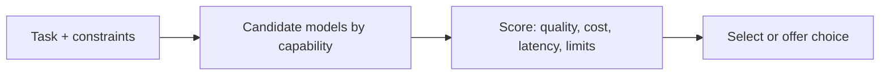

# 11 — AI Models

> **Owner:** AI · **Audience:** AI engineers, backend
> **Related:** [05_AI_Workflow](05_AI_Workflow.md) · [10_AI_Credits](10_AI_Credits.md) · [33_AI_Agent_Architecture](33_AI_Agent_Architecture.md)

---

## Executive Summary

CreatorForce integrates many AI providers (text, voice, music, video, image) behind a single **model abstraction layer**. No feature code calls a provider SDK directly; it calls a capability interface (`TextModel`, `VoiceModel`, etc.) resolved from the `ai_models` catalog. This keeps the platform provider-agnostic, enables per-task model selection, powers accurate credit estimation, and lets us add, disable, price, or A/B models via configuration rather than code changes. Every model exposes unit cost, limits, and capability metadata so the transparency and credit systems work uniformly.

---

## Purpose

Define the model catalog, abstraction interfaces, selection logic, and provider integration so any model can be added or swapped without touching feature code.

---

## Goals

- Provider-agnostic capability interfaces.
- Catalog-driven model registration, pricing, and enablement.
- Task-appropriate model selection (quality/cost/latency).
- Uniform metadata for estimates and transparency.
- Safe, resilient provider calls.

---

## Scope

In scope: catalog, interfaces, selection, provider adapters, resilience. Out of scope: credit math ([10_AI_Credits](10_AI_Credits.md)), agent orchestration ([33_AI_Agent_Architecture](33_AI_Agent_Architecture.md)).

---

## Model Catalog

`ai_models(id, provider, name, capability, unit_cost, enabled, meta)` ([03_Database_Architecture](03_Database_Architecture.md)).

| Field | Meaning |
|---|---|
| capability | text / voice / music / video / image |
| unit_cost | credits per unit (token, second, frame) |
| enabled | availability flag |
| meta | context window, max output, rate limits, quality tier |

---

## Abstraction Layer



Interfaces: `TextModel.generate()`, `VoiceModel.synthesize()`, `MusicModel.compose()`, `VideoModel.generate()`, `ImageModel.generate()`. Adapters implement these per provider; the resolver picks the concrete model.

---

## Model Selection



- Default per capability + optional user/plan override.
- Respects budget (cheaper model when near cap), quality tier, and rate limits.
- Selection feeds the estimate before run ([10_AI_Credits](10_AI_Credits.md)).

---

## Provider Resilience

- Timeouts, retries with backoff, circuit breakers per provider.
- Fallback to an alternate model of the same capability where allowed.
- Rate-limit awareness at the worker level.

---

## Folder Structure

```
services/ai-orchestration/models/
├── interfaces/       # capability contracts
├── resolver/         # selection logic
├── adapters/         # per-provider implementations
├── resilience/       # retry, breaker, fallback
└── catalog/          # ai_models access
```

---

## Database Design

`ai_models` catalog; referenced by `stage_versions.model_id` and `credit_ledger.model_id`. See [03_Database_Architecture](03_Database_Architecture.md).

---

## API Design

| Endpoint | Purpose |
|---|---|
| `GET /models?capability=` | List enabled models |
| `GET /channels/:id/models/preferred` | Channel/plan defaults |
| `PUT /channels/:id/models/preferred` | Set preference |

Provider calls happen only in workers, never in the request path. See [16_API_Architecture](16_API_Architecture.md).

---

## UI Design

Model shown in every estimate; optional model picker with quality/cost/latency hints. See [17_Frontend_UI_UX](17_Frontend_UI_UX.md).

---

## Component Design

Model picker, capability badges, cost/latency hints. See [18_Component_Guidelines](18_Component_Guidelines.md).

---

## Business Rules

- Feature code never imports provider SDKs directly.
- Disabled models are never selected.
- Selected model recorded on every version and ledger row.

---

## Validation Rules

- Adapter output validated against expected schema before use.
- Rate/limit metadata honored before dispatch.

---

## Security

Provider credentials in secrets manager; prompt-injection sanitization at the boundary; no credentials in logs. See [14_Security](14_Security.md).

---

## Performance

Warm connections, batching where supported, latency-aware selection, caching of identical requests. See [13_Performance](13_Performance.md), [36_Caching](36_Caching.md).

---

## Caching

Identical (model, input) results cacheable to avoid re-spend; invalidated by input change. See [36_Caching](36_Caching.md).

---

## Background Jobs

All provider calls run in workers with retry/breaker/fallback. See [12_Background_Jobs](12_Background_Jobs.md).

---

## Error Handling

Provider failure → retry/fallback; exhausted → typed error + credit refund. See [32_Error_Handling](32_Error_Handling.md).

---

## Logging

Model, tokens/units, latency, provider status logged per call. See [38_Logging](38_Logging.md).

---

## Testing

Adapter contract tests with mocked providers; resolver selection tests; resilience (timeout/breaker/fallback) tests. See [21_Testing_Strategy](21_Testing_Strategy.md).

---

## Acceptance Criteria

- [ ] All AI use goes through capability interfaces.
- [ ] Catalog drives enablement, pricing, and selection.
- [ ] Selected model recorded on versions and ledger.
- [ ] Provider failures retry/fallback and refund on exhaustion.
- [ ] Adding a model requires no feature-code change.

---

## Edge Cases

- Provider deprecates a model → disable in catalog, route to fallback.
- All candidates rate-limited → queue/backoff, inform user.
- Output schema drift → validation catches, error surfaced.

---

## Risks

| Risk | Mitigation |
|---|---|
| Provider lock-in | Abstraction + adapters |
| Cost/latency variance | Selection scoring + estimates |
| Output instability | Schema validation + fallback |

---

## Future Improvements

- User/team custom model registration.
- Automatic quality benchmarking.
- Multi-model ensemble generation.

---

## Implementation Checklist

- [ ] Capability interfaces + adapters.
- [ ] Catalog-driven resolver + selection.
- [ ] Resilience layer.
- [ ] Estimate integration.

---

## References

[03_Database_Architecture](03_Database_Architecture.md) · [05_AI_Workflow](05_AI_Workflow.md) · [10_AI_Credits](10_AI_Credits.md) · [14_Security](14_Security.md) · [33_AI_Agent_Architecture](33_AI_Agent_Architecture.md)
