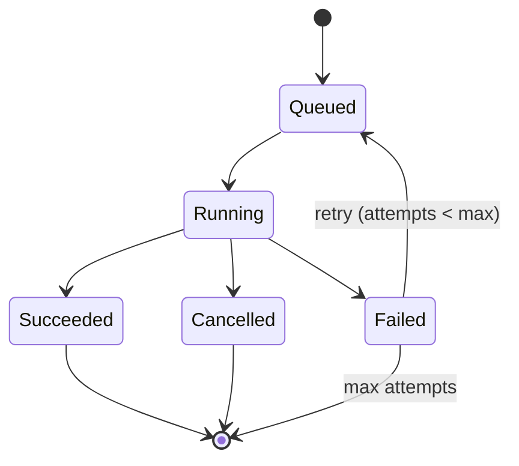
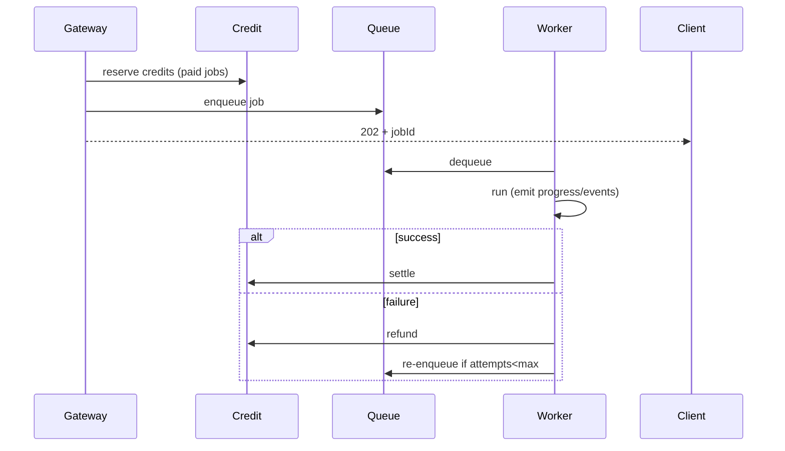

# 12 — Background Jobs

> **Owner:** Backend / Platform · **Audience:** Backend, DevOps
> **Related:** [34_Background_Workers](34_Background_Workers.md) · [35_Queues](35_Queues.md) · [10_AI_Credits](10_AI_Credits.md) · [02_System_Architecture](02_System_Architecture.md)

---

## Executive Summary

All expensive or externally dependent work — channel sync, AI generation, rendering, publishing, analytics ingestion — runs as **asynchronous background jobs**. Jobs are durable, resumable (cursor state), retriable (backoff), cancellable, and observable (progress + events). Jobs integrate with credits (reserve on enqueue, settle/refund on completion) and never block the request path. The UI submits work, receives a job id, and tracks progress via polling or events.

---

## Purpose

Define the job model, lifecycle, retry/cancel/resume semantics, and credit integration.

---

## Goals

- Never block the UI on long work.
- Durable, resumable, retriable, cancellable jobs.
- Progress + event stream per job.
- Credit reservation/settlement tied to job outcome.

---

## Scope

In scope: job model, lifecycle, semantics, credit hooks. Out of scope: queue infra ([35_Queues](35_Queues.md)), worker internals ([34_Background_Workers](34_Background_Workers.md)).

---

## Job Model

`jobs(id, channel_id, kind, status, progress, cursor, reserved_credit_ledger_id, attempts, error)` + `job_events` ([03_Database_Architecture](03_Database_Architecture.md)).



---

## Lifecycle



---

## Semantics

- **Resumable:** `cursor` persisted (e.g., YouTube pageToken) so restarts continue.
- **Retriable:** exponential backoff, capped attempts, then terminal failure.
- **Cancellable:** cooperative cancellation flag; refunds unused reservation.
- **Idempotent:** jobs safe to re-run (upserts, dedupe keys).

---

## Job Kinds

| Kind | Notes |
|---|---|
| sync | Paginated, resumable YouTube sync |
| ai_generate | Workflow/edit generation (paid) |
| render | Media rendering (paid) |
| publish | Upload to YouTube |
| analytics | Metrics ingestion |

---

## Folder Structure

```
services/*/jobs/ + workers/
├── model/          # job records + events
├── lifecycle/      # enqueue, retry, cancel
├── progress/
└── credit-hooks/
```

---

## Database Design

`jobs`, `job_events`, linked `credit_ledger` reservation. See [03_Database_Architecture](03_Database_Architecture.md).

---

## API Design

| Endpoint | Purpose |
|---|---|
| `GET /channels/:id/jobs?status=` | List jobs |
| `GET /jobs/:id` | Status + progress |
| `GET /jobs/:id/events` | Event stream |
| `POST /jobs/:id/cancel` | Cancel |

See [16_API_Architecture](16_API_Architecture.md).

---

## UI Design

Job list + progress in context rail; toasts on completion; cancel affordance. See [17_Frontend_UI_UX](17_Frontend_UI_UX.md).

---

## Component Design

Job progress widget, event log viewer, cancel button. See [18_Component_Guidelines](18_Component_Guidelines.md).

---

## Business Rules

- Paid jobs reserve before enqueue, settle on success, refund on failure/cancel.
- Sync jobs resume from cursor, never restart from scratch.
- Terminal failure preserves last good state.

---

## Validation Rules

- Enqueue validates inputs + credit reservation.
- Cancel only valid in Queued/Running.

---

## Security

Per-channel authorization on job actions; no secrets in job payloads/events. See [14_Security](14_Security.md).

---

## Performance

Workers autoscale on queue depth; backpressure applied; progress batched. See [13_Performance](13_Performance.md).

---

## Caching

Job status cached briefly for polling; invalidated on transition. See [36_Caching](36_Caching.md).

---

## Background Jobs

(This is the job spec itself.) Worker execution: [34_Background_Workers](34_Background_Workers.md); queue: [35_Queues](35_Queues.md).

---

## Error Handling

Typed `error` persisted; retry/backoff; refund on failure. See [32_Error_Handling](32_Error_Handling.md).

---

## Logging

Job transitions + events logged with correlation id. See [38_Logging](38_Logging.md).

---

## Testing

Retry/backoff, cancellation, resume-from-cursor, idempotency, credit refund-on-failure tests. Chaos tests on worker crashes. See [21_Testing_Strategy](21_Testing_Strategy.md).

---

## Acceptance Criteria

- [ ] All long work runs as jobs; UI never blocks.
- [ ] Jobs resume from cursor after restart.
- [ ] Retry/backoff and cancellation work.
- [ ] Credits reserved/settled/refunded correctly.
- [ ] Progress and events observable.

---

## Edge Cases

- Worker crash mid-job → re-dequeued, resumes.
- Duplicate enqueue → idempotency key dedupes.
- Cancel after completion → no-op.
- Quota error → backoff + resume.

---

## Risks

| Risk | Mitigation |
|---|---|
| Stuck/zombie jobs | Heartbeats + reaper |
| Retry storms | Backoff + caps |
| Reservation leaks | Reconciliation job |

---

## Future Improvements

- Priority queues per plan.
- Scheduled/recurring jobs.
- Job dependency graphs.

---

## Implementation Checklist

- [ ] Job model + event stream.
- [ ] Lifecycle (enqueue/retry/cancel/resume).
- [ ] Credit hooks.
- [ ] Status/events API + UI.

---

## References

[02_System_Architecture](02_System_Architecture.md) · [03_Database_Architecture](03_Database_Architecture.md) · [10_AI_Credits](10_AI_Credits.md) · [34_Background_Workers](34_Background_Workers.md) · [35_Queues](35_Queues.md)
