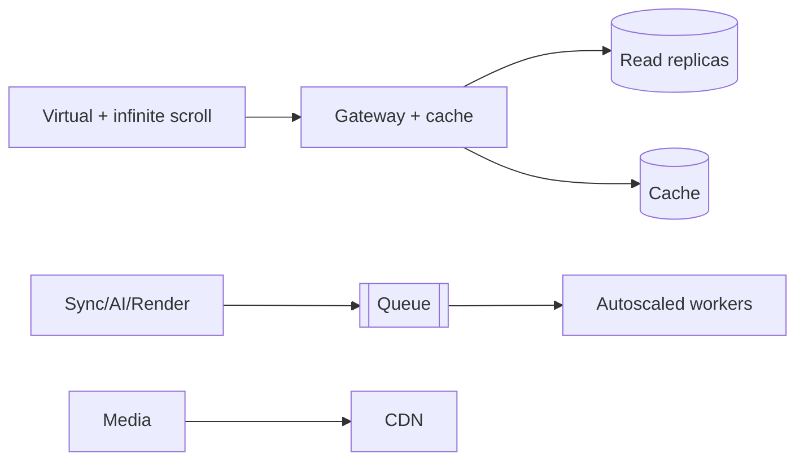

# 13 — Performance

> **Related:** [04_Channel_Workspace](04_Channel_Workspace.md) · [08_Playlists_and_Library](08_Playlists_and_Library.md) · [36_Caching](36_Caching.md) · [44_Performance_Budget](44_Performance_Budget.md) · [12_Background_Jobs](12_Background_Jobs.md)

---

## Executive Summary

CreatorForce must stay fast at extreme scale: unlimited libraries, large media, and many concurrent AI jobs. Performance is achieved through virtual and infinite scrolling, cursor pagination, a read-through cache layer, read replicas, CDN media delivery, async job execution, and strict performance budgets enforced in CI. The UI never blocks on sync, AI, or rendering.

---

## Purpose

Define Performance for CreatorForce in enough detail that a senior engineer can implement it without guessing, consistent with the channel-first, non-destructive, transparent-AI principles of the platform.

---

## Goals

- Constant-performance browsing at any library size
- Sub-2s interactive workspace (p75)
- Async execution of all expensive work
- Enforced performance budgets in CI

---

## Scope

In scope: as described above. Out of scope: detail owned by the related documents.

---

## Architecture / Workflow



---

## Folder Structure

```
performance/
├── core/
├── api/
├── ui/
└── tests/
```

---

## Database Design

Uses the channel-scoped schema in [03_Database_Architecture](03_Database_Architecture.md); all domain rows carry `channel_id`.

---

## API Design

Endpoints are channel-scoped and versioned; long operations return 202 + job id. See [16_API_Architecture](16_API_Architecture.md).

---

## UI Design

Follows [17_Frontend_UI_UX](17_Frontend_UI_UX.md) and [19_Design_System](19_Design_System.md): fast, minimal, accessible.

---

## Component Design

Reusable, dependency-injected, accessible components per [18_Component_Guidelines](18_Component_Guidelines.md).

---

## Business Rules

- No expensive operation runs in the request path.
- All large lists use cursor pagination and virtualization.
- Performance budgets are CI gates ([44_Performance_Budget](44_Performance_Budget.md)).

---

## Validation Rules

- Reject OFFSET pagination on large tables.
- Enforce payload size limits.

---

## Security

Per-channel authorization, input validation, secret management, and audit logging per [14_Security](14_Security.md).

---

## Performance

Core techniques: keyset pagination, virtualization, caching, replicas, CDN, autoscaling workers, code-splitting, lazy loading, image optimization.

---

## Caching

Channel-scoped, event-invalidated caching per [36_Caching](36_Caching.md).

---

## Background Jobs

Expensive work runs as jobs with retry/cancel/resume and credit hooks per [12_Background_Jobs](12_Background_Jobs.md).

---

## Error Handling

Typed error envelope, no silent failures, rollback on paid-action failure per [32_Error_Handling](32_Error_Handling.md).

---

## Logging

Structured, correlation-ID'd logs (AI actions include model/tokens/credits) per [38_Logging](38_Logging.md).

---

## Testing

Unit, integration, and (where user-facing) E2E/accessibility/visual/performance/security tests, all in CI. See [21_Testing_Strategy](21_Testing_Strategy.md).

---

## Acceptance Criteria

- [ ] Workspace interactive ≤ 2.0s p75 on a 10k-item channel.
- [ ] Library scrolls smoothly at 100k items.
- [ ] No blocking calls > 1s in the request path.
- [ ] Performance budgets enforced in CI.

---

## Edge Cases

- Empty/at-scale inputs.
- Provider/quota failures with resume.
- Concurrent edits (last-writer-wins + version).
- Revoked credentials mid-operation.

---

## Risks

| Risk | Mitigation |
|---|---|
| Scale hotspots | Pagination, cache, replicas |
| Provider variability | Abstraction + retries/fallback |
| Scope creep | Priority gating ([50_IMPLEMENTATION_PLAN](50_IMPLEMENTATION_PLAN.md)) |

---

## Future Improvements

- Deeper automation with preview.
- Team-aware capabilities.
- Additional integrations.

---

## Implementation Checklist

- [ ] Constant-performance browsing at any library size.
- [ ] Sub-2s interactive workspace (p75).
- [ ] Async execution of all expensive work.
- [ ] Enforced performance budgets in CI.

---

## References

[04_Channel_Workspace](04_Channel_Workspace.md) · [08_Playlists_and_Library](08_Playlists_and_Library.md) · [36_Caching](36_Caching.md) · [44_Performance_Budget](44_Performance_Budget.md) · [12_Background_Jobs](12_Background_Jobs.md)
