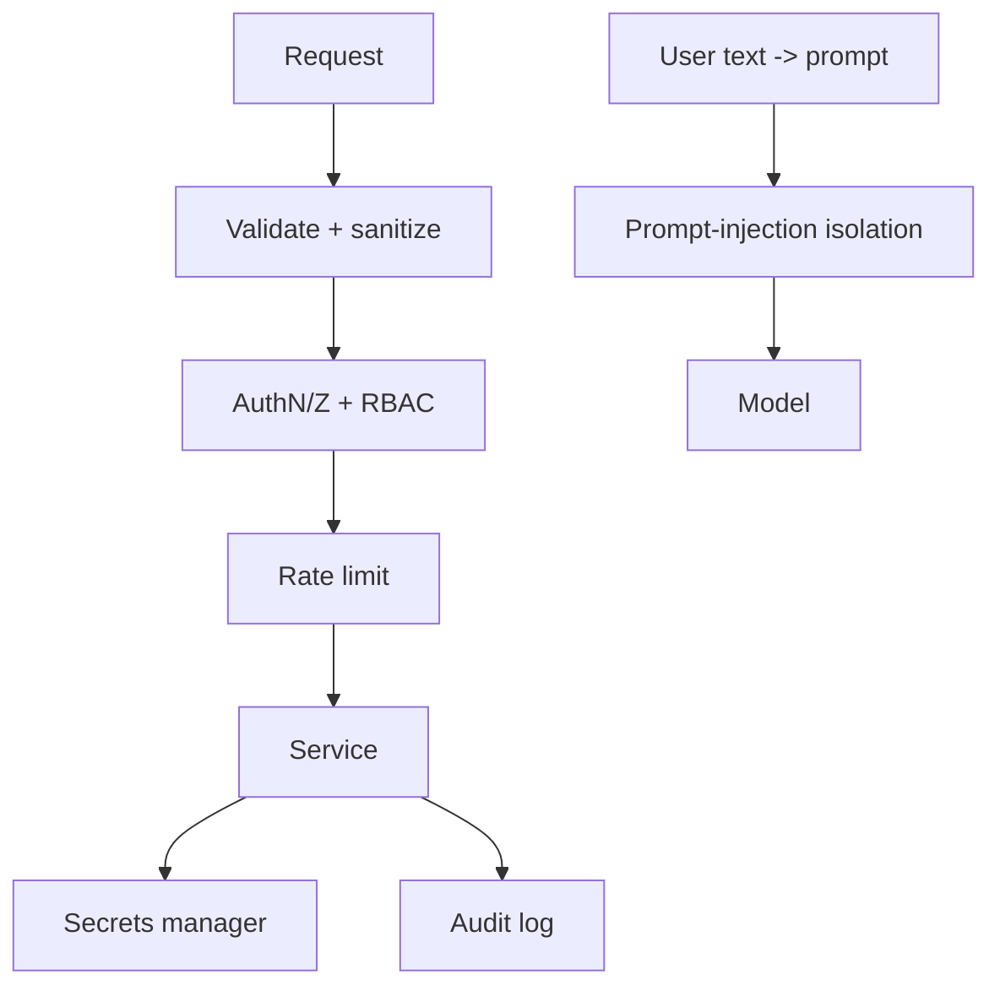

# 14 — Security

> **Related:** [15_Authentication](15_Authentication.md) · [23_OWASP_ZAP](23_OWASP_ZAP.md) · [24_BurpSuite](24_BurpSuite.md) · [25_Snyk](25_Snyk.md) · [27_Semgrep](27_Semgrep.md) · [03_Database_Architecture](03_Database_Architecture.md)

---

## Executive Summary

Security is designed in, not added later. CreatorForce defends against the OWASP Top 10 and LLM-specific threats: XSS, CSRF, SQL injection, SSRF, prompt injection, insecure file upload, JWT/OAuth abuse, and secret exposure. Controls include least-privilege RBAC scoped per channel, encrypted secret management, audit logging of all state-changing and AI actions, strict input validation and output encoding, rate limiting, and a hardened AI boundary that isolates untrusted content from instructions.

---

## Purpose

Define Security for CreatorForce in enough detail that a senior engineer can implement it without guessing, consistent with the channel-first, non-destructive, transparent-AI principles of the platform.

---

## Goals

- Defend the OWASP Top 10 and LLM threats
- Least-privilege RBAC per channel
- Encrypted secrets, no raw tokens in DB
- Audit every state-changing and AI action
- Harden the AI/prompt boundary

---

## Scope

In scope: as described above. Out of scope: detail owned by the related documents.

---

## Architecture / Workflow



---

## Folder Structure

```
security/
├── core/
├── api/
├── ui/
└── tests/
```

---

## Database Design

Uses the channel-scoped schema in [03_Database_Architecture](03_Database_Architecture.md); all domain rows carry `channel_id`.

---

## API Design

Endpoints are channel-scoped and versioned; long operations return 202 + job id. See [16_API_Architecture](16_API_Architecture.md).

---

## UI Design

Follows [17_Frontend_UI_UX](17_Frontend_UI_UX.md) and [19_Design_System](19_Design_System.md): fast, minimal, accessible.

---

## Component Design

Reusable, dependency-injected, accessible components per [18_Component_Guidelines](18_Component_Guidelines.md).

---

## Business Rules

- Every request is authorized per channel with least privilege.
- Secrets live only in the secrets manager (references in DB).
- All state-changing and AI actions are audit-logged.
- Untrusted content is isolated from instructions at the AI boundary.

---

## Validation Rules

- Parameterized queries only (SQLi).
- Output encoding + CSP (XSS).
- CSRF tokens / same-site cookies.
- SSRF allowlists on outbound fetches.
- File upload type/size/scan.
- JWT alg pinning + key rotation.

---

## Security

Layered defense across gateway, services, workers, and data. Prompt-injection: treat channel content and user input as data, never instructions; strip/deny instruction-like payloads; constrain tool/model capabilities. LLM security: output validation, rate/spend caps, no secret exposure to models.

---

## Performance

Async execution, caching, and pagination per [13_Performance](13_Performance.md) and [44_Performance_Budget](44_Performance_Budget.md).

---

## Caching

Channel-scoped, event-invalidated caching per [36_Caching](36_Caching.md).

---

## Background Jobs

Expensive work runs as jobs with retry/cancel/resume and credit hooks per [12_Background_Jobs](12_Background_Jobs.md).

---

## Error Handling

Typed error envelope, no silent failures, rollback on paid-action failure per [32_Error_Handling](32_Error_Handling.md).

---

## Logging

Structured, correlation-ID'd logs (AI actions include model/tokens/credits) per [38_Logging](38_Logging.md).

---

## Testing

Unit, integration, and (where user-facing) E2E/accessibility/visual/performance/security tests, all in CI. See [21_Testing_Strategy](21_Testing_Strategy.md).

---

## Acceptance Criteria

- [ ] OWASP Top 10 controls implemented and tested.
- [ ] Prompt-injection isolation verified.
- [ ] Secrets never appear in DB/logs.
- [ ] Audit log covers all state-changing + AI actions.
- [ ] RBAC enforced on every channel-scoped request.

---

## Edge Cases

- Empty/at-scale inputs.
- Provider/quota failures with resume.
- Concurrent edits (last-writer-wins + version).
- Revoked credentials mid-operation.

---

## Risks

| Risk | Mitigation |
|---|---|
| Scale hotspots | Pagination, cache, replicas |
| Provider variability | Abstraction + retries/fallback |
| Scope creep | Priority gating ([50_IMPLEMENTATION_PLAN](50_IMPLEMENTATION_PLAN.md)) |

---

## Future Improvements

- Deeper automation with preview.
- Team-aware capabilities.
- Additional integrations.

---

## Implementation Checklist

- [ ] Defend the OWASP Top 10 and LLM threats.
- [ ] Least-privilege RBAC per channel.
- [ ] Encrypted secrets, no raw tokens in DB.
- [ ] Audit every state-changing and AI action.
- [ ] Harden the AI/prompt boundary.

---

## References

[15_Authentication](15_Authentication.md) · [23_OWASP_ZAP](23_OWASP_ZAP.md) · [24_BurpSuite](24_BurpSuite.md) · [25_Snyk](25_Snyk.md) · [27_Semgrep](27_Semgrep.md) · [03_Database_Architecture](03_Database_Architecture.md)
