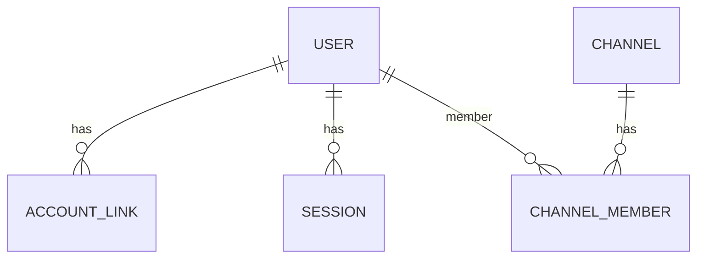
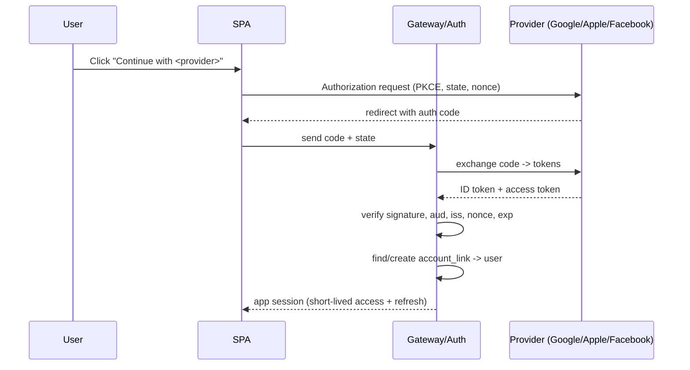
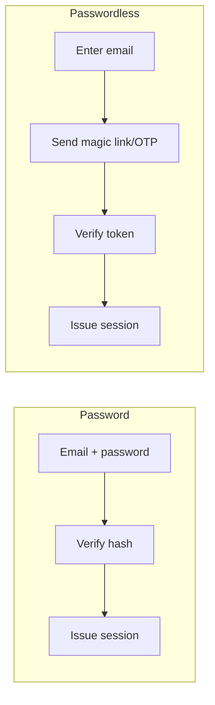
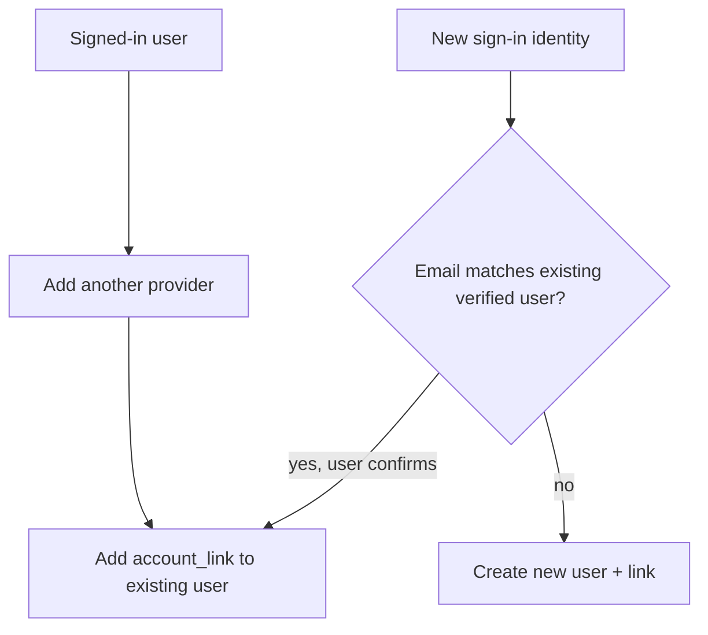
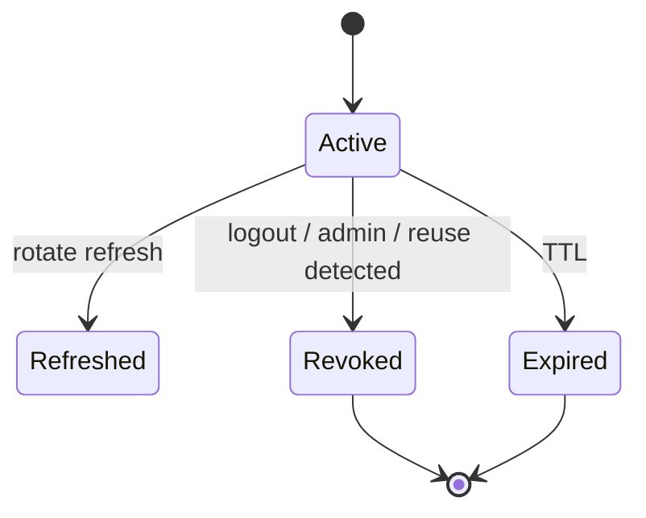
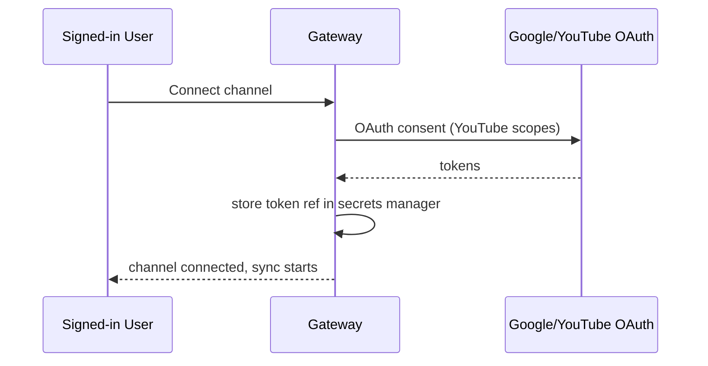

# 15 — Authentication

> **Owner:** Security + Backend · **Audience:** Backend, frontend, security
> **Related:** [14_Security](14_Security.md) · [02_System_Architecture](02_System_Architecture.md) · [16_API_Architecture](16_API_Architecture.md) · [03_Database_Architecture](03_Database_Architecture.md)

---

## Executive Summary

CreatorForce authentication supports multiple sign-in methods with a unified identity: **Email, Google, Apple, and Facebook**, and is built to add **future providers** without schema or flow rewrites. Social sign-in uses standards-based **OAuth 2.0 / OIDC**; email uses secure password or passwordless (magic-link/OTP) flows. Multiple methods can be **linked to one account**, so a user who signs up with Google can later add Apple or email and still land in the same identity. Sessions are secure, revocable, and short-lived with refresh; every request is authorized per channel via RBAC.

> **Sign-in method update:** the supported set is **Email + Google + Apple + Facebook + future providers**, all mapping to a single user via account linking. This supersedes any earlier single-method assumption. YouTube channel connection is a **separate OAuth authorization** (for the YouTube Data API scopes), distinct from account sign-in.

---

## Purpose

Define sign-in methods, OAuth/OIDC flows, account linking, session management, and channel-connection authorization precisely enough to implement securely.

---

## Goals

- Multiple sign-in methods → one identity.
- Standards-based, secure OAuth/OIDC and email flows.
- Robust account linking and de-duplication.
- Secure, revocable session management.
- Clean separation of app sign-in vs YouTube channel authorization.
- Extensible to future providers.

---

## Scope

In scope: sign-in methods, flows, linking, sessions, channel-connect auth, RBAC claims. Out of scope: general security controls ([14_Security](14_Security.md)), API surface detail ([16_API_Architecture](16_API_Architecture.md)).

---

## Supported Sign-In Methods

| Method | Protocol | Notes |
|---|---|---|
| **Email** | Password (hashed) or passwordless (magic link / OTP) | Verified email required |
| **Google** | OAuth 2.0 / OIDC | ID token verified |
| **Apple** | Sign in with Apple (OIDC) | Handles private relay email |
| **Facebook** | OAuth 2.0 | Email scope when granted |
| **Future providers** | OAuth/OIDC | Added via config + adapter, no schema change |

Each method produces a `(provider, provider_subject)` identity stored in `account_links` and mapped to a single `users` row ([03_Database_Architecture](03_Database_Architecture.md)).

---

## Data Model



- `users(id, email, display_name, status)`
- `account_links(id, user_id, provider, provider_subject, linked_at, UNIQUE(provider, provider_subject))`
- `sessions(id, user_id, refresh_token_hash, device, ip, created_at, expires_at, revoked_at)`
- `channel_members(channel_id, user_id, role)` — RBAC per channel.

---

## Sign-In Flow (social OAuth/OIDC)



Security details: PKCE for public clients, `state` for CSRF, `nonce` for replay, strict ID-token validation. See [14_Security](14_Security.md).

---

## Sign-In Flow (email)



Passwords hashed with a strong adaptive algorithm; email always verified; rate-limited to resist brute force and enumeration.

---

## Account Linking



- A signed-in user can add methods explicitly (safest path).
- Automatic linking by email only when the email is **verified on both sides** and the user confirms, to prevent account takeover.
- Apple private-relay emails handled as first-class identities.

---

## Session Management

- **Short-lived access token** (JWT or opaque) + **refresh token** (rotating, hashed at rest).
- Refresh rotation with reuse detection (revoke family on reuse).
- Sessions listable and revocable by the user (device/session management).
- Server-side revocation list / short TTLs so logout and compromise response are effective.
- Idle + absolute session lifetimes.



---

## Channel Connection (separate from sign-in)

Connecting a YouTube channel is a **distinct OAuth authorization** requesting YouTube Data API scopes. The resulting tokens are stored **only as secret-manager references** on the `channels` row (never raw in DB) and used by sync/publish workers.



Revoked channel tokens are detected during sync and surfaced for reconnection ([04_Channel_Workspace](04_Channel_Workspace.md)).

---

## RBAC & Authorization

- Claims include user id + per-channel roles (owner/editor/reviewer/viewer).
- Gateway enforces authorization on every channel-scoped request.
- Least privilege; single-user today, team-ready model. See [14_Security](14_Security.md).

---

## Folder Structure

```
services/auth/
├── providers/        # google, apple, facebook, email, <future>
├── oidc/             # verification, PKCE, state/nonce
├── linking/
├── sessions/         # issue, rotate, revoke
├── channel-connect/  # YouTube OAuth
└── rbac/
```

---

## Database Design

`users`, `account_links` (unique per provider+subject), `sessions`, `channel_members`; channel OAuth tokens as secret refs on `channels`. See [03_Database_Architecture](03_Database_Architecture.md).

---

## API Design

| Endpoint | Purpose |
|---|---|
| `POST /auth/:provider/start` | Begin OAuth (PKCE/state/nonce) |
| `POST /auth/:provider/callback` | Exchange + verify → session |
| `POST /auth/email/login` / `/register` / `/magic-link` / `/otp` | Email flows |
| `POST /auth/link/:provider` | Link method to signed-in user |
| `POST /auth/refresh` | Rotate session |
| `POST /auth/logout` | Revoke session |
| `GET /auth/sessions` / `DELETE /auth/sessions/:id` | Manage sessions |
| `POST /channels/connect` | YouTube channel OAuth |

Detail: [16_API_Architecture](16_API_Architecture.md).

---

## UI Design

Unified sign-in screen: "Continue with Google / Apple / Facebook" + email. Linked-methods management in settings; active-session list; clear separation of "sign in" vs "connect a channel." See [17_Frontend_UI_UX](17_Frontend_UI_UX.md).

---

## Component Design

Provider buttons, email form, magic-link/OTP flow, linked-accounts panel, sessions panel. See [18_Component_Guidelines](18_Component_Guidelines.md).

---

## Business Rules

- One identity per person; multiple methods link to it.
- Auto-link only on verified-email match with confirmation.
- Channel OAuth is separate from sign-in and stored as secret refs.
- Refresh reuse → revoke session family.

---

## Validation Rules

- Verify ID token `iss`, `aud`, `exp`, `nonce`, signature.
- Enforce PKCE + `state` on all OAuth flows.
- Verify email before linking by email.
- Rate-limit login/register/magic-link/OTP.

---

## Security

CSRF (`state`), replay (`nonce`), PKCE, secure cookie/token handling, hashed refresh tokens, brute-force + enumeration protection, secret-manager storage of provider/channel tokens, JWT attack mitigation (alg pinning, key rotation). Full treatment: [14_Security](14_Security.md).

---

## Performance

Stateless verification at gateway; cached JWKS for providers; fast session checks. See [13_Performance](13_Performance.md).

---

## Caching

Provider JWKS and RBAC claims cached with TTL; invalidated on role change/logout. See [36_Caching](36_Caching.md).

---

## Background Jobs

Session-cleanup and token-refresh maintenance jobs; channel-token health checks. See [12_Background_Jobs](12_Background_Jobs.md).

---

## Error Handling

Typed auth errors (invalid token, expired, linking conflict); never leak whether an email exists (enumeration-safe). See [32_Error_Handling](32_Error_Handling.md).

---

## Logging

Auth events (login, link, refresh, revoke, failures) audit-logged without secrets. See [38_Logging](38_Logging.md).

---

## Testing

Unit: token verification, linking rules. Integration: each provider flow (mocked), refresh rotation + reuse detection. E2E: sign in with each method, link methods, connect channel, logout/revoke. Security tests: CSRF, PKCE, enumeration. See [21_Testing_Strategy](21_Testing_Strategy.md), [23_OWASP_ZAP](23_OWASP_ZAP.md).

---

## Acceptance Criteria

- [ ] Users can sign in with Email, Google, Apple, and Facebook.
- [ ] Multiple methods link to one identity safely.
- [ ] Adding a new provider requires config + adapter only (no schema change).
- [ ] Sessions are short-lived, rotating, and revocable; reuse detection works.
- [ ] Channel OAuth is separate and stored as secret references.
- [ ] All flows enforce PKCE/state/nonce and are enumeration-safe.

---

## Edge Cases

- Same email across two providers → confirmed linking, no silent takeover.
- Apple private relay email → treated as valid identity.
- Provider returns no email → account created on subject; prompt to add email.
- Refresh token stolen/reused → family revoked.
- Channel token revoked externally → sync flags reconnection.

---

## Risks

| Risk | Mitigation |
|---|---|
| Account takeover via auto-link | Verified-email + confirmation only |
| Token theft | Rotation, reuse detection, short TTL |
| Provider outage | Multiple methods; graceful messaging |
| Secret exposure | Secrets manager, never raw tokens in DB |

---

## Future Improvements

- Additional providers (Microsoft, TikTok, etc.) via adapters.
- Passkeys / WebAuthn.
- MFA and step-up auth for sensitive actions.
- Enterprise SSO (SAML/OIDC) for teams.

---

## Implementation Checklist

- [ ] Email + Google + Apple + Facebook flows (OAuth/OIDC, PKCE/state/nonce).
- [ ] Account linking (verified-email + explicit).
- [ ] Session issue/rotate/revoke + reuse detection.
- [ ] Separate YouTube channel-connect OAuth + secret-ref storage.
- [ ] RBAC claims + gateway enforcement.
- [ ] Provider-adapter extension point for future methods.

---

## References

[02_System_Architecture](02_System_Architecture.md) · [03_Database_Architecture](03_Database_Architecture.md) · [14_Security](14_Security.md) · [16_API_Architecture](16_API_Architecture.md) · [17_Frontend_UI_UX](17_Frontend_UI_UX.md) · [23_OWASP_ZAP](23_OWASP_ZAP.md)
