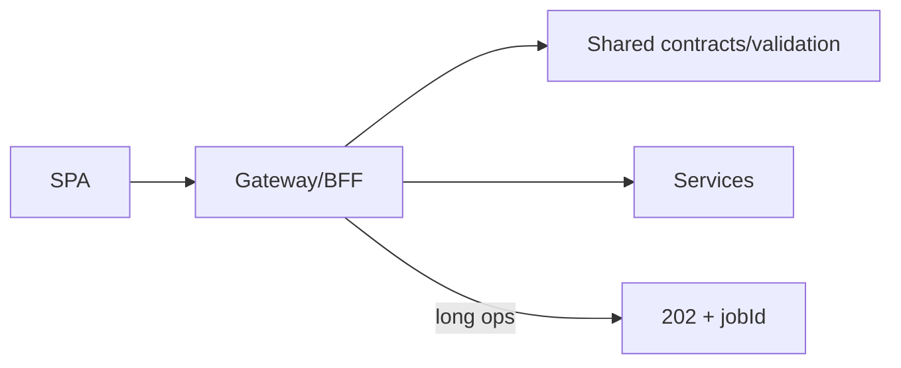

# 16 — API Architecture

> **Related:** [02_System_Architecture](02_System_Architecture.md) · [05_AI_Workflow](05_AI_Workflow.md) · [10_AI_Credits](10_AI_Credits.md) · [12_Background_Jobs](12_Background_Jobs.md) · [32_Error_Handling](32_Error_Handling.md)

---

## Executive Summary

The API is resource-oriented, channel-scoped, versioned, and contract-first. A BFF/gateway exposes endpoints under /channels/:id/..., enforces auth, validation, and rate limits, and shapes responses for the SPA. Expensive operations follow the estimate → accept → run pattern and return 202 + job id. Contracts are defined in a shared package and validated at the boundary.

---

## Purpose

Define API Architecture for CreatorForce in enough detail that a senior engineer can implement it without guessing, consistent with the channel-first, non-destructive, transparent-AI principles of the platform.

---

## Goals

- Resource-oriented, channel-scoped endpoints
- Contract-first, versioned APIs
- Estimate/accept/run for paid AI actions
- 202 + job id for long operations

---

## Scope

In scope: as described above. Out of scope: detail owned by the related documents.

---

## Architecture / Workflow



---

## Folder Structure

```
api-architecture/
├── core/
├── api/
├── ui/
└── tests/
```

---

## Database Design

Uses the channel-scoped schema in [03_Database_Architecture](03_Database_Architecture.md); all domain rows carry `channel_id`.

---

## API Design

Conventions: nouns + channel scope, cursor pagination, consistent error envelope, idempotency keys on mutating job enqueues, ETags for cacheable reads. Example error envelope: {code, message, details, correlationId}.

---

## UI Design

Follows [17_Frontend_UI_UX](17_Frontend_UI_UX.md) and [19_Design_System](19_Design_System.md): fast, minimal, accessible.

---

## Component Design

Reusable, dependency-injected, accessible components per [18_Component_Guidelines](18_Component_Guidelines.md).

---

## Business Rules

- All domain endpoints are channel-scoped and authorized.
- Paid AI actions require a prior accepted estimate.
- Long operations return 202 + job id, never block.

---

## Validation Rules

- Validate every payload against contract schemas.
- Whitelist query params; validate cursors.
- Version breaking changes.

---

## Security

Per-channel authorization, input validation, secret management, and audit logging per [14_Security](14_Security.md).

---

## Performance

Async execution, caching, and pagination per [13_Performance](13_Performance.md) and [44_Performance_Budget](44_Performance_Budget.md).

---

## Caching

Channel-scoped, event-invalidated caching per [36_Caching](36_Caching.md).

---

## Background Jobs

Expensive work runs as jobs with retry/cancel/resume and credit hooks per [12_Background_Jobs](12_Background_Jobs.md).

---

## Error Handling

Typed error envelope, no silent failures, rollback on paid-action failure per [32_Error_Handling](32_Error_Handling.md).

---

## Logging

Structured, correlation-ID'd logs (AI actions include model/tokens/credits) per [38_Logging](38_Logging.md).

---

## Testing

Unit, integration, and (where user-facing) E2E/accessibility/visual/performance/security tests, all in CI. See [21_Testing_Strategy](21_Testing_Strategy.md).

---

## Acceptance Criteria

- [ ] All endpoints channel-scoped + authorized.
- [ ] Contracts validated at boundary.
- [ ] Estimate/accept/run enforced.
- [ ] Long ops return 202 + job id.

---

## Edge Cases

- Empty/at-scale inputs.
- Provider/quota failures with resume.
- Concurrent edits (last-writer-wins + version).
- Revoked credentials mid-operation.

---

## Risks

| Risk | Mitigation |
|---|---|
| Scale hotspots | Pagination, cache, replicas |
| Provider variability | Abstraction + retries/fallback |
| Scope creep | Priority gating ([50_IMPLEMENTATION_PLAN](50_IMPLEMENTATION_PLAN.md)) |

---

## Future Improvements

- Deeper automation with preview.
- Team-aware capabilities.
- Additional integrations.

---

## Implementation Checklist

- [ ] Resource-oriented, channel-scoped endpoints.
- [ ] Contract-first, versioned APIs.
- [ ] Estimate/accept/run for paid AI actions.
- [ ] 202 + job id for long operations.

---

## References

[02_System_Architecture](02_System_Architecture.md) · [05_AI_Workflow](05_AI_Workflow.md) · [10_AI_Credits](10_AI_Credits.md) · [12_Background_Jobs](12_Background_Jobs.md) · [32_Error_Handling](32_Error_Handling.md)
