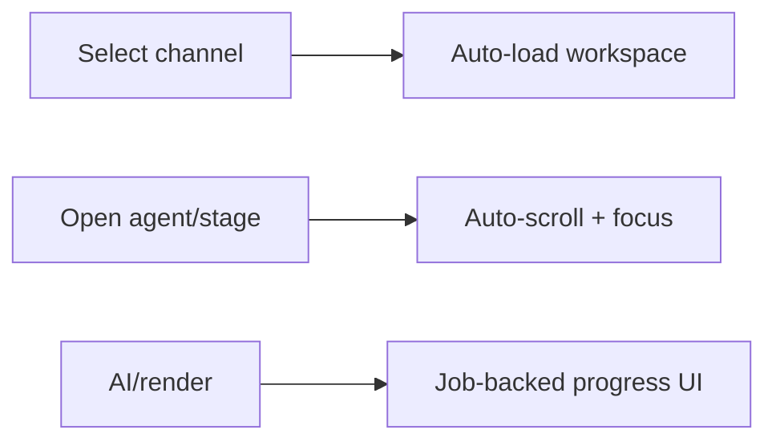

# 17 — Frontend UI/UX

> **Related:** [04_Channel_Workspace](04_Channel_Workspace.md) · [18_Component_Guidelines](18_Component_Guidelines.md) · [19_Design_System](19_Design_System.md) · [42_Accessibility](42_Accessibility.md) · [37_State_Management](37_State_Management.md)

---

## Executive Summary

The interface is fast, predictable, minimal, professional, responsive, and accessible — designed for creators, not developers. AI reduces clicks and never adds complexity. Key behaviors: auto-load on channel select, auto-scroll and auto-focus when opening an agent/stage, smooth transitions, and job-backed UI for async work. It follows the design system and WCAG 2.2 AA.

---

## Purpose

Define Frontend UI/UX for CreatorForce in enough detail that a senior engineer can implement it without guessing, consistent with the channel-first, non-destructive, transparent-AI principles of the platform.

---

## Goals

- Fast, minimal, predictable creator UX
- Auto-load/auto-focus/auto-scroll behaviors
- Responsive + accessible (WCAG 2.2 AA)
- AI reduces clicks, never adds friction

---

## Scope

In scope: as described above. Out of scope: detail owned by the related documents.

---

## Architecture / Workflow



---

## Folder Structure

```
frontend-ui-ux/
├── core/
├── api/
├── ui/
└── tests/
```

---

## Database Design

Uses the channel-scoped schema in [03_Database_Architecture](03_Database_Architecture.md); all domain rows carry `channel_id`.

---

## API Design

Endpoints are channel-scoped and versioned; long operations return 202 + job id. See [16_API_Architecture](16_API_Architecture.md).

---

## UI Design

Layout: workspace shell (switcher, nav, main, context rail). Interaction: optimistic quick edits, job-backed AI/render, estimate modals before paid actions. Motion: smooth, non-jarring transitions. Responsive breakpoints; keyboard-first.

---

## Component Design

Reusable, dependency-injected, accessible components per [18_Component_Guidelines](18_Component_Guidelines.md).

---

## Business Rules

- Selecting a channel auto-loads its workspace.
- Opening an agent auto-scrolls + focuses the primary input.
- Async actions show job progress, never freeze the UI.

---

## Validation Rules

- Inputs sanitized (XSS) and validated inline.
- Accessible labels/roles on all controls.

---

## Security

Per-channel authorization, input validation, secret management, and audit logging per [14_Security](14_Security.md).

---

## Performance

Async execution, caching, and pagination per [13_Performance](13_Performance.md) and [44_Performance_Budget](44_Performance_Budget.md).

---

## Caching

Channel-scoped, event-invalidated caching per [36_Caching](36_Caching.md).

---

## Background Jobs

Expensive work runs as jobs with retry/cancel/resume and credit hooks per [12_Background_Jobs](12_Background_Jobs.md).

---

## Error Handling

Typed error envelope, no silent failures, rollback on paid-action failure per [32_Error_Handling](32_Error_Handling.md).

---

## Logging

Structured, correlation-ID'd logs (AI actions include model/tokens/credits) per [38_Logging](38_Logging.md).

---

## Testing

Unit, integration, and (where user-facing) E2E/accessibility/visual/performance/security tests, all in CI. See [21_Testing_Strategy](21_Testing_Strategy.md).

---

## Acceptance Criteria

- [ ] Auto-load, auto-scroll, auto-focus behaviors work.
- [ ] WCAG 2.2 AA met.
- [ ] Estimates shown before paid actions.
- [ ] Responsive across breakpoints.

---

## Edge Cases

- Empty/at-scale inputs.
- Provider/quota failures with resume.
- Concurrent edits (last-writer-wins + version).
- Revoked credentials mid-operation.

---

## Risks

| Risk | Mitigation |
|---|---|
| Scale hotspots | Pagination, cache, replicas |
| Provider variability | Abstraction + retries/fallback |
| Scope creep | Priority gating ([50_IMPLEMENTATION_PLAN](50_IMPLEMENTATION_PLAN.md)) |

---

## Future Improvements

- Deeper automation with preview.
- Team-aware capabilities.
- Additional integrations.

---

## Implementation Checklist

- [ ] Fast, minimal, predictable creator UX.
- [ ] Auto-load/auto-focus/auto-scroll behaviors.
- [ ] Responsive + accessible (WCAG 2.2 AA).
- [ ] AI reduces clicks, never adds friction.

---

## References

[04_Channel_Workspace](04_Channel_Workspace.md) · [18_Component_Guidelines](18_Component_Guidelines.md) · [19_Design_System](19_Design_System.md) · [42_Accessibility](42_Accessibility.md) · [37_State_Management](37_State_Management.md)
