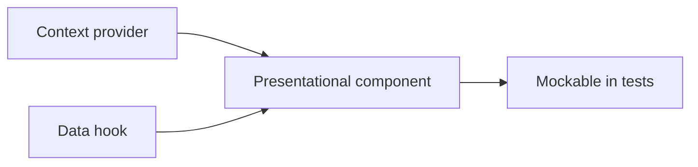

# 18 — Component Guidelines

> **Related:** [17_Frontend_UI_UX](17_Frontend_UI_UX.md) · [19_Design_System](19_Design_System.md) · [31_Coding_Standards](31_Coding_Standards.md) · [37_State_Management](37_State_Management.md) · [42_Accessibility](42_Accessibility.md)

---

## Executive Summary

Components are reusable, loosely coupled, accessible, and testable. They receive data via injected providers/hooks (not global singletons) so they can be mocked in tests. Guidelines cover composition over inheritance, prop contracts, state boundaries, accessibility, and performance (memoization, virtualization).

---

## Purpose

Define Component Guidelines for CreatorForce in enough detail that a senior engineer can implement it without guessing, consistent with the channel-first, non-destructive, transparent-AI principles of the platform.

---

## Goals

- Reusable, loosely coupled components
- Dependency-injected data sources (testable)
- Accessible by default
- Performance-conscious (memo/virtualize)

---

## Scope

In scope: as described above. Out of scope: detail owned by the related documents.

---

## Architecture / Workflow



---

## Folder Structure

```
component-guidelines/
├── core/
├── api/
├── ui/
└── tests/
```

---

## Database Design

Uses the channel-scoped schema in [03_Database_Architecture](03_Database_Architecture.md); all domain rows carry `channel_id`.

---

## API Design

Endpoints are channel-scoped and versioned; long operations return 202 + job id. See [16_API_Architecture](16_API_Architecture.md).

---

## UI Design

Follows [17_Frontend_UI_UX](17_Frontend_UI_UX.md) and [19_Design_System](19_Design_System.md): fast, minimal, accessible.

---

## Component Design

Patterns: presentational vs container split, compound components for complex widgets (timeline, filters), controlled inputs, error boundaries per panel, virtualization for lists.

---

## Business Rules

- Components depend on interfaces/hooks, not concrete services.
- Shared UI lives in a component library; no duplication.
- Every interactive component is accessible.

---

## Validation Rules

- Prop types/contracts enforced.
- No direct DOM/security-sensitive manipulation without sanitization.

---

## Security

Per-channel authorization, input validation, secret management, and audit logging per [14_Security](14_Security.md).

---

## Performance

Async execution, caching, and pagination per [13_Performance](13_Performance.md) and [44_Performance_Budget](44_Performance_Budget.md).

---

## Caching

Channel-scoped, event-invalidated caching per [36_Caching](36_Caching.md).

---

## Background Jobs

Expensive work runs as jobs with retry/cancel/resume and credit hooks per [12_Background_Jobs](12_Background_Jobs.md).

---

## Error Handling

Typed error envelope, no silent failures, rollback on paid-action failure per [32_Error_Handling](32_Error_Handling.md).

---

## Logging

Structured, correlation-ID'd logs (AI actions include model/tokens/credits) per [38_Logging](38_Logging.md).

---

## Testing

Unit, integration, and (where user-facing) E2E/accessibility/visual/performance/security tests, all in CI. See [21_Testing_Strategy](21_Testing_Strategy.md).

---

## Acceptance Criteria

- [ ] Shared components reused (no duplication).
- [ ] Components testable via injected data.
- [ ] Accessibility on all interactive components.
- [ ] Lists virtualized where large.

---

## Edge Cases

- Empty/at-scale inputs.
- Provider/quota failures with resume.
- Concurrent edits (last-writer-wins + version).
- Revoked credentials mid-operation.

---

## Risks

| Risk | Mitigation |
|---|---|
| Scale hotspots | Pagination, cache, replicas |
| Provider variability | Abstraction + retries/fallback |
| Scope creep | Priority gating ([50_IMPLEMENTATION_PLAN](50_IMPLEMENTATION_PLAN.md)) |

---

## Future Improvements

- Deeper automation with preview.
- Team-aware capabilities.
- Additional integrations.

---

## Implementation Checklist

- [ ] Reusable, loosely coupled components.
- [ ] Dependency-injected data sources (testable).
- [ ] Accessible by default.
- [ ] Performance-conscious (memo/virtualize).

---

## References

[17_Frontend_UI_UX](17_Frontend_UI_UX.md) · [19_Design_System](19_Design_System.md) · [31_Coding_Standards](31_Coding_Standards.md) · [37_State_Management](37_State_Management.md) · [42_Accessibility](42_Accessibility.md)
