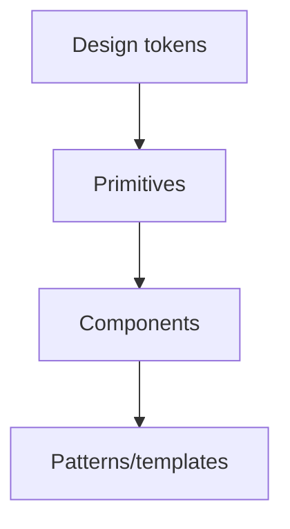

# 19 — Design System

> **Related:** [17_Frontend_UI_UX](17_Frontend_UI_UX.md) · [18_Component_Guidelines](18_Component_Guidelines.md) · [42_Accessibility](42_Accessibility.md)

---

## Executive Summary

A token-driven design system provides consistent color, typography, spacing, elevation, motion, and components across CreatorForce. It is original (inspired by, not copied from, pro tools), themeable, and accessible. Tokens are the single source of truth consumed by all components.

---

## Purpose

Define Design System for CreatorForce in enough detail that a senior engineer can implement it without guessing, consistent with the channel-first, non-destructive, transparent-AI principles of the platform.

---

## Goals

- Token-driven, consistent visual language
- Original, professional aesthetic
- Accessible color/typography by default
- Themeable and scalable

---

## Scope

In scope: as described above. Out of scope: detail owned by the related documents.

---

## Architecture / Workflow



---

## Folder Structure

```
design-system/
├── core/
├── api/
├── ui/
└── tests/
```

---

## Database Design

Uses the channel-scoped schema in [03_Database_Architecture](03_Database_Architecture.md); all domain rows carry `channel_id`.

---

## API Design

Endpoints are channel-scoped and versioned; long operations return 202 + job id. See [16_API_Architecture](16_API_Architecture.md).

---

## UI Design

Foundations: color scales, type scale, spacing grid, radius, elevation, motion curves. Components: buttons, inputs, modals, cards, tables, timeline primitives. Theming via token overrides.

---

## Component Design

Reusable, dependency-injected, accessible components per [18_Component_Guidelines](18_Component_Guidelines.md).

---

## Business Rules

- All components consume tokens; no hard-coded values.
- Contrast ratios meet WCAG AA.
- The system is original, not a competitor clone.

---

## Validation Rules

- Lint against non-token color/spacing usage.
- Verify contrast in CI.

---

## Security

Per-channel authorization, input validation, secret management, and audit logging per [14_Security](14_Security.md).

---

## Performance

Async execution, caching, and pagination per [13_Performance](13_Performance.md) and [44_Performance_Budget](44_Performance_Budget.md).

---

## Caching

Channel-scoped, event-invalidated caching per [36_Caching](36_Caching.md).

---

## Background Jobs

Expensive work runs as jobs with retry/cancel/resume and credit hooks per [12_Background_Jobs](12_Background_Jobs.md).

---

## Error Handling

Typed error envelope, no silent failures, rollback on paid-action failure per [32_Error_Handling](32_Error_Handling.md).

---

## Logging

Structured, correlation-ID'd logs (AI actions include model/tokens/credits) per [38_Logging](38_Logging.md).

---

## Testing

Unit, integration, and (where user-facing) E2E/accessibility/visual/performance/security tests, all in CI. See [21_Testing_Strategy](21_Testing_Strategy.md).

---

## Acceptance Criteria

- [ ] Tokens are the single source of truth.
- [ ] Contrast checks pass in CI.
- [ ] No hard-coded design values in components.
- [ ] Theming supported.

---

## Edge Cases

- Empty/at-scale inputs.
- Provider/quota failures with resume.
- Concurrent edits (last-writer-wins + version).
- Revoked credentials mid-operation.

---

## Risks

| Risk | Mitigation |
|---|---|
| Scale hotspots | Pagination, cache, replicas |
| Provider variability | Abstraction + retries/fallback |
| Scope creep | Priority gating ([50_IMPLEMENTATION_PLAN](50_IMPLEMENTATION_PLAN.md)) |

---

## Future Improvements

- Deeper automation with preview.
- Team-aware capabilities.
- Additional integrations.

---

## Implementation Checklist

- [ ] Token-driven, consistent visual language.
- [ ] Original, professional aesthetic.
- [ ] Accessible color/typography by default.
- [ ] Themeable and scalable.

---

## References

[17_Frontend_UI_UX](17_Frontend_UI_UX.md) · [18_Component_Guidelines](18_Component_Guidelines.md) · [42_Accessibility](42_Accessibility.md)
