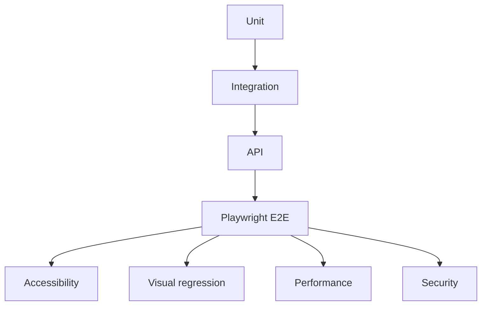

# 21 — Testing Strategy

> **Related:** [22_Playwright_Testing](22_Playwright_Testing.md) · [23_OWASP_ZAP](23_OWASP_ZAP.md) · [24_BurpSuite](24_BurpSuite.md) · [25_Snyk](25_Snyk.md) · [27_Semgrep](27_Semgrep.md) · [29_CI_CD](29_CI_CD.md)

---

## Executive Summary

Every feature ships with a full test suite: unit, integration, API, end-to-end (Playwright), accessibility, cross-browser, visual regression, performance, and security tests — all runnable in CI with clear pass/fail gates. The pyramid favors fast unit/integration tests with targeted E2E for critical flows.

---

## Purpose

Define Testing Strategy for CreatorForce in enough detail that a senior engineer can implement it without guessing, consistent with the channel-first, non-destructive, transparent-AI principles of the platform.

---

## Goals

- Comprehensive, layered test coverage
- CI-enforced pass/fail gates
- Critical flows covered E2E
- A11y, visual, perf, security in CI

---

## Scope

In scope: as described above. Out of scope: detail owned by the related documents.

---

## Architecture / Workflow



---

## Folder Structure

```
testing-strategy/
├── core/
├── api/
├── ui/
└── tests/
```

---

## Database Design

Uses the channel-scoped schema in [03_Database_Architecture](03_Database_Architecture.md); all domain rows carry `channel_id`.

---

## API Design

Endpoints are channel-scoped and versioned; long operations return 202 + job id. See [16_API_Architecture](16_API_Architecture.md).

---

## UI Design

Follows [17_Frontend_UI_UX](17_Frontend_UI_UX.md) and [19_Design_System](19_Design_System.md): fast, minimal, accessible.

---

## Component Design

Reusable, dependency-injected, accessible components per [18_Component_Guidelines](18_Component_Guidelines.md).

---

## Business Rules

- No feature merges without required tests.
- Critical flows (auth, workflow, credits, publish) have E2E.
- Security and a11y checks are CI gates.

---

## Validation Rules

- Coverage thresholds enforced.
- Flaky tests quarantined + fixed.

---

## Security

Per-channel authorization, input validation, secret management, and audit logging per [14_Security](14_Security.md).

---

## Performance

Async execution, caching, and pagination per [13_Performance](13_Performance.md) and [44_Performance_Budget](44_Performance_Budget.md).

---

## Caching

Channel-scoped, event-invalidated caching per [36_Caching](36_Caching.md).

---

## Background Jobs

Expensive work runs as jobs with retry/cancel/resume and credit hooks per [12_Background_Jobs](12_Background_Jobs.md).

---

## Error Handling

Typed error envelope, no silent failures, rollback on paid-action failure per [32_Error_Handling](32_Error_Handling.md).

---

## Logging

Structured, correlation-ID'd logs (AI actions include model/tokens/credits) per [38_Logging](38_Logging.md).

---

## Testing

Layers and tools: unit/integration (Vitest/Jest), API tests, E2E ([22_Playwright_Testing](22_Playwright_Testing.md)), visual regression, accessibility (axe), cross-browser, load/perf, chaos, security (ZAP/Burp/Semgrep/Snyk).

---

## Acceptance Criteria

- [ ] All layers present and in CI.
- [ ] Coverage thresholds met.
- [ ] Critical flows have E2E.
- [ ] A11y + security gates enforced.

---

## Edge Cases

- Empty/at-scale inputs.
- Provider/quota failures with resume.
- Concurrent edits (last-writer-wins + version).
- Revoked credentials mid-operation.

---

## Risks

| Risk | Mitigation |
|---|---|
| Scale hotspots | Pagination, cache, replicas |
| Provider variability | Abstraction + retries/fallback |
| Scope creep | Priority gating ([50_IMPLEMENTATION_PLAN](50_IMPLEMENTATION_PLAN.md)) |

---

## Future Improvements

- Deeper automation with preview.
- Team-aware capabilities.
- Additional integrations.

---

## Implementation Checklist

- [ ] Comprehensive, layered test coverage.
- [ ] CI-enforced pass/fail gates.
- [ ] Critical flows covered E2E.
- [ ] A11y, visual, perf, security in CI.

---

## References

[22_Playwright_Testing](22_Playwright_Testing.md) · [23_OWASP_ZAP](23_OWASP_ZAP.md) · [24_BurpSuite](24_BurpSuite.md) · [25_Snyk](25_Snyk.md) · [27_Semgrep](27_Semgrep.md) · [29_CI_CD](29_CI_CD.md)
