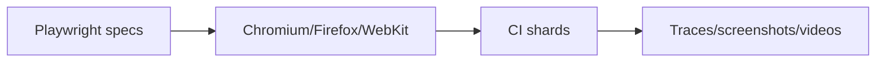

# 22 — Playwright Testing

> **Related:** [21_Testing_Strategy](21_Testing_Strategy.md) · [29_CI_CD](29_CI_CD.md) · [42_Accessibility](42_Accessibility.md) · [15_Authentication](15_Authentication.md)

---

## Executive Summary

Playwright drives end-to-end and cross-browser tests across Chromium, Firefox, and WebKit. It covers critical journeys (sign-in for each method, channel connect + sync, full AI workflow with edits, credit estimate/budget, publish), plus visual regression and accessibility assertions. Tests run in CI with sharding, retries for flakiness triage, traces, and screenshots on failure.

---

## Purpose

Define Playwright Testing for CreatorForce in enough detail that a senior engineer can implement it without guessing, consistent with the channel-first, non-destructive, transparent-AI principles of the platform.

---

## Goals

- E2E coverage of critical journeys
- Cross-browser (Chromium/Firefox/WebKit)
- Visual + a11y assertions
- CI sharding, traces, artifacts

---

## Scope

In scope: as described above. Out of scope: detail owned by the related documents.

---

## Architecture / Workflow



---

## Folder Structure

```
playwright-testing/
├── core/
├── api/
├── ui/
└── tests/
```

---

## Database Design

Uses the channel-scoped schema in [03_Database_Architecture](03_Database_Architecture.md); all domain rows carry `channel_id`.

---

## API Design

Endpoints are channel-scoped and versioned; long operations return 202 + job id. See [16_API_Architecture](16_API_Architecture.md).

---

## UI Design

Follows [17_Frontend_UI_UX](17_Frontend_UI_UX.md) and [19_Design_System](19_Design_System.md): fast, minimal, accessible.

---

## Component Design

Reusable, dependency-injected, accessible components per [18_Component_Guidelines](18_Component_Guidelines.md).

---

## Business Rules

- Critical journeys must have Playwright coverage.
- Failures upload traces + screenshots.
- Cross-browser runs on release branches.

---

## Validation Rules

- Stable selectors (test ids), no brittle locators.
- Deterministic test data.

---

## Security

Per-channel authorization, input validation, secret management, and audit logging per [14_Security](14_Security.md).

---

## Performance

Async execution, caching, and pagination per [13_Performance](13_Performance.md) and [44_Performance_Budget](44_Performance_Budget.md).

---

## Caching

Channel-scoped, event-invalidated caching per [36_Caching](36_Caching.md).

---

## Background Jobs

Expensive work runs as jobs with retry/cancel/resume and credit hooks per [12_Background_Jobs](12_Background_Jobs.md).

---

## Error Handling

Typed error envelope, no silent failures, rollback on paid-action failure per [32_Error_Handling](32_Error_Handling.md).

---

## Logging

Structured, correlation-ID'd logs (AI actions include model/tokens/credits) per [38_Logging](38_Logging.md).

---

## Testing

Config: projects per browser, base URL per env, trace on first retry, video on failure. Journeys: auth per provider, channel sync at scale, workflow + selective regeneration, estimate/budget, edit studio, publish. Include axe a11y and screenshot diffs.

---

## Acceptance Criteria

- [ ] Critical journeys covered across 3 engines.
- [ ] Traces/screenshots on failure.
- [ ] Visual + a11y assertions integrated.
- [ ] Runs sharded in CI.

---

## Edge Cases

- Empty/at-scale inputs.
- Provider/quota failures with resume.
- Concurrent edits (last-writer-wins + version).
- Revoked credentials mid-operation.

---

## Risks

| Risk | Mitigation |
|---|---|
| Scale hotspots | Pagination, cache, replicas |
| Provider variability | Abstraction + retries/fallback |
| Scope creep | Priority gating ([50_IMPLEMENTATION_PLAN](50_IMPLEMENTATION_PLAN.md)) |

---

## Future Improvements

- Deeper automation with preview.
- Team-aware capabilities.
- Additional integrations.

---

## Implementation Checklist

- [ ] E2E coverage of critical journeys.
- [ ] Cross-browser (Chromium/Firefox/WebKit).
- [ ] Visual + a11y assertions.
- [ ] CI sharding, traces, artifacts.

---

## References

[21_Testing_Strategy](21_Testing_Strategy.md) · [29_CI_CD](29_CI_CD.md) · [42_Accessibility](42_Accessibility.md) · [15_Authentication](15_Authentication.md)
