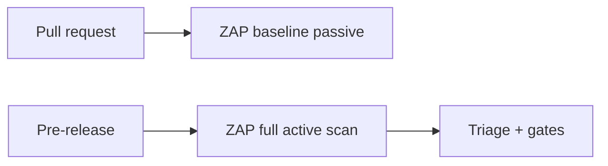

# 23 — OWASP ZAP

> **Related:** [14_Security](14_Security.md) · [24_BurpSuite](24_BurpSuite.md) · [25_Snyk](25_Snyk.md) · [27_Semgrep](27_Semgrep.md) · [29_CI_CD](29_CI_CD.md)

---

## Executive Summary

OWASP ZAP performs automated dynamic application security testing (DAST) in CI. Baseline passive scans run on every pull request; full active scans run on a schedule and before releases against a staging environment. Findings are triaged with severity gates that block merges/releases on high-severity issues.

---

## Purpose

Define OWASP ZAP for CreatorForce in enough detail that a senior engineer can implement it without guessing, consistent with the channel-first, non-destructive, transparent-AI principles of the platform.

---

## Goals

- Automated DAST in CI
- Passive scans per PR, active scans pre-release
- Severity gates block high findings
- Authenticated scanning of protected routes

---

## Scope

In scope: as described above. Out of scope: detail owned by the related documents.

---

## Architecture / Workflow



---

## Folder Structure

```
owasp-zap/
├── core/
├── api/
├── ui/
└── tests/
```

---

## Database Design

Uses the channel-scoped schema in [03_Database_Architecture](03_Database_Architecture.md); all domain rows carry `channel_id`.

---

## API Design

Endpoints are channel-scoped and versioned; long operations return 202 + job id. See [16_API_Architecture](16_API_Architecture.md).

---

## UI Design

Follows [17_Frontend_UI_UX](17_Frontend_UI_UX.md) and [19_Design_System](19_Design_System.md): fast, minimal, accessible.

---

## Component Design

Reusable, dependency-injected, accessible components per [18_Component_Guidelines](18_Component_Guidelines.md).

---

## Business Rules

- High-severity findings block merge/release.
- Active scans target staging, never production.
- Authenticated scans cover protected routes.

---

## Validation Rules

- Maintain scan context + auth scripts.
- Suppress false positives with documented justification.

---

## Security

Config: baseline scan in PR pipeline; scheduled full scan; authenticated context using a test session; alert thresholds mapped to CI gates. Complements static tools ([27_Semgrep.md], [25_Snyk.md]).

---

## Performance

Async execution, caching, and pagination per [13_Performance](13_Performance.md) and [44_Performance_Budget](44_Performance_Budget.md).

---

## Caching

Channel-scoped, event-invalidated caching per [36_Caching](36_Caching.md).

---

## Background Jobs

Expensive work runs as jobs with retry/cancel/resume and credit hooks per [12_Background_Jobs](12_Background_Jobs.md).

---

## Error Handling

Typed error envelope, no silent failures, rollback on paid-action failure per [32_Error_Handling](32_Error_Handling.md).

---

## Logging

Structured, correlation-ID'd logs (AI actions include model/tokens/credits) per [38_Logging](38_Logging.md).

---

## Testing

Unit, integration, and (where user-facing) E2E/accessibility/visual/performance/security tests, all in CI. See [21_Testing_Strategy](21_Testing_Strategy.md).

---

## Acceptance Criteria

- [ ] Passive scan on every PR.
- [ ] Full authenticated scan pre-release.
- [ ] High findings gate the pipeline.
- [ ] False positives documented.

---

## Edge Cases

- Empty/at-scale inputs.
- Provider/quota failures with resume.
- Concurrent edits (last-writer-wins + version).
- Revoked credentials mid-operation.

---

## Risks

| Risk | Mitigation |
|---|---|
| Scale hotspots | Pagination, cache, replicas |
| Provider variability | Abstraction + retries/fallback |
| Scope creep | Priority gating ([50_IMPLEMENTATION_PLAN](50_IMPLEMENTATION_PLAN.md)) |

---

## Future Improvements

- Deeper automation with preview.
- Team-aware capabilities.
- Additional integrations.

---

## Implementation Checklist

- [ ] Automated DAST in CI.
- [ ] Passive scans per PR, active scans pre-release.
- [ ] Severity gates block high findings.
- [ ] Authenticated scanning of protected routes.

---

## References

[14_Security](14_Security.md) · [24_BurpSuite](24_BurpSuite.md) · [25_Snyk](25_Snyk.md) · [27_Semgrep](27_Semgrep.md) · [29_CI_CD](29_CI_CD.md)
