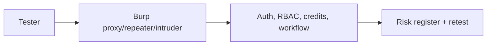

# 24 — Burp Suite

> **Related:** [14_Security](14_Security.md) · [23_OWASP_ZAP](23_OWASP_ZAP.md) · [47_Risk_Register](47_Risk_Register.md) · [15_Authentication](15_Authentication.md)

---

## Executive Summary

Burp Suite supports manual and semi-automated penetration testing beyond automated DAST. It is used for deep authorization testing (per-channel isolation, RBAC), business-logic flaws (credit reservation abuse, workflow tampering), and auth flows. Findings feed the risk register and are retested after fixes.

---

## Purpose

Define Burp Suite for CreatorForce in enough detail that a senior engineer can implement it without guessing, consistent with the channel-first, non-destructive, transparent-AI principles of the platform.

---

## Goals

- Manual/semi-automated pentesting
- Deep authorization + business-logic testing
- Auth-flow probing
- Findings tracked to closure

---

## Scope

In scope: as described above. Out of scope: detail owned by the related documents.

---

## Architecture / Workflow



---

## Folder Structure

```
burp-suite/
├── core/
├── api/
├── ui/
└── tests/
```

---

## Database Design

Uses the channel-scoped schema in [03_Database_Architecture](03_Database_Architecture.md); all domain rows carry `channel_id`.

---

## API Design

Endpoints are channel-scoped and versioned; long operations return 202 + job id. See [16_API_Architecture](16_API_Architecture.md).

---

## UI Design

Follows [17_Frontend_UI_UX](17_Frontend_UI_UX.md) and [19_Design_System](19_Design_System.md): fast, minimal, accessible.

---

## Component Design

Reusable, dependency-injected, accessible components per [18_Component_Guidelines](18_Component_Guidelines.md).

---

## Business Rules

- Pentests run pre-major-release and on sensitive changes.
- Findings logged in the risk register with owners.
- Retest required before closure.

---

## Validation Rules

- Test in staging with authorized scope.
- Never test production without approval.

---

## Security

Focus areas: horizontal/vertical privilege escalation across channels, credit reservation/settlement abuse, IDOR on assets/versions, OAuth/session handling, prompt-injection paths.

---

## Performance

Async execution, caching, and pagination per [13_Performance](13_Performance.md) and [44_Performance_Budget](44_Performance_Budget.md).

---

## Caching

Channel-scoped, event-invalidated caching per [36_Caching](36_Caching.md).

---

## Background Jobs

Expensive work runs as jobs with retry/cancel/resume and credit hooks per [12_Background_Jobs](12_Background_Jobs.md).

---

## Error Handling

Typed error envelope, no silent failures, rollback on paid-action failure per [32_Error_Handling](32_Error_Handling.md).

---

## Logging

Structured, correlation-ID'd logs (AI actions include model/tokens/credits) per [38_Logging](38_Logging.md).

---

## Testing

Unit, integration, and (where user-facing) E2E/accessibility/visual/performance/security tests, all in CI. See [21_Testing_Strategy](21_Testing_Strategy.md).

---

## Acceptance Criteria

- [ ] Authorization isolation verified across channels.
- [ ] Business-logic abuse cases tested.
- [ ] Findings tracked + retested.
- [ ] Scope + approvals documented.

---

## Edge Cases

- Empty/at-scale inputs.
- Provider/quota failures with resume.
- Concurrent edits (last-writer-wins + version).
- Revoked credentials mid-operation.

---

## Risks

| Risk | Mitigation |
|---|---|
| Scale hotspots | Pagination, cache, replicas |
| Provider variability | Abstraction + retries/fallback |
| Scope creep | Priority gating ([50_IMPLEMENTATION_PLAN](50_IMPLEMENTATION_PLAN.md)) |

---

## Future Improvements

- Deeper automation with preview.
- Team-aware capabilities.
- Additional integrations.

---

## Implementation Checklist

- [ ] Manual/semi-automated pentesting.
- [ ] Deep authorization + business-logic testing.
- [ ] Auth-flow probing.
- [ ] Findings tracked to closure.

---

## References

[14_Security](14_Security.md) · [23_OWASP_ZAP](23_OWASP_ZAP.md) · [47_Risk_Register](47_Risk_Register.md) · [15_Authentication](15_Authentication.md)
