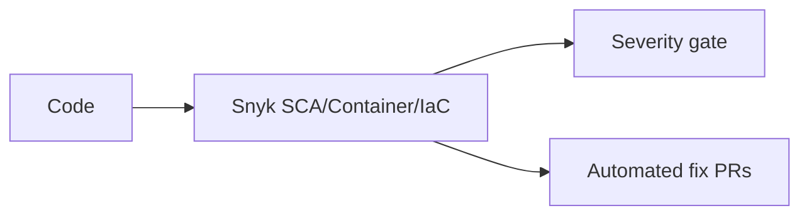

# 25 — Snyk

> **Related:** [14_Security](14_Security.md) · [26_Dependabot](26_Dependabot.md) · [27_Semgrep](27_Semgrep.md) · [29_CI_CD](29_CI_CD.md) · [30_Deployment](30_Deployment.md)

---

## Executive Summary

Snyk provides software composition analysis (SCA), container, and IaC scanning. It runs in CI to detect vulnerable dependencies, insecure container images, and misconfigured infrastructure, with severity gates and automated fix PRs where possible. It complements Dependabot for dependency hygiene.

---

## Purpose

Define Snyk for CreatorForce in enough detail that a senior engineer can implement it without guessing, consistent with the channel-first, non-destructive, transparent-AI principles of the platform.

---

## Goals

- SCA for dependency vulnerabilities
- Container + IaC scanning
- CI severity gates + fix PRs
- License compliance checks

---

## Scope

In scope: as described above. Out of scope: detail owned by the related documents.

---

## Architecture / Workflow



---

## Folder Structure

```
snyk/
├── core/
├── api/
├── ui/
└── tests/
```

---

## Database Design

Uses the channel-scoped schema in [03_Database_Architecture](03_Database_Architecture.md); all domain rows carry `channel_id`.

---

## API Design

Endpoints are channel-scoped and versioned; long operations return 202 + job id. See [16_API_Architecture](16_API_Architecture.md).

---

## UI Design

Follows [17_Frontend_UI_UX](17_Frontend_UI_UX.md) and [19_Design_System](19_Design_System.md): fast, minimal, accessible.

---

## Component Design

Reusable, dependency-injected, accessible components per [18_Component_Guidelines](18_Component_Guidelines.md).

---

## Business Rules

- Critical/high vulns block the pipeline.
- Container + IaC scanned before deploy.
- License violations flagged.

---

## Validation Rules

- Ignore rules require justification + expiry.
- Base images pinned and scanned.

---

## Security

Integrations: PR checks, monitored projects for new disclosures, container registry scanning, IaC policy checks. Works alongside [26_Dependabot.md] and [27_Semgrep.md].

---

## Performance

Async execution, caching, and pagination per [13_Performance](13_Performance.md) and [44_Performance_Budget](44_Performance_Budget.md).

---

## Caching

Channel-scoped, event-invalidated caching per [36_Caching](36_Caching.md).

---

## Background Jobs

Expensive work runs as jobs with retry/cancel/resume and credit hooks per [12_Background_Jobs](12_Background_Jobs.md).

---

## Error Handling

Typed error envelope, no silent failures, rollback on paid-action failure per [32_Error_Handling](32_Error_Handling.md).

---

## Logging

Structured, correlation-ID'd logs (AI actions include model/tokens/credits) per [38_Logging](38_Logging.md).

---

## Testing

Unit, integration, and (where user-facing) E2E/accessibility/visual/performance/security tests, all in CI. See [21_Testing_Strategy](21_Testing_Strategy.md).

---

## Acceptance Criteria

- [ ] Dependencies scanned in CI with gates.
- [ ] Containers + IaC scanned pre-deploy.
- [ ] Fix PRs enabled.
- [ ] License policy enforced.

---

## Edge Cases

- Empty/at-scale inputs.
- Provider/quota failures with resume.
- Concurrent edits (last-writer-wins + version).
- Revoked credentials mid-operation.

---

## Risks

| Risk | Mitigation |
|---|---|
| Scale hotspots | Pagination, cache, replicas |
| Provider variability | Abstraction + retries/fallback |
| Scope creep | Priority gating ([50_IMPLEMENTATION_PLAN](50_IMPLEMENTATION_PLAN.md)) |

---

## Future Improvements

- Deeper automation with preview.
- Team-aware capabilities.
- Additional integrations.

---

## Implementation Checklist

- [ ] SCA for dependency vulnerabilities.
- [ ] Container + IaC scanning.
- [ ] CI severity gates + fix PRs.
- [ ] License compliance checks.

---

## References

[14_Security](14_Security.md) · [26_Dependabot](26_Dependabot.md) · [27_Semgrep](27_Semgrep.md) · [29_CI_CD](29_CI_CD.md) · [30_Deployment](30_Deployment.md)
