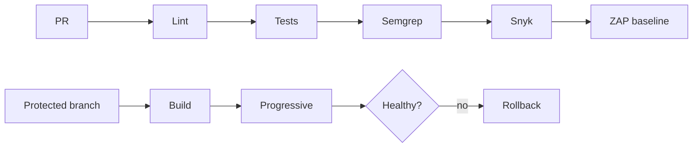

# 29 — CI/CD

> **Related:** [21_Testing_Strategy](21_Testing_Strategy.md) · [22_Playwright_Testing](22_Playwright_Testing.md) · [25_Snyk](25_Snyk.md) · [27_Semgrep](27_Semgrep.md) · [30_Deployment](30_Deployment.md) · [45_Release_Process](45_Release_Process.md)

---

## Executive Summary

CI/CD (GitHub Actions) builds, tests, scans, and deploys CreatorForce with clear gates. Pipelines run lint, unit/integration/API tests, Playwright E2E, Semgrep, Snyk, and ZAP baseline on PRs; full security scans and deploys run on protected branches. Deployments are progressive with automated rollback on health-check failure.

---

## Purpose

Define CI/CD for CreatorForce in enough detail that a senior engineer can implement it without guessing, consistent with the channel-first, non-destructive, transparent-AI principles of the platform.

---

## Goals

- Automated build/test/scan/deploy
- Quality + security gates on PRs
- Progressive delivery + rollback
- Reproducible, auditable pipelines

---

## Scope

In scope: as described above. Out of scope: detail owned by the related documents.

---

## Architecture / Workflow



---

## Folder Structure

```
ci-cd/
├── core/
├── api/
├── ui/
└── tests/
```

---

## Database Design

Uses the channel-scoped schema in [03_Database_Architecture](03_Database_Architecture.md); all domain rows carry `channel_id`.

---

## API Design

Endpoints are channel-scoped and versioned; long operations return 202 + job id. See [16_API_Architecture](16_API_Architecture.md).

---

## UI Design

Follows [17_Frontend_UI_UX](17_Frontend_UI_UX.md) and [19_Design_System](19_Design_System.md): fast, minimal, accessible.

---

## Component Design

Reusable, dependency-injected, accessible components per [18_Component_Guidelines](18_Component_Guidelines.md).

---

## Business Rules

- PRs must pass all gates to merge.
- Deploys are progressive with auto-rollback.
- Every deploy is traceable to a commit.

---

## Validation Rules

- No deploy without green pipeline.
- Secrets injected from secret store, never in logs.

---

## Security

Per-channel authorization, input validation, secret management, and audit logging per [14_Security](14_Security.md).

---

## Performance

Async execution, caching, and pagination per [13_Performance](13_Performance.md) and [44_Performance_Budget](44_Performance_Budget.md).

---

## Caching

Channel-scoped, event-invalidated caching per [36_Caching](36_Caching.md).

---

## Background Jobs

Expensive work runs as jobs with retry/cancel/resume and credit hooks per [12_Background_Jobs](12_Background_Jobs.md).

---

## Error Handling

Typed error envelope, no silent failures, rollback on paid-action failure per [32_Error_Handling](32_Error_Handling.md).

---

## Logging

Structured, correlation-ID'd logs (AI actions include model/tokens/credits) per [38_Logging](38_Logging.md).

---

## Testing

Stages: install/cache, lint, unit/integration/API, Playwright (sharded), SAST/SCA/DAST, build artifacts, deploy, smoke tests.

---

## Acceptance Criteria

- [ ] Full gated pipeline on PRs.
- [ ] Security scans integrated.
- [ ] Progressive deploy + rollback.
- [ ] Deploys traceable.

---

## Edge Cases

- Empty/at-scale inputs.
- Provider/quota failures with resume.
- Concurrent edits (last-writer-wins + version).
- Revoked credentials mid-operation.

---

## Risks

| Risk | Mitigation |
|---|---|
| Scale hotspots | Pagination, cache, replicas |
| Provider variability | Abstraction + retries/fallback |
| Scope creep | Priority gating ([50_IMPLEMENTATION_PLAN](50_IMPLEMENTATION_PLAN.md)) |

---

## Future Improvements

- Deeper automation with preview.
- Team-aware capabilities.
- Additional integrations.

---

## Implementation Checklist

- [ ] Automated build/test/scan/deploy.
- [ ] Quality + security gates on PRs.
- [ ] Progressive delivery + rollback.
- [ ] Reproducible, auditable pipelines.

---

## References

[21_Testing_Strategy](21_Testing_Strategy.md) · [22_Playwright_Testing](22_Playwright_Testing.md) · [25_Snyk](25_Snyk.md) · [27_Semgrep](27_Semgrep.md) · [30_Deployment](30_Deployment.md) · [45_Release_Process](45_Release_Process.md)
