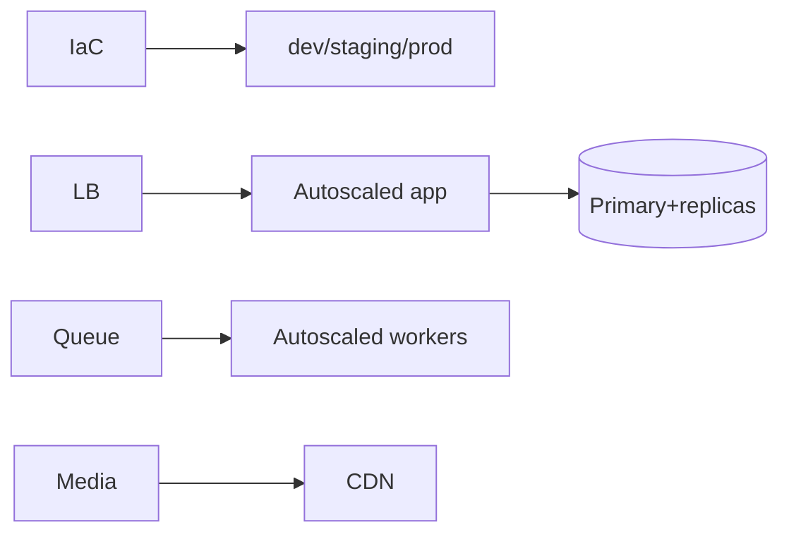

# 30 — Deployment

> **Related:** [02_System_Architecture](02_System_Architecture.md) · [29_CI_CD](29_CI_CD.md) · [40_Backup_Recovery](40_Backup_Recovery.md) · [41_Disaster_Recovery](41_Disaster_Recovery.md) · [45_Release_Process](45_Release_Process.md)

---

## Executive Summary

Deployment uses infrastructure-as-code and immutable, containerized artifacts across environments (dev/staging/prod). The app tier is stateless and autoscaled behind a load balancer; workers autoscale on queue depth; data uses managed primary + replicas; media uses object storage + CDN. Releases are progressive (canary/blue-green) with health gates.

---

## Purpose

Define Deployment for CreatorForce in enough detail that a senior engineer can implement it without guessing, consistent with the channel-first, non-destructive, transparent-AI principles of the platform.

---

## Goals

- IaC + immutable artifacts
- Stateless autoscaled app + workers
- Managed data + object storage/CDN
- Progressive, gated releases

---

## Scope

In scope: as described above. Out of scope: detail owned by the related documents.

---

## Architecture / Workflow



---

## Folder Structure

```
deployment/
├── core/
├── api/
├── ui/
└── tests/
```

---

## Database Design

Uses the channel-scoped schema in [03_Database_Architecture](03_Database_Architecture.md); all domain rows carry `channel_id`.

---

## API Design

Endpoints are channel-scoped and versioned; long operations return 202 + job id. See [16_API_Architecture](16_API_Architecture.md).

---

## UI Design

Follows [17_Frontend_UI_UX](17_Frontend_UI_UX.md) and [19_Design_System](19_Design_System.md): fast, minimal, accessible.

---

## Component Design

Reusable, dependency-injected, accessible components per [18_Component_Guidelines](18_Component_Guidelines.md).

---

## Business Rules

- Environments are reproducible via IaC.
- Prod releases are progressive with health gates.
- Config/secrets from managed stores.

---

## Validation Rules

- Health/readiness probes required.
- Migrations run via expand/contract ([03_Database_Architecture](03_Database_Architecture.md)).

---

## Security

Per-channel authorization, input validation, secret management, and audit logging per [14_Security](14_Security.md).

---

## Performance

Autoscaling policies for app (CPU/latency) and workers (queue depth); CDN for media; replica routing for reads.

---

## Caching

Channel-scoped, event-invalidated caching per [36_Caching](36_Caching.md).

---

## Background Jobs

Expensive work runs as jobs with retry/cancel/resume and credit hooks per [12_Background_Jobs](12_Background_Jobs.md).

---

## Error Handling

Typed error envelope, no silent failures, rollback on paid-action failure per [32_Error_Handling](32_Error_Handling.md).

---

## Logging

Structured, correlation-ID'd logs (AI actions include model/tokens/credits) per [38_Logging](38_Logging.md).

---

## Testing

Unit, integration, and (where user-facing) E2E/accessibility/visual/performance/security tests, all in CI. See [21_Testing_Strategy](21_Testing_Strategy.md).

---

## Acceptance Criteria

- [ ] IaC-provisioned environments.
- [ ] Progressive deploy with gates.
- [ ] Zero-downtime migrations.
- [ ] Autoscaling verified.

---

## Edge Cases

- Empty/at-scale inputs.
- Provider/quota failures with resume.
- Concurrent edits (last-writer-wins + version).
- Revoked credentials mid-operation.

---

## Risks

| Risk | Mitigation |
|---|---|
| Scale hotspots | Pagination, cache, replicas |
| Provider variability | Abstraction + retries/fallback |
| Scope creep | Priority gating ([50_IMPLEMENTATION_PLAN](50_IMPLEMENTATION_PLAN.md)) |

---

## Future Improvements

- Deeper automation with preview.
- Team-aware capabilities.
- Additional integrations.

---

## Implementation Checklist

- [ ] IaC + immutable artifacts.
- [ ] Stateless autoscaled app + workers.
- [ ] Managed data + object storage/CDN.
- [ ] Progressive, gated releases.

---

## References

[02_System_Architecture](02_System_Architecture.md) · [29_CI_CD](29_CI_CD.md) · [40_Backup_Recovery](40_Backup_Recovery.md) · [41_Disaster_Recovery](41_Disaster_Recovery.md) · [45_Release_Process](45_Release_Process.md)
