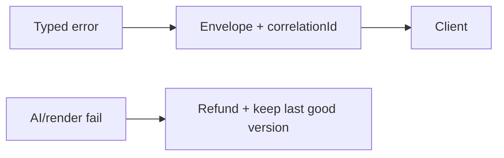

# 32 — Error Handling

> **Related:** [16_API_Architecture](16_API_Architecture.md) · [10_AI_Credits](10_AI_Credits.md) · [12_Background_Jobs](12_Background_Jobs.md) · [38_Logging](38_Logging.md) · [20_Observability](20_Observability.md)

---

## Executive Summary

Errors are typed, actionable, and never silently swallowed. A consistent error envelope flows from services to the client with a correlation ID. AI/render/credit failures roll back reservations and preserve the last good version. User-facing messages are clear and safe (no secret/stack leakage).

---

## Purpose

Define Error Handling for CreatorForce in enough detail that a senior engineer can implement it without guessing, consistent with the channel-first, non-destructive, transparent-AI principles of the platform.

---

## Goals

- Typed, consistent error envelope
- No silent failures
- Rollback on AI/credit/render failure
- Safe, actionable user messages

---

## Scope

In scope: as described above. Out of scope: detail owned by the related documents.

---

## Architecture / Workflow



---

## Folder Structure

```
error-handling/
├── core/
├── api/
├── ui/
└── tests/
```

---

## Database Design

Uses the channel-scoped schema in [03_Database_Architecture](03_Database_Architecture.md); all domain rows carry `channel_id`.

---

## API Design

Endpoints are channel-scoped and versioned; long operations return 202 + job id. See [16_API_Architecture](16_API_Architecture.md).

---

## UI Design

Follows [17_Frontend_UI_UX](17_Frontend_UI_UX.md) and [19_Design_System](19_Design_System.md): fast, minimal, accessible.

---

## Component Design

Reusable, dependency-injected, accessible components per [18_Component_Guidelines](18_Component_Guidelines.md).

---

## Business Rules

- All errors typed + logged with correlation id.
- Paid-action failures refund reservations.
- Last good version always preserved.

---

## Validation Rules

- Never expose secrets/stack traces to users.
- Map internal errors to safe messages.

---

## Security

Per-channel authorization, input validation, secret management, and audit logging per [14_Security](14_Security.md).

---

## Performance

Async execution, caching, and pagination per [13_Performance](13_Performance.md) and [44_Performance_Budget](44_Performance_Budget.md).

---

## Caching

Channel-scoped, event-invalidated caching per [36_Caching](36_Caching.md).

---

## Background Jobs

Expensive work runs as jobs with retry/cancel/resume and credit hooks per [12_Background_Jobs](12_Background_Jobs.md).

---

## Error Handling

Envelope: {code, message, details, correlationId}. Categories: validation, auth, not-found, conflict, rate-limit, provider, internal. Retry guidance per category.

---

## Logging

Structured, correlation-ID'd logs (AI actions include model/tokens/credits) per [38_Logging](38_Logging.md).

---

## Testing

Unit, integration, and (where user-facing) E2E/accessibility/visual/performance/security tests, all in CI. See [21_Testing_Strategy](21_Testing_Strategy.md).

---

## Acceptance Criteria

- [ ] Consistent envelope everywhere.
- [ ] Correlation id on every error.
- [ ] Refund + last-good-version on failure.
- [ ] No sensitive leakage.

---

## Edge Cases

- Empty/at-scale inputs.
- Provider/quota failures with resume.
- Concurrent edits (last-writer-wins + version).
- Revoked credentials mid-operation.

---

## Risks

| Risk | Mitigation |
|---|---|
| Scale hotspots | Pagination, cache, replicas |
| Provider variability | Abstraction + retries/fallback |
| Scope creep | Priority gating ([50_IMPLEMENTATION_PLAN](50_IMPLEMENTATION_PLAN.md)) |

---

## Future Improvements

- Deeper automation with preview.
- Team-aware capabilities.
- Additional integrations.

---

## Implementation Checklist

- [ ] Typed, consistent error envelope.
- [ ] No silent failures.
- [ ] Rollback on AI/credit/render failure.
- [ ] Safe, actionable user messages.

---

## References

[16_API_Architecture](16_API_Architecture.md) · [10_AI_Credits](10_AI_Credits.md) · [12_Background_Jobs](12_Background_Jobs.md) · [38_Logging](38_Logging.md) · [20_Observability](20_Observability.md)
