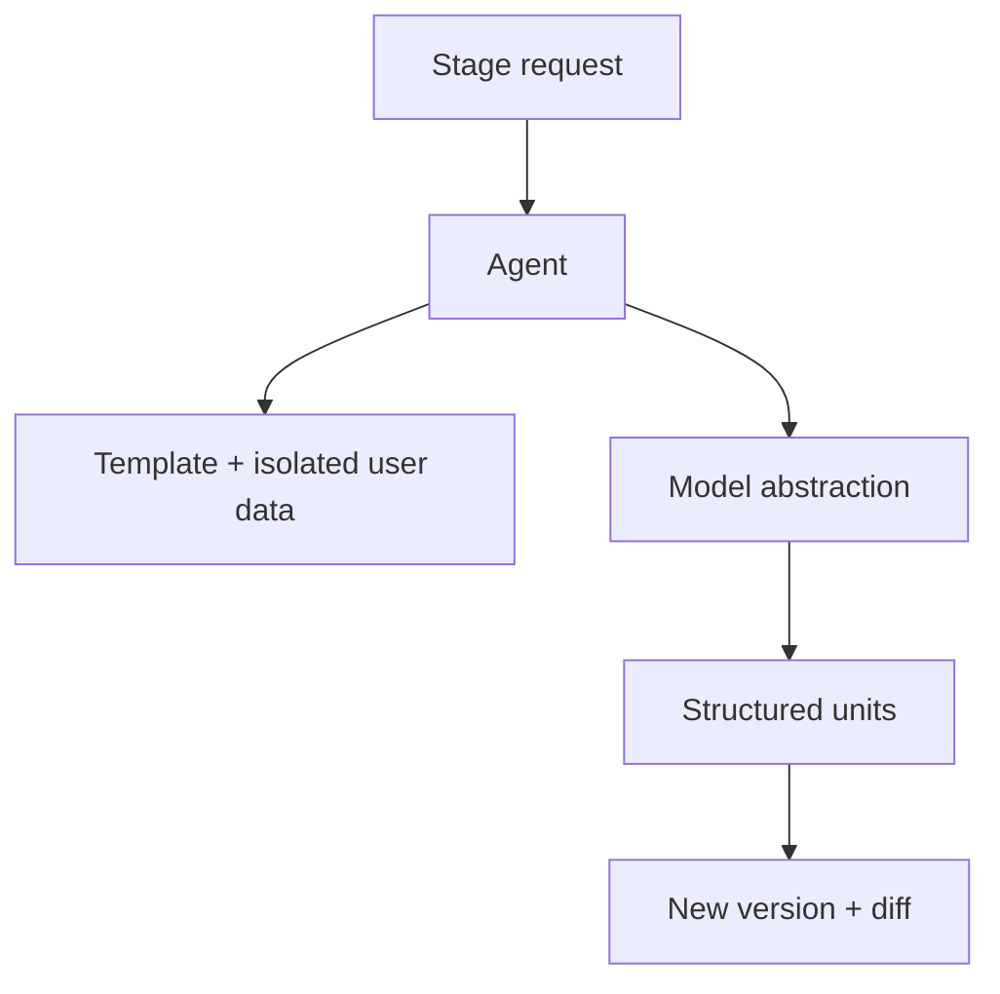

# 33 — AI Agent Architecture

> **Related:** [05_AI_Workflow](05_AI_Workflow.md) · [11_AI_Models](11_AI_Models.md) · [10_AI_Credits](10_AI_Credits.md) · [14_Security](14_Security.md) · [06_Edit_Studio](06_Edit_Studio.md)

---

## Executive Summary

AI agents orchestrate workflow stages using the model abstraction layer, structured prompts, and tool access under strict guardrails. Each agent is a bounded, testable unit with typed inputs/outputs, prompt templates isolated from untrusted content, and integration with estimates, versioning, and credits. Agents produce structured, unit-addressable outputs to enable selective regeneration.

---

## Purpose

Define AI Agent Architecture for CreatorForce in enough detail that a senior engineer can implement it without guessing, consistent with the channel-first, non-destructive, transparent-AI principles of the platform.

---

## Goals

- Bounded, testable agents per stage
- Structured, unit-addressable outputs
- Prompt-injection-isolated inputs
- Integrated with estimates/versions/credits

---

## Scope

In scope: as described above. Out of scope: detail owned by the related documents.

---

## Architecture / Workflow



---

## Folder Structure

```
ai-agent-architecture/
├── core/
├── api/
├── ui/
└── tests/
```

---

## Database Design

Uses the channel-scoped schema in [03_Database_Architecture](03_Database_Architecture.md); all domain rows carry `channel_id`.

---

## API Design

Endpoints are channel-scoped and versioned; long operations return 202 + job id. See [16_API_Architecture](16_API_Architecture.md).

---

## UI Design

Follows [17_Frontend_UI_UX](17_Frontend_UI_UX.md) and [19_Design_System](19_Design_System.md): fast, minimal, accessible.

---

## Component Design

Reusable, dependency-injected, accessible components per [18_Component_Guidelines](18_Component_Guidelines.md).

---

## Business Rules

- Agents output structured units (scenes/lines/segments).
- Untrusted content is data, never instructions.
- Every agent run is estimated, reserved, versioned, settled.

---

## Validation Rules

- Validate agent output schema before persisting.
- Reject partial/malformed outputs.

---

## Security

Prompt-injection isolation, capability-scoped tools, output validation, no secret exposure ([14_Security](14_Security.md)).

---

## Performance

Async execution, caching, and pagination per [13_Performance](13_Performance.md) and [44_Performance_Budget](44_Performance_Budget.md).

---

## Caching

Channel-scoped, event-invalidated caching per [36_Caching](36_Caching.md).

---

## Background Jobs

Expensive work runs as jobs with retry/cancel/resume and credit hooks per [12_Background_Jobs](12_Background_Jobs.md).

---

## Error Handling

Typed error envelope, no silent failures, rollback on paid-action failure per [32_Error_Handling](32_Error_Handling.md).

---

## Logging

Structured, correlation-ID'd logs (AI actions include model/tokens/credits) per [38_Logging](38_Logging.md).

---

## Testing

Unit, integration, and (where user-facing) E2E/accessibility/visual/performance/security tests, all in CI. See [21_Testing_Strategy](21_Testing_Strategy.md).

---

## Acceptance Criteria

- [ ] Agents produce structured, unit-addressable output.
- [ ] Inputs isolated from instructions.
- [ ] Integrated with estimate/version/credit.
- [ ] Output schema validated.

---

## Edge Cases

- Empty/at-scale inputs.
- Provider/quota failures with resume.
- Concurrent edits (last-writer-wins + version).
- Revoked credentials mid-operation.

---

## Risks

| Risk | Mitigation |
|---|---|
| Scale hotspots | Pagination, cache, replicas |
| Provider variability | Abstraction + retries/fallback |
| Scope creep | Priority gating ([50_IMPLEMENTATION_PLAN](50_IMPLEMENTATION_PLAN.md)) |

---

## Future Improvements

- Deeper automation with preview.
- Team-aware capabilities.
- Additional integrations.

---

## Implementation Checklist

- [ ] Bounded, testable agents per stage.
- [ ] Structured, unit-addressable outputs.
- [ ] Prompt-injection-isolated inputs.
- [ ] Integrated with estimates/versions/credits.

---

## References

[05_AI_Workflow](05_AI_Workflow.md) · [11_AI_Models](11_AI_Models.md) · [10_AI_Credits](10_AI_Credits.md) · [14_Security](14_Security.md) · [06_Edit_Studio](06_Edit_Studio.md)
