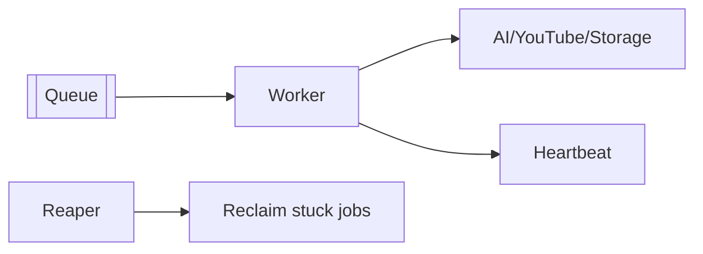

# 34 — Background Workers

> **Related:** [12_Background_Jobs](12_Background_Jobs.md) · [35_Queues](35_Queues.md) · [11_AI_Models](11_AI_Models.md) · [06_Edit_Studio](06_Edit_Studio.md)

---

## Executive Summary

Workers consume the queue and execute jobs (sync, AI generation, rendering, publishing, analytics). They are stateless, horizontally scalable, and heartbeat-monitored, with cooperative cancellation, resumable cursors, and per-provider concurrency/rate limits. A reaper reclaims stuck jobs.

---

## Purpose

Define Background Workers for CreatorForce in enough detail that a senior engineer can implement it without guessing, consistent with the channel-first, non-destructive, transparent-AI principles of the platform.

---

## Goals

- Stateless, horizontally scalable workers
- Heartbeats + stuck-job reaper
- Cooperative cancellation + resume
- Per-provider rate/concurrency limits

---

## Scope

In scope: as described above. Out of scope: detail owned by the related documents.

---

## Architecture / Workflow



---

## Folder Structure

```
background-workers/
├── core/
├── api/
├── ui/
└── tests/
```

---

## Database Design

Uses the channel-scoped schema in [03_Database_Architecture](03_Database_Architecture.md); all domain rows carry `channel_id`.

---

## API Design

Endpoints are channel-scoped and versioned; long operations return 202 + job id. See [16_API_Architecture](16_API_Architecture.md).

---

## UI Design

Follows [17_Frontend_UI_UX](17_Frontend_UI_UX.md) and [19_Design_System](19_Design_System.md): fast, minimal, accessible.

---

## Component Design

Reusable, dependency-injected, accessible components per [18_Component_Guidelines](18_Component_Guidelines.md).

---

## Business Rules

- Workers are stateless; state lives in the job record.
- Stuck jobs reclaimed by reaper.
- Provider limits respected.

---

## Validation Rules

- Validate provider outputs before persisting.
- Idempotent processing.

---

## Security

Per-channel authorization, input validation, secret management, and audit logging per [14_Security](14_Security.md).

---

## Performance

Async execution, caching, and pagination per [13_Performance](13_Performance.md) and [44_Performance_Budget](44_Performance_Budget.md).

---

## Caching

Channel-scoped, event-invalidated caching per [36_Caching](36_Caching.md).

---

## Background Jobs

Execution model, concurrency control, backpressure, graceful shutdown draining in-flight work. Render workers use fast preview + full render paths.

---

## Error Handling

Typed error envelope, no silent failures, rollback on paid-action failure per [32_Error_Handling](32_Error_Handling.md).

---

## Logging

Structured, correlation-ID'd logs (AI actions include model/tokens/credits) per [38_Logging](38_Logging.md).

---

## Testing

Unit, integration, and (where user-facing) E2E/accessibility/visual/performance/security tests, all in CI. See [21_Testing_Strategy](21_Testing_Strategy.md).

---

## Acceptance Criteria

- [ ] Workers autoscale on queue depth.
- [ ] Heartbeats + reaper functional.
- [ ] Cancellation + resume work.
- [ ] Provider limits enforced.

---

## Edge Cases

- Empty/at-scale inputs.
- Provider/quota failures with resume.
- Concurrent edits (last-writer-wins + version).
- Revoked credentials mid-operation.

---

## Risks

| Risk | Mitigation |
|---|---|
| Scale hotspots | Pagination, cache, replicas |
| Provider variability | Abstraction + retries/fallback |
| Scope creep | Priority gating ([50_IMPLEMENTATION_PLAN](50_IMPLEMENTATION_PLAN.md)) |

---

## Future Improvements

- Deeper automation with preview.
- Team-aware capabilities.
- Additional integrations.

---

## Implementation Checklist

- [ ] Stateless, horizontally scalable workers.
- [ ] Heartbeats + stuck-job reaper.
- [ ] Cooperative cancellation + resume.
- [ ] Per-provider rate/concurrency limits.

---

## References

[12_Background_Jobs](12_Background_Jobs.md) · [35_Queues](35_Queues.md) · [11_AI_Models](11_AI_Models.md) · [06_Edit_Studio](06_Edit_Studio.md)
