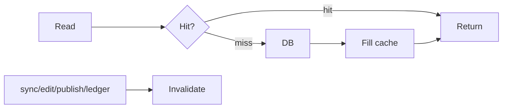

# 36 — Caching

> **Related:** [04_Channel_Workspace](04_Channel_Workspace.md) · [08_Playlists_and_Library](08_Playlists_and_Library.md) · [10_AI_Credits](10_AI_Credits.md) · [13_Performance](13_Performance.md) · [03_Database_Architecture](03_Database_Architecture.md)

---

## Executive Summary

A read-through cache accelerates hot reads: channel context headers, library pages, analytics summaries, credit balances, and JWKS. Keys are channel-scoped; invalidation is event-driven (sync/edit/publish/ledger). The strategy favors correctness (explicit invalidation) over blanket TTLs, with short TTLs as a safety net.

---

## Purpose

Define Caching for CreatorForce in enough detail that a senior engineer can implement it without guessing, consistent with the channel-first, non-destructive, transparent-AI principles of the platform.

---

## Goals

- Read-through caching of hot data
- Channel-scoped keys
- Event-driven invalidation
- Correctness over blanket TTLs

---

## Scope

In scope: as described above. Out of scope: detail owned by the related documents.

---

## Architecture / Workflow



---

## Folder Structure

```
caching/
├── core/
├── api/
├── ui/
└── tests/
```

---

## Database Design

Uses the channel-scoped schema in [03_Database_Architecture](03_Database_Architecture.md); all domain rows carry `channel_id`.

---

## API Design

Endpoints are channel-scoped and versioned; long operations return 202 + job id. See [16_API_Architecture](16_API_Architecture.md).

---

## UI Design

Follows [17_Frontend_UI_UX](17_Frontend_UI_UX.md) and [19_Design_System](19_Design_System.md): fast, minimal, accessible.

---

## Component Design

Reusable, dependency-injected, accessible components per [18_Component_Guidelines](18_Component_Guidelines.md).

---

## Business Rules

- Cache keys include channel_id.
- Mutations invalidate affected keys.
- Sensitive/short-lived data (signed URLs) cached only for their lifetime.

---

## Validation Rules

- No stale reads after invalidating events.
- No secrets cached beyond TTL.

---

## Security

Per-channel authorization, input validation, secret management, and audit logging per [14_Security](14_Security.md).

---

## Performance

Async execution, caching, and pagination per [13_Performance](13_Performance.md) and [44_Performance_Budget](44_Performance_Budget.md).

---

## Caching

Cached: context header, library pages (channel,cursor,filter,sort), analytics summaries, credit balance/forecast, JWKS, preview renders (by version hash). Invalidation events per domain.

---

## Background Jobs

Expensive work runs as jobs with retry/cancel/resume and credit hooks per [12_Background_Jobs](12_Background_Jobs.md).

---

## Error Handling

Typed error envelope, no silent failures, rollback on paid-action failure per [32_Error_Handling](32_Error_Handling.md).

---

## Logging

Structured, correlation-ID'd logs (AI actions include model/tokens/credits) per [38_Logging](38_Logging.md).

---

## Testing

Unit, integration, and (where user-facing) E2E/accessibility/visual/performance/security tests, all in CI. See [21_Testing_Strategy](21_Testing_Strategy.md).

---

## Acceptance Criteria

- [ ] Hot reads cached read-through.
- [ ] Event-driven invalidation correct.
- [ ] Keys channel-scoped.
- [ ] No stale/sensitive leakage.

---

## Edge Cases

- Empty/at-scale inputs.
- Provider/quota failures with resume.
- Concurrent edits (last-writer-wins + version).
- Revoked credentials mid-operation.

---

## Risks

| Risk | Mitigation |
|---|---|
| Scale hotspots | Pagination, cache, replicas |
| Provider variability | Abstraction + retries/fallback |
| Scope creep | Priority gating ([50_IMPLEMENTATION_PLAN](50_IMPLEMENTATION_PLAN.md)) |

---

## Future Improvements

- Deeper automation with preview.
- Team-aware capabilities.
- Additional integrations.

---

## Implementation Checklist

- [ ] Read-through caching of hot data.
- [ ] Channel-scoped keys.
- [ ] Event-driven invalidation.
- [ ] Correctness over blanket TTLs.

---

## References

[04_Channel_Workspace](04_Channel_Workspace.md) · [08_Playlists_and_Library](08_Playlists_and_Library.md) · [10_AI_Credits](10_AI_Credits.md) · [13_Performance](13_Performance.md) · [03_Database_Architecture](03_Database_Architecture.md)
