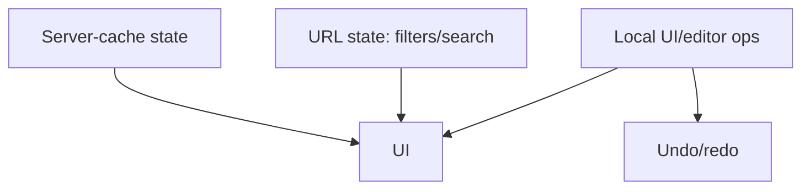

# 37 — State Management

> **Related:** [04_Channel_Workspace](04_Channel_Workspace.md) · [06_Edit_Studio](06_Edit_Studio.md) · [17_Frontend_UI_UX](17_Frontend_UI_UX.md) · [18_Component_Guidelines](18_Component_Guidelines.md)

---

## Executive Summary

Client state is layered: server-cache state (queried data with revalidation), URL state (filters/search/routing), and local UI state (editor operations, unsaved edits). Per-channel cache slices enable instant channel switching. The Edit Studio uses an operation-based document store powering undo/redo and non-destructive edits.

---

## Purpose

Define State Management for CreatorForce in enough detail that a senior engineer can implement it without guessing, consistent with the channel-first, non-destructive, transparent-AI principles of the platform.

---

## Goals

- Layered state (server-cache/URL/local)
- Per-channel cache slices
- URL as source of truth for filters
- Operation-based editor store (undo/redo)

---

## Scope

In scope: as described above. Out of scope: detail owned by the related documents.

---

## Architecture / Workflow



---

## Folder Structure

```
state-management/
├── core/
├── api/
├── ui/
└── tests/
```

---

## Database Design

Uses the channel-scoped schema in [03_Database_Architecture](03_Database_Architecture.md); all domain rows carry `channel_id`.

---

## API Design

Endpoints are channel-scoped and versioned; long operations return 202 + job id. See [16_API_Architecture](16_API_Architecture.md).

---

## UI Design

Follows [17_Frontend_UI_UX](17_Frontend_UI_UX.md) and [19_Design_System](19_Design_System.md): fast, minimal, accessible.

---

## Component Design

Reusable, dependency-injected, accessible components per [18_Component_Guidelines](18_Component_Guidelines.md).

---

## Business Rules

- URL reflects filters/search for shareability.
- Per-channel state preserved across switches.
- Editor edits are operations (undo/redo, non-destructive).

---

## Validation Rules

- No sensitive data in URL.
- Reconcile optimistic updates with server truth.

---

## Security

Per-channel authorization, input validation, secret management, and audit logging per [14_Security](14_Security.md).

---

## Performance

Async execution, caching, and pagination per [13_Performance](13_Performance.md) and [44_Performance_Budget](44_Performance_Budget.md).

---

## Caching

Channel-scoped, event-invalidated caching per [36_Caching](36_Caching.md).

---

## Background Jobs

Expensive work runs as jobs with retry/cancel/resume and credit hooks per [12_Background_Jobs](12_Background_Jobs.md).

---

## Error Handling

Typed error envelope, no silent failures, rollback on paid-action failure per [32_Error_Handling](32_Error_Handling.md).

---

## Logging

Structured, correlation-ID'd logs (AI actions include model/tokens/credits) per [38_Logging](38_Logging.md).

---

## Testing

Unit, integration, and (where user-facing) E2E/accessibility/visual/performance/security tests, all in CI. See [21_Testing_Strategy](21_Testing_Strategy.md).

---

## Acceptance Criteria

- [ ] Filters/search in URL.
- [ ] Channel switch preserves state.
- [ ] Editor undo/redo via operations.
- [ ] Optimistic updates reconcile.

---

## Edge Cases

- Empty/at-scale inputs.
- Provider/quota failures with resume.
- Concurrent edits (last-writer-wins + version).
- Revoked credentials mid-operation.

---

## Risks

| Risk | Mitigation |
|---|---|
| Scale hotspots | Pagination, cache, replicas |
| Provider variability | Abstraction + retries/fallback |
| Scope creep | Priority gating ([50_IMPLEMENTATION_PLAN](50_IMPLEMENTATION_PLAN.md)) |

---

## Future Improvements

- Deeper automation with preview.
- Team-aware capabilities.
- Additional integrations.

---

## Implementation Checklist

- [ ] Layered state (server-cache/URL/local).
- [ ] Per-channel cache slices.
- [ ] URL as source of truth for filters.
- [ ] Operation-based editor store (undo/redo).

---

## References

[04_Channel_Workspace](04_Channel_Workspace.md) · [06_Edit_Studio](06_Edit_Studio.md) · [17_Frontend_UI_UX](17_Frontend_UI_UX.md) · [18_Component_Guidelines](18_Component_Guidelines.md)
