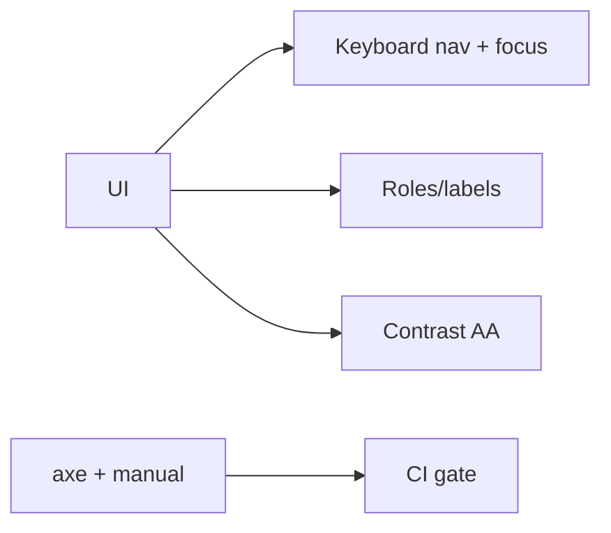

# 42 — Accessibility

> **Related:** [17_Frontend_UI_UX](17_Frontend_UI_UX.md) · [19_Design_System](19_Design_System.md) · [22_Playwright_Testing](22_Playwright_Testing.md) · [06_Edit_Studio](06_Edit_Studio.md)

---

## Executive Summary

CreatorForce targets WCAG 2.2 AA. All interactive elements are keyboard-accessible with visible focus, proper roles/labels, sufficient contrast, and screen-reader support. The Edit Studio provides keyboard editing and accessible timeline controls. Accessibility is tested automatically (axe) and manually, and is a CI gate.

---

## Purpose

Define Accessibility for CreatorForce in enough detail that a senior engineer can implement it without guessing, consistent with the channel-first, non-destructive, transparent-AI principles of the platform.

---

## Goals

- WCAG 2.2 AA compliance
- Full keyboard + screen-reader support
- Accessible editor/timeline controls
- Automated + manual a11y testing

---

## Scope

In scope: as described above. Out of scope: detail owned by the related documents.

---

## Architecture / Workflow



---

## Folder Structure

```
accessibility/
├── core/
├── api/
├── ui/
└── tests/
```

---

## Database Design

Uses the channel-scoped schema in [03_Database_Architecture](03_Database_Architecture.md); all domain rows carry `channel_id`.

---

## API Design

Endpoints are channel-scoped and versioned; long operations return 202 + job id. See [16_API_Architecture](16_API_Architecture.md).

---

## UI Design

Follows [17_Frontend_UI_UX](17_Frontend_UI_UX.md) and [19_Design_System](19_Design_System.md): fast, minimal, accessible.

---

## Component Design

Reusable, dependency-injected, accessible components per [18_Component_Guidelines](18_Component_Guidelines.md).

---

## Business Rules

- All interactions keyboard-accessible.
- Contrast meets AA.
- A11y checks gate releases.

---

## Validation Rules

- Labels/roles on all controls.
- Focus order logical; focus visible.

---

## Security

Per-channel authorization, input validation, secret management, and audit logging per [14_Security](14_Security.md).

---

## Performance

Async execution, caching, and pagination per [13_Performance](13_Performance.md) and [44_Performance_Budget](44_Performance_Budget.md).

---

## Caching

Channel-scoped, event-invalidated caching per [36_Caching](36_Caching.md).

---

## Background Jobs

Expensive work runs as jobs with retry/cancel/resume and credit hooks per [12_Background_Jobs](12_Background_Jobs.md).

---

## Error Handling

Typed error envelope, no silent failures, rollback on paid-action failure per [32_Error_Handling](32_Error_Handling.md).

---

## Logging

Structured, correlation-ID'd logs (AI actions include model/tokens/credits) per [38_Logging](38_Logging.md).

---

## Testing

Unit, integration, and (where user-facing) E2E/accessibility/visual/performance/security tests, all in CI. See [21_Testing_Strategy](21_Testing_Strategy.md).

---

## Acceptance Criteria

- [ ] WCAG 2.2 AA met.
- [ ] Keyboard + screen-reader flows work.
- [ ] Contrast verified in CI.
- [ ] Editor controls accessible.

---

## Edge Cases

- Empty/at-scale inputs.
- Provider/quota failures with resume.
- Concurrent edits (last-writer-wins + version).
- Revoked credentials mid-operation.

---

## Risks

| Risk | Mitigation |
|---|---|
| Scale hotspots | Pagination, cache, replicas |
| Provider variability | Abstraction + retries/fallback |
| Scope creep | Priority gating ([50_IMPLEMENTATION_PLAN](50_IMPLEMENTATION_PLAN.md)) |

---

## Future Improvements

- Deeper automation with preview.
- Team-aware capabilities.
- Additional integrations.

---

## Implementation Checklist

- [ ] WCAG 2.2 AA compliance.
- [ ] Full keyboard + screen-reader support.
- [ ] Accessible editor/timeline controls.
- [ ] Automated + manual a11y testing.

---

## References

[17_Frontend_UI_UX](17_Frontend_UI_UX.md) · [19_Design_System](19_Design_System.md) · [22_Playwright_Testing](22_Playwright_Testing.md) · [06_Edit_Studio](06_Edit_Studio.md)
