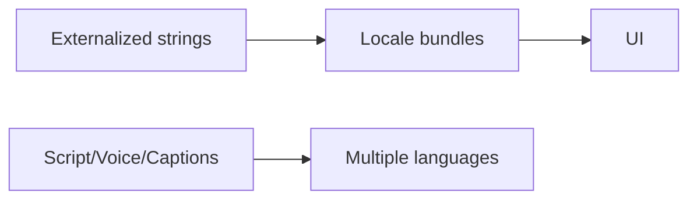

# 43 — Internationalization

> **Related:** [17_Frontend_UI_UX](17_Frontend_UI_UX.md) · [19_Design_System](19_Design_System.md) · [05_AI_Workflow](05_AI_Workflow.md) · [10_AI_Credits](10_AI_Credits.md)

---

## Executive Summary

The platform is i18n-ready: externalized strings, locale-aware formatting (dates/numbers/currency for credits), RTL support, and translatable UI. AI features handle multiple content languages (script/voice/captions). Locale is user-selectable and persisted; new locales are added without code changes.

---

## Purpose

Define Internationalization for CreatorForce in enough detail that a senior engineer can implement it without guessing, consistent with the channel-first, non-destructive, transparent-AI principles of the platform.

---

## Goals

- Externalized, translatable strings
- Locale-aware formatting + RTL
- Multi-language AI content
- Add locales without code changes

---

## Scope

In scope: as described above. Out of scope: detail owned by the related documents.

---

## Architecture / Workflow



---

## Folder Structure

```
internationalization/
├── core/
├── api/
├── ui/
└── tests/
```

---

## Database Design

Uses the channel-scoped schema in [03_Database_Architecture](03_Database_Architecture.md); all domain rows carry `channel_id`.

---

## API Design

Endpoints are channel-scoped and versioned; long operations return 202 + job id. See [16_API_Architecture](16_API_Architecture.md).

---

## UI Design

Follows [17_Frontend_UI_UX](17_Frontend_UI_UX.md) and [19_Design_System](19_Design_System.md): fast, minimal, accessible.

---

## Component Design

Reusable, dependency-injected, accessible components per [18_Component_Guidelines](18_Component_Guidelines.md).

---

## Business Rules

- No hard-coded user-facing strings.
- Locale persisted per user.
- Credit/cost formatting locale-aware.

---

## Validation Rules

- All strings have keys.
- RTL layouts verified.

---

## Security

Per-channel authorization, input validation, secret management, and audit logging per [14_Security](14_Security.md).

---

## Performance

Async execution, caching, and pagination per [13_Performance](13_Performance.md) and [44_Performance_Budget](44_Performance_Budget.md).

---

## Caching

Channel-scoped, event-invalidated caching per [36_Caching](36_Caching.md).

---

## Background Jobs

Expensive work runs as jobs with retry/cancel/resume and credit hooks per [12_Background_Jobs](12_Background_Jobs.md).

---

## Error Handling

Typed error envelope, no silent failures, rollback on paid-action failure per [32_Error_Handling](32_Error_Handling.md).

---

## Logging

Structured, correlation-ID'd logs (AI actions include model/tokens/credits) per [38_Logging](38_Logging.md).

---

## Testing

Unit, integration, and (where user-facing) E2E/accessibility/visual/performance/security tests, all in CI. See [21_Testing_Strategy](21_Testing_Strategy.md).

---

## Acceptance Criteria

- [ ] Strings externalized + translatable.
- [ ] Locale-aware formatting + RTL.
- [ ] Multi-language AI content.
- [ ] Locales added via config.

---

## Edge Cases

- Empty/at-scale inputs.
- Provider/quota failures with resume.
- Concurrent edits (last-writer-wins + version).
- Revoked credentials mid-operation.

---

## Risks

| Risk | Mitigation |
|---|---|
| Scale hotspots | Pagination, cache, replicas |
| Provider variability | Abstraction + retries/fallback |
| Scope creep | Priority gating ([50_IMPLEMENTATION_PLAN](50_IMPLEMENTATION_PLAN.md)) |

---

## Future Improvements

- Deeper automation with preview.
- Team-aware capabilities.
- Additional integrations.

---

## Implementation Checklist

- [ ] Externalized, translatable strings.
- [ ] Locale-aware formatting + RTL.
- [ ] Multi-language AI content.
- [ ] Add locales without code changes.

---

## References

[17_Frontend_UI_UX](17_Frontend_UI_UX.md) · [19_Design_System](19_Design_System.md) · [05_AI_Workflow](05_AI_Workflow.md) · [10_AI_Credits](10_AI_Credits.md)
