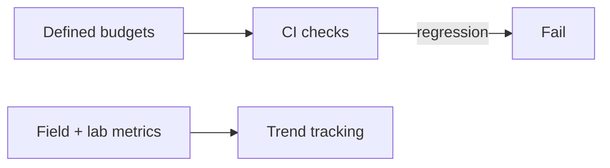

# 44 — Performance Budget

> **Related:** [13_Performance](13_Performance.md) · [29_CI_CD](29_CI_CD.md) · [04_Channel_Workspace](04_Channel_Workspace.md) · [08_Playlists_and_Library](08_Playlists_and_Library.md)

---

## Executive Summary

Explicit, enforced budgets keep CreatorForce fast: bundle size, time-to-interactive, API latency, and scroll performance targets are defined and checked in CI. Regressions beyond budget fail the pipeline. Budgets are per surface (workspace, library, edit studio) and tracked over time.

---

## Purpose

Define Performance Budget for CreatorForce in enough detail that a senior engineer can implement it without guessing, consistent with the channel-first, non-destructive, transparent-AI principles of the platform.

---

## Goals

- Explicit performance budgets
- CI enforcement of regressions
- Per-surface targets
- Tracked over time

---

## Scope

In scope: as described above. Out of scope: detail owned by the related documents.

---

## Architecture / Workflow



---

## Folder Structure

```
performance-budget/
├── core/
├── api/
├── ui/
└── tests/
```

---

## Database Design

Uses the channel-scoped schema in [03_Database_Architecture](03_Database_Architecture.md); all domain rows carry `channel_id`.

---

## API Design

Endpoints are channel-scoped and versioned; long operations return 202 + job id. See [16_API_Architecture](16_API_Architecture.md).

---

## UI Design

Follows [17_Frontend_UI_UX](17_Frontend_UI_UX.md) and [19_Design_System](19_Design_System.md): fast, minimal, accessible.

---

## Component Design

Reusable, dependency-injected, accessible components per [18_Component_Guidelines](18_Component_Guidelines.md).

---

## Business Rules

- Budgets are CI gates.
- Each surface has targets.
- Regressions block merge.

---

## Validation Rules

- Measure lab + field metrics.
- Budgets versioned.

---

## Security

Per-channel authorization, input validation, secret management, and audit logging per [14_Security](14_Security.md).

---

## Performance

Targets: workspace TTI ≤ 2.0s p75; API p95 latency thresholds; bundle size caps; 60fps scroll on large lists. Enforced via CI perf checks.

---

## Caching

Channel-scoped, event-invalidated caching per [36_Caching](36_Caching.md).

---

## Background Jobs

Expensive work runs as jobs with retry/cancel/resume and credit hooks per [12_Background_Jobs](12_Background_Jobs.md).

---

## Error Handling

Typed error envelope, no silent failures, rollback on paid-action failure per [32_Error_Handling](32_Error_Handling.md).

---

## Logging

Structured, correlation-ID'd logs (AI actions include model/tokens/credits) per [38_Logging](38_Logging.md).

---

## Testing

Unit, integration, and (where user-facing) E2E/accessibility/visual/performance/security tests, all in CI. See [21_Testing_Strategy](21_Testing_Strategy.md).

---

## Acceptance Criteria

- [ ] Budgets defined per surface.
- [ ] Enforced in CI.
- [ ] Regressions fail pipeline.
- [ ] Trends tracked.

---

## Edge Cases

- Empty/at-scale inputs.
- Provider/quota failures with resume.
- Concurrent edits (last-writer-wins + version).
- Revoked credentials mid-operation.

---

## Risks

| Risk | Mitigation |
|---|---|
| Scale hotspots | Pagination, cache, replicas |
| Provider variability | Abstraction + retries/fallback |
| Scope creep | Priority gating ([50_IMPLEMENTATION_PLAN](50_IMPLEMENTATION_PLAN.md)) |

---

## Future Improvements

- Deeper automation with preview.
- Team-aware capabilities.
- Additional integrations.

---

## Implementation Checklist

- [ ] Explicit performance budgets.
- [ ] CI enforcement of regressions.
- [ ] Per-surface targets.
- [ ] Tracked over time.

---

## References

[13_Performance](13_Performance.md) · [29_CI_CD](29_CI_CD.md) · [04_Channel_Workspace](04_Channel_Workspace.md) · [08_Playlists_and_Library](08_Playlists_and_Library.md)
