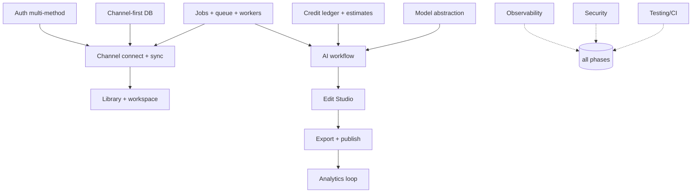

# 50 — Implementation Plan

> **Owner:** Engineering leadership + Product · **Audience:** All teams
> **Related:** [00_Master_PRD](00_Master_PRD.md) · [46_Roadmap](46_Roadmap.md) · [48_Project_Checklist](48_Project_Checklist.md) · [02_System_Architecture](02_System_Architecture.md)

---

## Executive Summary

This plan sequences CreatorForce from foundation to full platform in phased milestones, each with clear dependencies, deliverables, and exit criteria. It converts the specs into an ordered build path, prioritized P0 → P2, that reaches a usable channel-first product early and layers capability without rework. It enforces the platform's invariants (channel-first, non-destructive, transparent AI, async-by-default) from the first commit so later phases compose cleanly.

---

## Purpose

Provide a concrete, dependency-aware build order and exit criteria so teams can execute without guessing what to build first or how phases fit together.

---

## Goals

- Reach a usable channel-first MVP quickly.
- Build foundations (auth, data, jobs, credits) before features that depend on them.
- Ship the full AI workflow and Edit Studio without rework.
- Keep security, observability, and testing in every phase, not at the end.

---

## Scope

In scope: phasing, dependencies, deliverables, exit criteria, sequencing rationale. Out of scope: per-feature design (numbered specs) and dated commitments (business-owned).

---

## Guiding Sequencing Principles

1. **Foundations first:** identity, channel-first data, jobs, credits, observability, security scaffolding.
2. **Invariants from day one:** channel scoping, non-destructive versioning, estimate/accept/run, async jobs.
3. **Thin vertical slices:** ship one end-to-end path (connect → sync → one AI stage → edit → publish) before breadth.
4. **Testing + security continuous:** every slice ships with tests and passes security gates.

---

## Dependency Map



---

## Phase 0 — Foundations & Channel-First MVP (P0)

**Objective:** a user can sign in, connect a channel, see it fully sync, and run one AI stage with transparent credits.

Deliverables:
- Auth: Email, Google, Apple, Facebook + account linking + sessions ([15_Authentication](15_Authentication.md)).
- Channel-first schema + migrations ([03_Database_Architecture](03_Database_Architecture.md)).
- Queue + workers + job model ([12_Background_Jobs](12_Background_Jobs.md), [34_Background_Workers](34_Background_Workers.md), [35_Queues](35_Queues.md)).
- YouTube channel connect + resumable full sync ([04_Channel_Workspace](04_Channel_Workspace.md), [08_Playlists_and_Library](08_Playlists_and_Library.md)).
- Workspace shell + virtual/infinite library ([04_Channel_Workspace](04_Channel_Workspace.md)).
- Credit ledger + estimate/accept/run + budgets ([10_AI_Credits](10_AI_Credits.md)).
- Model abstraction + one capability (e.g., Script) ([11_AI_Models](11_AI_Models.md), [33_AI_Agent_Architecture](33_AI_Agent_Architecture.md)).
- Observability, security scaffolding, CI/CD with gates ([20_Observability](20_Observability.md), [14_Security](14_Security.md), [29_CI_CD](29_CI_CD.md)).

**Exit criteria:**
- [ ] Sign in with all four methods; link methods; sessions revocable.
- [ ] Connect a channel; full library syncs in background (resumable).
- [ ] Workspace auto-loads; library scrolls at 10k+ items.
- [ ] Run one AI stage with visible estimate; output versioned + reversible.
- [ ] CI gates (tests + SAST/SCA/DAST) green.

---

## Phase 1 — Full AI Workflow & Edit Studio (P0)

**Objective:** the complete workflow with non-destructive editing and publishing.

Deliverables:
- All workflow stages with selective regeneration ([05_AI_Workflow](05_AI_Workflow.md)).
- Voice/Music/Video/Image capabilities via model layer ([11_AI_Models](11_AI_Models.md)).
- Edit Studio: timeline, multi-track, versions, comparison, undo/redo, render ([06_Edit_Studio](06_Edit_Studio.md)).
- Asset management + Brand Kit ([09_Asset_Management](09_Asset_Management.md)).
- Review & approval gates ([05_AI_Workflow](05_AI_Workflow.md)).
- Export + YouTube publishing (Publishing service).
- Shorts Studio ([07_Shorts_Studio](07_Shorts_Studio.md)).

**Exit criteria:**
- [ ] Full workflow runnable; each stage editable + reversible.
- [ ] Editing one unit regenerates only affected downstream units.
- [ ] Edit Studio non-destructive with comparison + revert.
- [ ] Publish to YouTube succeeds.
- [ ] Playwright E2E covers the full journey.

---

## Phase 2 — Analytics Loop & Optimization (P1)

**Objective:** close the loop and make cost/quality smarter.

Deliverables:
- Analytics ingestion + workspace display (Analytics service).
- Credit forecasting, optimization recommendations, resource dashboard ([10_AI_Credits](10_AI_Credits.md)).
- Caching maturity + performance budgets enforced ([36_Caching](36_Caching.md), [44_Performance_Budget](44_Performance_Budget.md)).
- Notifications ([12_Background_Jobs](12_Background_Jobs.md)).
- Accessibility + i18n hardening ([42_Accessibility](42_Accessibility.md), [43_Internationalization](43_Internationalization.md)).

**Exit criteria:**
- [ ] Analytics feed back into Analyse stage.
- [ ] Forecast + recommendations live in the dashboard.
- [ ] Performance budgets enforced in CI.
- [ ] WCAG 2.2 AA verified.

---

## Phase 3 — Teams & Multi-Platform (P2, future)

**Objective:** collaboration and reach.

Deliverables:
- Team collaboration (roles, shared review, comments).
- Multi-platform publishing beyond YouTube.
- Model marketplace / templates.
- Multi-region + DR maturity ([41_Disaster_Recovery](41_Disaster_Recovery.md)).

**Exit criteria:**
- [ ] Multiple users collaborate on a channel with RBAC.
- [ ] Publish to at least one additional platform.
- [ ] DR game days pass.

---

## Cross-Cutting Workstreams (all phases)

| Workstream | Continuous deliverable |
|---|---|
| Security | OWASP controls, prompt-injection isolation, scans in CI ([14_Security](14_Security.md), [23_OWASP_ZAP](23_OWASP_ZAP.md), [25_Snyk](25_Snyk.md), [27_Semgrep](27_Semgrep.md)) |
| Testing | Full suite per feature ([21_Testing_Strategy](21_Testing_Strategy.md), [22_Playwright_Testing](22_Playwright_Testing.md)) |
| Observability | Metrics/logs/traces/alerts ([20_Observability](20_Observability.md), [28_Prometheus_Grafana](28_Prometheus_Grafana.md)) |
| Reliability | Backups + DR ([40_Backup_Recovery](40_Backup_Recovery.md), [41_Disaster_Recovery](41_Disaster_Recovery.md)) |
| Release | Gated CI/CD + progressive delivery ([29_CI_CD](29_CI_CD.md), [45_Release_Process](45_Release_Process.md)) |

---

## Folder Structure (delivery view)

```
creatorforce/
├── apps/{web,api}
├── services/{auth,channel,ai-orchestration,credit,media,publishing,analytics,notification}
├── workers/
├── packages/{domain,db,contracts,observability,config}
├── infra/            # IaC + CI/CD
└── tests/            # cross-cutting
```

---

## Database Design

All phases build on the channel-first schema in [03_Database_Architecture](03_Database_Architecture.md); schema changes use expand/contract for zero-downtime.

## API Design

Endpoints delivered per phase, contract-first and channel-scoped ([16_API_Architecture](16_API_Architecture.md)).

## UI Design

Workspace and studios delivered per phase following [17_Frontend_UI_UX](17_Frontend_UI_UX.md).

## Component Design

Shared component library grows across phases; no duplication ([18_Component_Guidelines](18_Component_Guidelines.md)).

---

## Business Rules

- Later phases must not violate earlier invariants.
- P2 scope excluded from P0/P1.
- Each phase exits only when its acceptance criteria pass.

## Validation Rules

- Phase exit gated by acceptance criteria and CI health.
- No skipping foundations to reach features.

---

## Security / Performance / Caching / Background Jobs / Error Handling / Logging

Delivered continuously per the cross-cutting workstreams and their specs; never deferred to a later phase.

---

## Testing

Each phase ships its full test layers; Phase 1 adds full Playwright journeys; Phase 2 adds performance-budget enforcement; Phase 3 adds DR game days. See [21_Testing_Strategy](21_Testing_Strategy.md).

---

## Acceptance Criteria

- [ ] Phases delivered in dependency order.
- [ ] Invariants enforced from Phase 0.
- [ ] Each phase meets its exit criteria before the next begins.
- [ ] Cross-cutting workstreams active in every phase.

---

## Edge Cases

- Foundation slips → do not start dependent features; re-sequence.
- Provider/quota constraints → Phase 0 sync must be resumable before scaling breadth.
- Scope pressure → defer to a later phase rather than cut invariants.

---

## Risks

| Risk | Mitigation |
|---|---|
| Building breadth before foundations | Strict dependency gating |
| Deferring security/testing | Continuous cross-cutting workstreams |
| Scope creep from "OS" vision | P0/P1/P2 gating + roadmap alignment |
| Version storage cost early | Pruning policy in Phase 0 data design |

---

## Future Improvements

- Parallelize independent Phase 1 capabilities across teams.
- Introduce ADRs for major decisions.
- Automate exit-criteria verification in CI dashboards.

---

## Implementation Checklist

- [ ] Phase 0 foundations complete + exit criteria met.
- [ ] Phase 1 workflow + Edit Studio + publish complete.
- [ ] Phase 2 analytics + optimization complete.
- [ ] Phase 3 teams + multi-platform (future) scoped.
- [ ] Cross-cutting workstreams green throughout.

---

## References

[00_Master_PRD](00_Master_PRD.md) · [02_System_Architecture](02_System_Architecture.md) · [03_Database_Architecture](03_Database_Architecture.md) · [05_AI_Workflow](05_AI_Workflow.md) · [10_AI_Credits](10_AI_Credits.md) · [15_Authentication](15_Authentication.md) · [46_Roadmap](46_Roadmap.md) · [48_Project_Checklist](48_Project_Checklist.md)
