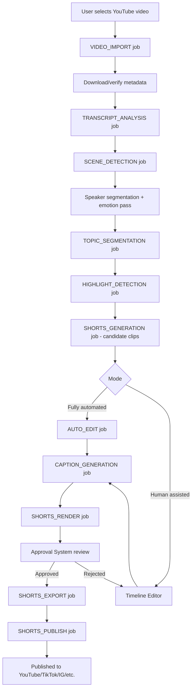
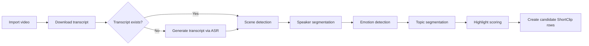
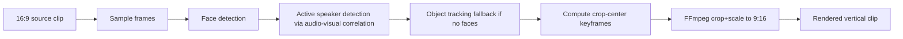

# AI Shorts Studio — Module Specification

**Module ID:** `ai-shorts-studio`
**Status:** Design-complete, ready for implementation
**Owning surface:** CreatorForce Platform
**Author:** Lead AI Architect

> This document specifies a new module for the existing CreatorForce platform. It **does not** introduce new architecture — it reuses the existing Next.js frontend, NestJS backend, PostgreSQL + Prisma, BullMQ job queue, Agent Job system, Shared AI Client, FFmpeg pipeline, Project/Asset system, Job Queue, Pipeline framework, and Approval System. Every section below states explicitly which existing service is being extended versus what net-new code is required.

---

## Table of Contents

1. [Overview](#1-overview)
2. [YouTube Integration](#2-youtube-integration)
3. [Video Import Pipeline](#3-video-import-pipeline)
4. [AI Topic Detection](#4-ai-topic-detection)
5. [Highlight Scoring](#5-highlight-scoring)
6. [Clip Recommendation](#6-clip-recommendation)
7. [AI Clip Types](#7-ai-clip-types)
8. [Interactive Timeline Editor](#8-interactive-timeline-editor)
9. [AI Editing Assistant](#9-ai-editing-assistant)
10. [Manual Editing](#10-manual-editing)
11. [AI Caption System](#11-ai-caption-system)
12. [Smart Reframing](#12-smart-reframing)
13. [Thumbnail Generator](#13-thumbnail-generator)
14. [Asset Management](#14-asset-management)
15. [Agent Jobs](#15-agent-jobs)
16. [Resume Support](#16-resume-support)
17. [Database Design](#17-database-design)
18. [API Endpoints](#18-api-endpoints)
19. [Frontend](#19-frontend)
20. [Timeline UI](#20-timeline-ui)
21. [AI Provider Strategy](#21-ai-provider-strategy)
22. [Token Optimization](#22-token-optimization)
23. [Performance](#23-performance)
24. [Security](#24-security)
25. [Folder Structure](#25-folder-structure)
26. [Implementation Plan](#26-implementation-plan)
27. [Future Extensions](#27-future-extensions)

---

## 1. Overview

AI Shorts Studio lets a creator connect a YouTube channel, pick one long-form video they already own, and have CreatorForce's existing Agent Job pipeline turn it into multiple publish-ready vertical Shorts — either fully autonomously or with a human editor in the loop at any stage.

### 1.1 End-to-end workflow



### 1.2 Two operating modes

| Mode | Description | Human touchpoints |
|---|---|---|
| **Fully AI automated** | Pipeline runs VIDEO_IMPORT through SHORTS_PUBLISH unattended, stopping only at the mandatory Approval System gate before publish. | Approval only |
| **Human assisted** | Pipeline stops after SHORTS_GENERATION. Candidate clips populate the Timeline Editor. User edits, then resumes the pipeline from AUTO_EDIT/CAPTION_GENERATION onward. | Editing + Approval |

Both modes share the exact same Agent Job graph — the only difference is which jobs are auto-enqueued versus queued in a WAITING_ON_USER state (see Section 15, Section 16).

### 1.3 What is reused vs. net-new

| Layer | Reused as-is | Net-new |
|---|---|---|
| Auth/OAuth | Existing YouTube OAuth connector | Scope additions only (read-only) |
| Queue | BullMQ, existing AgentJobQueue, existing worker pool | New job processors registered under existing queue |
| AI | Shared AI Client, provider router | New prompt templates + task types |
| Media | FFmpeg pipeline service, existing renderer | New render presets (9:16, captions, reframe filters) |
| Storage | Existing Asset system, signed URL service | New AssetType enum values |
| Data | Existing Project, Asset, Job, ApprovalRequest tables | New tables listed in Section 17 |
| Frontend | Existing Project shell, Job status components, Approval UI | New route group shorts-studio + Timeline Editor components |

---

## 2. YouTube Integration

**Reuses:** existing `YouTubeOAuthConnector`, existing `OAuthToken` storage, existing token refresh cron.
**Net-new:** a thin `YouTubeReadService` wrapping YouTube Data API v3 + Captions API, scoped **read-only**.

### 2.1 Required scopes

```
https://www.googleapis.com/auth/youtube.readonly
https://www.googleapis.com/auth/youtube.force-ssl   (captions download only)
```

No upload/write scopes are requested by this module. Publishing (Section 15/18) is handled by the existing Publishing connector module, not by AI Shorts Studio directly — Shorts Studio only *hands off* a render + metadata payload to it.

### 2.2 Data pulled per video

| Field | Source | Cached in |
|---|---|---|
| Video ID, title, description | `videos.list` | `ImportedVideo` |
| Duration | `videos.list` (`contentDetails.duration`) | `ImportedVideo` |
| Thumbnail URLs | `videos.list` | `ImportedVideo` |
| View / like / comment counts | `videos.list` (`statistics`) | `ImportedVideo` (refreshed on demand) |
| Captions/transcript | `captions.list` + `captions.download`, fallback to Whisper via Shared AI Client | `TranscriptSegment` |
| Channel video list | `search.list` / `playlistItems.list` (uploads playlist) | not persisted — paginated live |

### 2.3 Service interface

```typescript
// apps/api/src/modules/shorts-studio/youtube/youtube-read.service.ts
export interface YouTubeReadService {
  listChannelVideos(channelId: string, pageToken?: string): Promise<YouTubeVideoListPage>;
  getVideoMetadata(videoId: string): Promise<YouTubeVideoMetadata>;
  getTranscript(videoId: string): Promise<TranscriptSegmentDTO[] | null>; // null if no captions exist
  getStatistics(videoId: string): Promise<YouTubeVideoStatistics>;
}
```

If `getTranscript` returns `null`, the `TRANSCRIPT_ANALYSIS` job falls back to audio extraction + Shared AI Client speech-to-text (see Section 3).

---

## 3. Video Import Pipeline

**Reuses:** existing Pipeline framework (`PipelineDefinition`, `PipelineRunner`), existing Agent Job system, existing Asset system for the downloaded media file, existing BullMQ queue.
**Net-new:** one `PipelineDefinition` (`shorts-import-pipeline`) chaining the jobs below, plus the job processors themselves.

### 3.1 Pipeline stages



### 3.2 Trigger

`POST /api/shorts-studio/videos/:importedVideoId/analyze` enqueues the pipeline (see Section 18). This creates one `Job` row of type `VIDEO_IMPORT` as the pipeline root; each subsequent stage is a child `Job` linked via `parentJobId`, matching the existing Agent Job parent/child convention.

### 3.3 Persistence contract

Every stage writes its output before signaling completion, so any stage can be resumed independently (Section 16):

| Stage | Writes to |
|---|---|
| Import video | `ImportedVideo`, raw video `Asset` |
| Download/generate transcript | `TranscriptSegment[]` |
| Scene detection | `VideoScene[]` |
| Speaker segmentation | `VideoScene.speakerId` back-fill |
| Emotion detection | `VideoScene.emotionScores` (jsonb) |
| Topic segmentation | `TopicSegment[]` |
| Highlight scoring | `Highlight[]` |
| Candidate clips | `ShortClip[]` (status `CANDIDATE`) |

---

## 4. AI Topic Detection

**Reuses:** Shared AI Client (task-routed completion calls), existing embeddings service if present, existing transcript chunking utilities.
**Net-new:** the `TopicSegmentationService` prompt chain.

### 4.1 Principle

The model must never fall back to fixed-interval slicing. Topic boundaries are derived from **semantic discourse structure**, not time. The prompt explicitly instructs the model to reason about where one self-contained idea ends and another begins, using the transcript plus scene-boundary and speaker-change signals as supporting evidence — not as the splitting mechanism itself.

### 4.2 Topic categories the model must classify each segment into

`QUESTION_ANSWERED`, `STORY`, `TUTORIAL_STEP`, `FUNNY_MOMENT`, `IMPORTANT_STATEMENT`, `HOOK`, `PROBLEM`, `SOLUTION`, `STATISTIC`, `TIP`, `MISTAKE`, `WARNING`, `QUOTE`, `OPINION`, `LESSON`, `SUCCESS_STORY`, `FAILURE`, `CALL_TO_ACTION`

### 4.3 Processing approach

1. Chunk transcript into overlapping windows (~2,000 tokens, 200-token overlap) to stay within context limits while preserving cross-boundary continuity.
2. For each window, call Shared AI Client with task type `topic-segmentation`, requesting strict JSON output: array of `{ startMs, endMs, category, title, summary, confidence }`.
3. Merge overlapping-window results, deduplicating segments whose boundaries fall inside the overlap zone (keep the higher-confidence call).
4. Persist merged segments to `TopicSegment`.

### 4.4 Example prompt contract (Shared AI Client task)

```typescript
await sharedAIClient.complete({
  task: 'topic-segmentation',
  input: { transcriptWindow, sceneBoundaries, speakerChanges },
  responseSchema: TopicSegmentArraySchema, // zod schema, enforced via provider JSON mode
});
```

The Shared AI Client — not this module — decides which underlying provider (OpenAI/Claude/Gemini) services the `topic-segmentation` task (Section 21).

---

## 5. Highlight Scoring

**Reuses:** Shared AI Client, `TopicSegment` output from Section 4.
**Net-new:** `HighlightScoringService`.

### 5.1 Score dimensions (0-100 each)

`virality`, `emotion`, `retention`, `hookStrength`, `education`, `entertainment`, `confidence`, `trendPotential`, `shortSuitability`

### 5.2 Final score

```
finalScore = weighted average of the 9 dimensions,
             weights configurable per-project in HighlightScoringWeights
             default: equal weighting (1/9 each) if no override exists
```

Weights are stored per-project so a tutorial-focused channel can weight `education` higher than `virality`, while an entertainment channel does the opposite.

### 5.3 Output

Each `TopicSegment` produces exactly one `Highlight` row containing the 9 sub-scores + `finalScore` + a short natural-language `reason` string explaining the score (used in the UI, Section 6).

---

## 6. Clip Recommendation

**Reuses:** `Highlight` rows from Section 5.
**Net-new:** `ClipRecommendationService` — pure ranking/formatting logic, no additional AI calls (scores already computed).

### 6.1 Behavior

`GET /api/shorts-studio/videos/:id/recommendations?limit=5|10|20` returns the top-N `Highlight` rows by `finalScore`, each formatted as:

```typescript
interface ClipRecommendation {
  highlightId: string;
  topicSegmentId: string;
  startMs: number;
  endMs: number;
  durationMs: number;
  confidence: number;         // 0-1
  reason: string;             // from Highlight.reason
  predictedPerformance: {     // derived from score dimensions, not a separate model call
    viralityBand: 'low' | 'medium' | 'high';
    estimatedRetention: number;
  };
  keywords: string[];         // extracted from TopicSegment.summary via lightweight NLP, no extra LLM call
  titleSuggestion: string;    // generated in the same LLM call as Section 4/5 to avoid extra tokens (Section 22)
}
```

Title suggestions are generated **during** the topic-segmentation/highlight-scoring calls (piggybacked in the JSON schema) rather than as a separate request, per the token-optimization rule in Section 22.

---

## 7. AI Clip Types

**Reuses:** the same candidate `ShortClip` + FFmpeg render pipeline; only the output preset differs.
**Net-new:** a `ClipTypePreset` config table/enum driving aspect ratio, max duration, and safe-zone overlay for each target platform.

| Clip type | Aspect ratio | Max duration | Safe-zone notes |
|---|---|---|---|
| `YOUTUBE_SHORTS` | 9:16 | 60s (up to 180s where allowed) | Avoid bottom 12% (UI overlay) |
| `INSTAGRAM_REELS` | 9:16 | 90s | Avoid bottom 20%, top 8% |
| `TIKTOK` | 9:16 | 60s | Avoid bottom 15% (caption/UI) |
| `LINKEDIN_CLIPS` | 1:1 or 16:9 | 90s | No strict safe-zone |
| `FACEBOOK_REELS` | 9:16 | 90s | Avoid bottom 18% |
| `PODCAST_HIGHLIGHTS` | 16:9 or 1:1 | 120s | Waveform/static-image layout supported |

A single `Highlight` can be rendered into multiple `ShortClip` rows, one per requested `ClipType`, sharing the same source timecodes but independent render/caption/reframe settings.

---

## 8. Interactive Timeline Editor

**Reuses:** existing Project workspace shell, existing Asset preview/streaming service, existing undo/redo pattern if one exists elsewhere in CreatorForce (otherwise the local implementation below is net-new and scoped to this module only).
**Net-new:** `TimelineEditor` React component tree + `Timeline`/`TimelineTrack`/`TimelineItem` data model (Section 17).

### 8.1 Required interactions

Trim, split, delete, merge, duplicate, move, resize, zoom, snap-to-grid/snap-to-marker, undo/redo (command-stack based), full keyboard-shortcut set, drag-and-drop reordering across tracks.

### 8.2 Client-side architecture

- State managed via a command-pattern reducer (`TimelineCommand` objects), enabling trivial undo/redo by replaying/inverting commands rather than diffing full state snapshots.
- Every mutating command is optimistically applied client-side, then persisted via `PATCH /api/shorts-studio/timelines/:id` (debounced/batched), and appended to `TimelineEditHistory` server-side for audit (Section 24).
- Timeline rendering uses virtualization for tracks with many items (Section 23).

### 8.3 Command interface (sketch)

```typescript
type TimelineCommand =
  | { type: 'TRIM'; itemId: string; newStartMs: number; newEndMs: number }
  | { type: 'SPLIT'; itemId: string; atMs: number }
  | { type: 'DELETE'; itemId: string }
  | { type: 'MERGE'; itemIds: [string, string] }
  | { type: 'DUPLICATE'; itemId: string }
  | { type: 'MOVE'; itemId: string; toTrackId: string; toStartMs: number }
  | { type: 'RESIZE'; itemId: string; edge: 'start' | 'end'; deltaMs: number };
```

---

## 9. AI Editing Assistant

**Reuses:** Shared AI Client, FFmpeg pipeline (silence/filler detection is signal-processing + transcript-alignment, not a new render engine), existing face-detection library if already present in CreatorForce's media stack (otherwise net-new dependency, isolated to this module).
**Net-new:** `AIEditingAssistantService`, exposed as a set of "apply suggestion" actions inside the Timeline Editor rather than a chat interface.

### 9.1 Capabilities

| Capability | Mechanism |
|---|---|
| Remove silence | Audio energy analysis on the source track (FFmpeg `silencedetect`), returns cut-list |
| Remove filler words ("uh", "um") | Forced alignment between transcript words and audio timestamps; filler tokens flagged via transcript pattern-match + LLM confirmation for ambiguous cases |
| Remove repeated sentences | Transcript similarity detection (embedding cosine similarity) flags near-duplicate spans for user/AI removal |
| Improve pacing | LLM-suggested cut points based on transcript density scoring, applied as `TRIM`/`DELETE` commands |
| Auto zoom / auto crop / auto reframe | See Section 12 |
| Face / speaker tracking | Frame-sampled face detection feeding the reframe engine (Section 12) |
| Auto captions | See Section 11 |
| Auto emojis | Piggybacked on caption generation LLM call |
| Auto B-roll suggestions | LLM proposes stock/asset-library search terms per segment; user/auto picks from existing Asset library or connected stock provider |
| Auto transitions / background music / sound effects | Rule-based defaults per `ClipTypePreset`, overridable; music/SFX pulled from existing Asset library |
| Auto title overlays / auto CTA | Generated text overlays positioned via safe-zone rules (Section 7) |

### 9.2 Interaction model

Every AI Editing Assistant action returns a **proposed diff** (a list of `TimelineCommand`s) rather than mutating the timeline directly. In fully-automated mode, the diff is auto-applied; in human-assisted mode, it is shown as a reviewable suggestion the user accepts, edits, or rejects — keeping both modes on one code path.

---

## 10. Manual Editing

**Reuses:** Timeline Editor mutation pipeline (Section 8), Asset library for music/logo/watermark/image-overlay assets.
**Net-new:** property panels bound to `TimelineItem` attributes.

### 10.1 Editable properties

Start, end, crop, rotate, speed, audio, volume, music, captions, text, image overlay, sticker, blur, mute, background, watermark, logo — all modeled as typed fields on `TimelineItem`/`Caption` (Section 17), edited via the same `PATCH` + `TimelineEditHistory` audit path as AI-driven edits.

---

## 11. AI Caption System

**Reuses:** Shared AI Client (for caption text + keyword emphasis), transcript/forced-alignment data from Section 3/9.
**Net-new:** `CaptionGenerationService`, `Caption` model, caption rendering filters in the FFmpeg pipeline.

### 11.1 Supported modes

Word-by-word, sentence-level, animated, keyword-highlighted, emoji-insertion, per-speaker color coding, template/font selection.

### 11.2 Generation flow

1. Forced alignment produces word-level timestamps.
2. A single Shared AI Client call (task `caption-styling`) annotates which words are "keywords" (for highlight styling) and suggests emoji insertions inline — reusing the same transcript context already loaded, per Section 22.
3. Output persisted as `Caption` rows referencing word-level timing + style metadata (jsonb: color, emphasis, emoji).
4. Render stage burns captions in per the selected template, or exports as a soft-caption track depending on target platform requirements.

---

## 12. Smart Reframing

**Reuses:** FFmpeg pipeline for crop/scale filters.
**Net-new:** `SmartReframeService` — face/active-speaker/object tracking producing a per-frame (or per-keyframe) crop-center path, consumed by FFmpeg's `crop`/`zoompan` filters.

### 12.1 Flow



Crop-center keyframes are smoothed (moving average) to avoid jitter, and stored on the `ShortClip` as `reframeKeyframes` (jsonb) so re-renders (e.g. after a manual caption edit) don't require re-running detection — consistent with Section 16/22.

---

## 13. Thumbnail Generator

**Reuses:** Shared AI Client (image-capable provider) or existing frame-extraction + overlay tooling if CreatorForce already has a thumbnail service elsewhere; otherwise net-new here, scoped to Shorts.
**Net-new:** `ThumbnailGenerationService`.

### 13.1 Flow

1. Extract N candidate frames from the highlight-scored region of the clip (favor high-emotion frames using Section 4/5 emotion scores already computed — no new detection pass).
2. Generate 3-5 thumbnail variations combining a candidate frame with an AI-generated title overlay (short text derived from the clip's `titleSuggestion`, Section 6).
3. Apply the project's brand template (logo, color, font) if one is configured in the existing brand-kit system.
4. Persist each variation as a `Thumbnail` asset linked to the `ShortClip`; user (or auto-mode) selects the primary one.

---

## 14. Asset Management

**Reuses:** the existing Asset system (storage, signed URLs, versioning) in full — this section only enumerates the new `AssetType` values Shorts Studio introduces. No parallel storage system is created.

| AssetType | Produced by |
|---|---|
| `SHORTS_SOURCE_VIDEO` | Video Import Pipeline (Section 3) |
| `SHORTS_TRANSCRIPT` | Transcript stage |
| `SHORTS_SCENE_MANIFEST` | Scene detection |
| `SHORTS_CLIP_RENDER` | SHORTS_RENDER job |
| `SHORTS_CAPTION_TRACK` | Caption generation |
| `SHORTS_MUSIC` / `SHORTS_SFX` | AI Editing Assistant or user upload |
| `SHORTS_VOICE` | Reserved for future dubbing/voiceover (Section 27) |
| `SHORTS_THUMBNAIL` | Thumbnail Generator |
| `SHORTS_PREVIEW` | Low-res proxy render for editor scrubbing |
| `SHORTS_FINAL_EXPORT` | SHORTS_EXPORT job |

All assets carry the existing `projectId`, `ownerId`, and signed-URL access model — Section 24 covers isolation.

---

## 15. Agent Jobs

**Reuses:** the existing Agent Job system entirely — job lifecycle states, retry policy, BullMQ processor registration pattern, `parentJobId` chaining. This section only lists the new `JobType` enum values and their processors.

| JobType | Input | Output | Resumable unit |
|---|---|---|---|
| `VIDEO_IMPORT` | YouTube video ID | `ImportedVideo` + source Asset | Whole job |
| `TRANSCRIPT_ANALYSIS` | `ImportedVideo` | `TranscriptSegment[]` | Whole job |
| `SCENE_DETECTION` | source Asset | `VideoScene[]` | Whole job |
| `TOPIC_SEGMENTATION` | transcript + scenes | `TopicSegment[]` | Per transcript window (Section 4.3) |
| `HIGHLIGHT_DETECTION` | `TopicSegment[]` | `Highlight[]` | Per segment |
| `SHORTS_GENERATION` | `Highlight[]` + requested `ClipType[]` | `ShortClip[]` (status `CANDIDATE`) | Per highlight × clip type |
| `AUTO_EDIT` | `ShortClip` + `Timeline` | Applied `TimelineCommand[]` | Per clip |
| `CAPTION_GENERATION` | `Timeline` + transcript | `Caption[]` | Per clip |
| `SHORTS_RENDER` | `Timeline` + `Caption[]` + reframe data | `RenderJob` → rendered Asset | Whole job, checkpointed by FFmpeg pass |
| `SHORTS_EXPORT` | rendered Asset | `ExportHistory` row + platform-ready package | Whole job |
| `SHORTS_PUBLISH` | export package | publish confirmation (via existing Publishing connector) | Whole job |

### 15.1 Registration pattern

```typescript
// apps/api/src/modules/shorts-studio/jobs/shorts-studio.jobs.module.ts
@Module({
  imports: [AgentJobModule], // existing
  providers: [
    VideoImportProcessor,
    TranscriptAnalysisProcessor,
    SceneDetectionProcessor,
    TopicSegmentationProcessor,
    HighlightDetectionProcessor,
    ShortsGenerationProcessor,
    AutoEditProcessor,
    CaptionGenerationProcessor,
    ShortsRenderProcessor,
    ShortsExportProcessor,
    ShortsPublishProcessor,
  ],
})
export class ShortsStudioJobsModule {}
```

Each processor implements the existing `AgentJobProcessor<TInput, TOutput>` interface already used by other CreatorForce modules — no new processor contract is introduced.

---

## 16. Resume Support

**Reuses:** existing Job retry/resume semantics (idempotency keys, `Job.status`, checkpoint payloads).
**Net-new:** checkpoint granularity specific to Shorts Studio's long-running stages.

### 16.1 Rules

1. **Never regenerate completed work.** Before enqueuing any job, the pipeline runner checks for an existing completed sibling job producing the same output (keyed by `(importedVideoId, jobType)` or `(shortClipId, jobType)`). If found and its output rows still exist, the job is skipped and marked `SKIPPED_ALREADY_SATISFIED`.
2. **Reuse assets.** `SHORTS_RENDER` reuses the existing `SHORTS_PREVIEW` proxy asset for scrubbing instead of re-rendering full quality until export.
3. **Reuse transcript.** `TRANSCRIPT_ANALYSIS` output is keyed by `importedVideoId` and never re-run for a video that already has segments, even across multiple Shorts-generation attempts.
4. **Reuse embeddings.** Any embeddings computed for duplicate-sentence detection (Section 9) or keyword extraction (Section 6) are cached on the `TranscriptSegment` row (`embedding` vector column) and reused across all downstream jobs for that video.
5. **Reuse scene detection.** `VideoScene` rows are immutable once written for a given source Asset checksum; if the same video is re-imported, scene detection is skipped.
6. **Partial resume within a job.** `TOPIC_SEGMENTATION` and `HIGHLIGHT_DETECTION` checkpoint per transcript-window / per-segment (Section 4.3/5), storing progress in `Job.checkpoint` (jsonb) so a crashed job resumes at the next unprocessed unit rather than restarting.

---

## 17. Database Design

**Reuses:** existing `Project`, `Asset`, `Job`, `ApprovalRequest`, `User` models — all new models below reference them via foreign key, none duplicate their fields.

```prisma
// packages/db/prisma/schema/shorts-studio.prisma

model ImportedVideo {
  id                String   @id @default(cuid())
  projectId         String
  project           Project  @relation(fields: [projectId], references: [id])
  youtubeVideoId    String
  title             String
  description       String?  @db.Text
  durationMs        Int
  thumbnailUrl      String?
  viewCount         BigInt?
  likeCount         BigInt?
  commentCount      BigInt?
  sourceAssetId     String?
  sourceAsset       Asset?   @relation(fields: [sourceAssetId], references: [id])
  transcriptStatus  TranscriptStatus @default(PENDING)
  createdAt         DateTime @default(now())
  updatedAt         DateTime @updatedAt

  transcriptSegments TranscriptSegment[]
  scenes             VideoScene[]
  topicSegments      TopicSegment[]

  @@unique([projectId, youtubeVideoId])
  @@index([projectId])
}

enum TranscriptStatus {
  PENDING
  YOUTUBE_CAPTIONS
  ASR_GENERATED
  FAILED
}

model TranscriptSegment {
  id              String   @id @default(cuid())
  importedVideoId String
  importedVideo   ImportedVideo @relation(fields: [importedVideoId], references: [id])
  startMs         Int
  endMs           Int
  speakerId       String?
  text            String   @db.Text
  embedding       Float[]  // pgvector recommended; array fallback documented in 17.1
  createdAt       DateTime @default(now())

  @@index([importedVideoId, startMs])
}

model VideoScene {
  id              String   @id @default(cuid())
  importedVideoId String
  importedVideo   ImportedVideo @relation(fields: [importedVideoId], references: [id])
  startMs         Int
  endMs           Int
  speakerId       String?
  emotionScores   Json?    // { joy, anger, surprise, sadness, neutral, ... }
  sceneChangeConfidence Float?
  createdAt       DateTime @default(now())

  @@index([importedVideoId, startMs])
}

model TopicSegment {
  id              String   @id @default(cuid())
  importedVideoId String
  importedVideo   ImportedVideo @relation(fields: [importedVideoId], references: [id])
  startMs         Int
  endMs           Int
  category        TopicCategory
  title           String
  summary         String   @db.Text
  confidence      Float
  createdAt       DateTime @default(now())

  highlight       Highlight?
  clips           ShortClip[]

  @@index([importedVideoId, startMs])
}

enum TopicCategory {
  QUESTION_ANSWERED
  STORY
  TUTORIAL_STEP
  FUNNY_MOMENT
  IMPORTANT_STATEMENT
  HOOK
  PROBLEM
  SOLUTION
  STATISTIC
  TIP
  MISTAKE
  WARNING
  QUOTE
  OPINION
  LESSON
  SUCCESS_STORY
  FAILURE
  CALL_TO_ACTION
}

model Highlight {
  id               String   @id @default(cuid())
  topicSegmentId   String   @unique
  topicSegment     TopicSegment @relation(fields: [topicSegmentId], references: [id])
  virality         Float
  emotion          Float
  retention        Float
  hookStrength     Float
  education        Float
  entertainment    Float
  confidence       Float
  trendPotential   Float
  shortSuitability Float
  finalScore       Float
  reason           String   @db.Text
  titleSuggestion  String
  keywords         String[]
  createdAt        DateTime @default(now())

  @@index([finalScore])
}

model ShortClip {
  id              String   @id @default(cuid())
  topicSegmentId  String
  topicSegment    TopicSegment @relation(fields: [topicSegmentId], references: [id])
  projectId       String
  project         Project  @relation(fields: [projectId], references: [id])
  clipType        ClipType
  status          ShortClipStatus @default(CANDIDATE)
  sourceStartMs   Int
  sourceEndMs     Int
  reframeKeyframes Json?
  timelineId      String?  @unique
  timeline        Timeline?
  renderAssetId   String?
  renderAsset     Asset?   @relation(fields: [renderAssetId], references: [id])
  createdAt       DateTime @default(now())
  updatedAt       DateTime @updatedAt

  thumbnails      Thumbnail[]

  @@index([projectId, status])
}

enum ClipType {
  YOUTUBE_SHORTS
  INSTAGRAM_REELS
  TIKTOK
  LINKEDIN_CLIPS
  FACEBOOK_REELS
  PODCAST_HIGHLIGHTS
}

enum ShortClipStatus {
  CANDIDATE
  IN_EDITING
  READY_FOR_RENDER
  RENDERING
  RENDERED
  PENDING_APPROVAL
  APPROVED
  REJECTED
  EXPORTED
  PUBLISHED
}

model Timeline {
  id          String   @id @default(cuid())
  shortClipId String   @unique
  shortClip   ShortClip @relation(fields: [shortClipId], references: [id])
  durationMs  Int
  createdAt   DateTime @default(now())
  updatedAt   DateTime @updatedAt

  tracks      TimelineTrack[]
  editHistory TimelineEditHistory[]
}

model TimelineTrack {
  id          String   @id @default(cuid())
  timelineId  String
  timeline    Timeline @relation(fields: [timelineId], references: [id])
  type        TimelineTrackType
  orderIndex  Int

  items       TimelineItem[]

  @@index([timelineId, orderIndex])
}

enum TimelineTrackType {
  VIDEO
  AUDIO
  MUSIC
  CAPTION
  OVERLAY
}

model TimelineItem {
  id           String   @id @default(cuid())
  trackId      String
  track        TimelineTrack @relation(fields: [trackId], references: [id])
  startMs      Int
  endMs        Int
  sourceAssetId String?
  sourceAsset  Asset?   @relation(fields: [sourceAssetId], references: [id])
  cropRect     Json?     // { x, y, width, height }
  rotationDeg  Float?    @default(0)
  speed        Float?    @default(1.0)
  volume       Float?    @default(1.0)
  properties   Json?     // catch-all for blur, mute, watermark, sticker, text overlay, etc.

  @@index([trackId, startMs])
}

model Caption {
  id           String   @id @default(cuid())
  timelineId   String
  timeline     Timeline @relation(fields: [timelineId], references: [id])
  startMs      Int
  endMs        Int
  text         String
  speakerColor String?
  emphasis     Boolean  @default(false)
  emoji        String?
  templateId   String?

  @@index([timelineId, startMs])
}

model TimelineEditHistory {
  id          String   @id @default(cuid())
  timelineId  String
  timeline    Timeline @relation(fields: [timelineId], references: [id])
  actorId     String   // User.id, or 'AI_ASSISTANT'
  command     Json      // serialized TimelineCommand
  createdAt   DateTime @default(now())

  @@index([timelineId, createdAt])
}

model Thumbnail {
  id           String   @id @default(cuid())
  shortClipId  String
  shortClip    ShortClip @relation(fields: [shortClipId], references: [id])
  assetId      String
  asset        Asset    @relation(fields: [assetId], references: [id])
  isPrimary    Boolean  @default(false)
  createdAt    DateTime @default(now())

  @@index([shortClipId])
}

model RenderJob {
  id            String   @id @default(cuid())
  shortClipId   String
  shortClip     ShortClip @relation(fields: [shortClipId], references: [id])
  jobId         String   // FK to existing Job table
  ffmpegPass    Int      @default(0)
  checkpointData Json?
  status        RenderJobStatus @default(QUEUED)
  createdAt     DateTime @default(now())
  updatedAt     DateTime @updatedAt

  @@index([shortClipId])
}

enum RenderJobStatus {
  QUEUED
  RUNNING
  CHECKPOINTED
  COMPLETE
  FAILED
}

model ExportHistory {
  id           String   @id @default(cuid())
  shortClipId  String
  shortClip    ShortClip @relation(fields: [shortClipId], references: [id])
  clipType     ClipType
  exportAssetId String
  exportAsset  Asset    @relation(fields: [exportAssetId], references: [id])
  publishedAt  DateTime?
  publishTargetId String? // FK to existing Publishing connector's target/account record
  createdAt    DateTime @default(now())

  @@index([shortClipId])
}
```

### 17.1 Notes

- `TranscriptSegment.embedding` should use the `pgvector` extension if already enabled on the CreatorForce PostgreSQL instance; otherwise store as `Float[]` and add a vector index later without a breaking migration.
- All new models are additive migrations under `packages/db/prisma/schema/shorts-studio.prisma`, merged into the existing multi-file Prisma schema — no changes to existing tables are required beyond adding inverse relations if CreatorForce's `Project`/`Asset` models need `@relation` back-references.

---

## 18. API Endpoints

**Reuses:** existing NestJS module conventions, existing auth guards, existing Job status polling endpoints (pipeline jobs are visible through the existing `/api/jobs/:id` endpoint — Shorts Studio does not duplicate job-status APIs).

All routes below are prefixed `/api/shorts-studio` and live in `apps/api/src/modules/shorts-studio/`.

### 18.1 Import

```
GET    /channels/:channelId/videos                 List channel videos (paginated passthrough)
GET    /videos/:youtubeVideoId/metadata             Fetch metadata without importing
POST   /videos/import                               { youtubeVideoId, projectId } -> ImportedVideo
```

### 18.2 Analyze

```
POST   /videos/:importedVideoId/analyze             Enqueues shorts-import-pipeline
GET    /videos/:importedVideoId/analysis-status      Aggregated status across pipeline jobs
GET    /videos/:importedVideoId/topics               List TopicSegment[]
GET    /videos/:importedVideoId/highlights            List Highlight[]
```

### 18.3 Generate

```
POST   /videos/:importedVideoId/recommendations       ?limit=5|10|20 -> ClipRecommendation[]
POST   /highlights/:highlightId/generate-clips         { clipTypes: ClipType[], mode: 'AUTO' | 'ASSISTED' } -> ShortClip[]
```

### 18.4 Timeline / Editor

```
GET    /clips/:shortClipId/timeline                    -> Timeline (with tracks + items + captions)
PATCH  /timelines/:timelineId                          { commands: TimelineCommand[] } -> Timeline
POST   /timelines/:timelineId/ai-suggestions           { capability: string } -> TimelineCommand[] (proposed diff, Section 9.2)
POST   /timelines/:timelineId/ai-suggestions/apply     { commands: TimelineCommand[] } -> Timeline
GET    /timelines/:timelineId/history                  -> TimelineEditHistory[]
```

### 18.5 Render

```
POST   /clips/:shortClipId/render                      Enqueues SHORTS_RENDER job -> RenderJob
GET    /clips/:shortClipId/render-status                -> RenderJob
```

### 18.6 Export

```
POST   /clips/:shortClipId/export                       { clipType } -> ExportHistory (enqueues SHORTS_EXPORT)
GET    /clips/:shortClipId/exports                       -> ExportHistory[]
```

### 18.7 Publish

```
POST   /clips/:shortClipId/publish                       { exportId, targetAccountId } -> enqueues SHORTS_PUBLISH,
                                                            gated by existing Approval System (Section 24)
GET    /clips/:shortClipId/publish-status                 -> publish confirmation / status
```

### 18.8 Example request/response

```http
POST /api/shorts-studio/highlights/hl_9f2a/generate-clips
Content-Type: application/json

{
  "clipTypes": ["YOUTUBE_SHORTS", "TIKTOK"],
  "mode": "ASSISTED"
}
```

```json
{
  "data": [
    {
      "id": "clip_7bce",
      "clipType": "YOUTUBE_SHORTS",
      "status": "CANDIDATE",
      "sourceStartMs": 184200,
      "sourceEndMs": 231800,
      "timelineId": "tl_44aa"
    },
    {
      "id": "clip_7bcf",
      "clipType": "TIKTOK",
      "status": "CANDIDATE",
      "sourceStartMs": 184200,
      "sourceEndMs": 231800,
      "timelineId": "tl_44ab"
    }
  ]
}
```

---

## 19. Frontend

**Reuses:** existing Next.js app shell, existing Project navigation, existing Job-status and Approval UI components, existing design system.
**Net-new:** route group `app/(project)/[projectId]/shorts-studio/`.

| Page | Route | Purpose |
|---|---|---|
| YouTube Library | `/shorts-studio/library` | Connected channel's videos, import action |
| Video Analysis | `/shorts-studio/videos/[importedVideoId]` | Pipeline progress, transcript/scene preview |
| Topic Viewer | `/shorts-studio/videos/[importedVideoId]/topics` | Browse `TopicSegment[]` by category |
| Highlight Viewer | `/shorts-studio/videos/[importedVideoId]/highlights` | Ranked highlights with score breakdown, generate-clips action |
| Timeline Editor | `/shorts-studio/clips/[shortClipId]/edit` | Full editing surface (Section 20) |
| Export | `/shorts-studio/clips/[shortClipId]/export` | Render status, clip-type variants, thumbnail picker |
| Publishing | `/shorts-studio/clips/[shortClipId]/publish` | Wraps existing Approval + Publishing UI, scoped to this clip |

---

## 20. Timeline UI

**Reuses:** Timeline Editor mutation pipeline (Section 8), Asset streaming for scrubbing preview.
**Net-new:** the visual timeline component itself.

### 20.1 Required elements

Multi-track layout, zoomable ruler, snap markers (scene boundaries, topic boundaries, beat markers from music), draggable playhead, per-track waveform rendering (audio/music tracks), full keyboard-shortcut map (space = play/pause, `S` = split, `Del` = delete, `Cmd/Ctrl+Z` = undo, `Cmd/Ctrl+Shift+Z` = redo, arrow keys = nudge selection, `+`/`-` = zoom).

### 20.2 Component tree (sketch)

```
<TimelineEditor>
  <TimelinePlayer />              // video preview, synced to playhead
  <TimelineToolbar />             // trim/split/merge/etc. actions, zoom control
  <TimelineRuler />                // time ruler + markers
  <TimelineTracks>
    <TimelineTrack type="VIDEO">
      <TimelineItem />
    </TimelineTrack>
    <TimelineTrack type="AUDIO">  <Waveform /> </TimelineTrack>
    <TimelineTrack type="MUSIC">  <Waveform /> </TimelineTrack>
    <TimelineTrack type="CAPTION"><CaptionBlock /></TimelineTrack>
    <TimelineTrack type="OVERLAY"><OverlayBlock /></TimelineTrack>
  </TimelineTracks>
  <AIAssistantPanel />            // Section 9 suggestions, review/accept UI
</TimelineEditor>
```

---

## 21. AI Provider Strategy

**Reuses:** the existing Shared AI Client and its provider-routing logic in full. This module introduces **zero** direct provider SDK calls — every AI operation goes through `sharedAIClient.complete(...)` with a `task` identifier.

### 21.1 New task identifiers registered by this module

`topic-segmentation`, `highlight-scoring`, `caption-styling`, `filler-word-detection`, `broll-suggestion`, `thumbnail-title-overlay`, `pacing-suggestion`

### 21.2 Routing responsibility

Provider selection (OpenAI vs Claude vs Gemini), fallback on failure, cost/latency/quality tradeoffs, and token accounting all remain the Shared AI Client's responsibility, driven by whatever routing policy is already configured for each `task` type. Shorts Studio only declares the task identifiers and their expected input/output schemas — it never hardcodes a model name or provider.

```typescript
// Never do this:
// await openai.chat.completions.create({ model: 'gpt-4o', ... })

// Always do this:
await sharedAIClient.complete({
  task: 'topic-segmentation',
  input: payload,
  responseSchema: TopicSegmentArraySchema,
});
```

---

## 22. Token Optimization

**Reuses:** Shared AI Client's existing caching hooks if present; otherwise this module implements its own cache layer scoped to `ImportedVideo`/`TopicSegment`/`ShortClip`.

### 22.1 Rules enforced by this module

1. Transcript, embeddings, scene detection, highlight detection, and topic segmentation outputs are **persisted once per source** and never regenerated for the same `ImportedVideo` (Section 16).
2. Title suggestions and B-roll keyword prompts piggyback on existing topic-segmentation/highlight-scoring calls rather than issuing separate LLM requests (Section 6, 13).
3. Caption keyword-highlighting and emoji suggestion reuse the transcript context already loaded for forced alignment — one combined call, not two (Section 11.2).
4. When a user edits a `TimelineItem` (e.g. trims a clip), only the **changed region's** captions/AI suggestions are regenerated — the rest of the timeline's already-generated captions/edits are left untouched.
5. Re-renders after a caption/property edit reuse the cached `reframeKeyframes` and do not re-run face/speaker detection (Section 12).

---

## 23. Performance

**Reuses:** existing BullMQ concurrency configuration, existing FFmpeg worker pool, existing CDN/streaming setup for Asset delivery.

| Concern | Approach |
|---|---|
| Parallel processing | Topic-segmentation and highlight-scoring run per-window/per-segment jobs in parallel via BullMQ, bounded by existing worker concurrency limits |
| GPU encoding | `SHORTS_RENDER` job requests GPU-accelerated FFmpeg encode (`h264_nvenc`/`hevc_nvenc`) where the render worker pool exposes GPU nodes, falling back to CPU encode otherwise |
| Streaming uploads | Large source video import uses existing chunked/streaming upload path, not a single buffered request |
| Chunk processing | Transcript windows, scene batches, and per-highlight clip generation are all chunked (Section 3/4) to bound memory and enable partial resume |
| Background jobs | All heavy work runs as Agent Jobs; API endpoints only enqueue and poll |
| Lazy loading | Topic/Highlight viewer pages paginate; timeline preview loads a low-res proxy asset (`SHORTS_PREVIEW`) rather than the full-quality render |
| Virtual scrolling | Timeline track rendering virtualizes `TimelineItem`s outside the visible time-range/zoom window |

---

## 24. Security

**Reuses:** existing role-permission system, existing signed-URL asset access, existing Approval System, existing audit-log infrastructure.

1. **User isolation** — every new table scopes to `projectId`, inheriting the existing project-level access control; no cross-project queries are possible through this module's services.
2. **Signed URLs** — all rendered/exported assets are served exclusively through the existing signed-URL Asset delivery path; no new public storage endpoints are introduced.
3. **Role permissions** — generating clips, editing timelines, and exporting require the existing project `EDITOR` role or above; publishing requires the existing `PUBLISHER`/`OWNER` role, enforced by existing guards.
4. **Approval before publish** — `SHORTS_PUBLISH` cannot be enqueued until the associated `ShortClip.status` is `APPROVED` via the existing Approval System; this module adds no bypass path.
5. **Audit logs** — `TimelineEditHistory` (Section 17) captures every mutating command with `actorId`, feeding into the existing audit-log pipeline alongside export/publish events.

---

## 25. Folder Structure

```
apps/
  api/
    src/
      modules/
        shorts-studio/
          youtube/
            youtube-read.service.ts
            youtube-read.controller.ts
            dto/
          import/
            video-import.service.ts
            video-import.controller.ts
            pipelines/
              shorts-import.pipeline.ts
          transcript/
            transcript-analysis.service.ts
            forced-alignment.util.ts
          scenes/
            scene-detection.service.ts
          topics/
            topic-segmentation.service.ts
            topic-segmentation.schema.ts
          highlights/
            highlight-scoring.service.ts
            highlight-scoring.weights.ts
          clips/
            clip-recommendation.service.ts
            short-clip.controller.ts
            short-clip.service.ts
            clip-type-presets.ts
          editing/
            ai-editing-assistant.service.ts
            silence-detection.util.ts
            filler-word-detection.util.ts
            duplicate-sentence-detection.util.ts
          reframe/
            smart-reframe.service.ts
            face-detection.util.ts
            active-speaker-detection.util.ts
          captions/
            caption-generation.service.ts
            caption-styling.schema.ts
          thumbnails/
            thumbnail-generation.service.ts
          timeline/
            timeline.controller.ts
            timeline.service.ts
            timeline-command.types.ts
            timeline-command.reducer.ts
          render/
            shorts-render.processor.ts
            ffmpeg-presets/
          export/
            shorts-export.processor.ts
          publish/
            shorts-publish.processor.ts
          jobs/
            shorts-studio.jobs.module.ts
            video-import.processor.ts
            transcript-analysis.processor.ts
            scene-detection.processor.ts
            topic-segmentation.processor.ts
            highlight-detection.processor.ts
            shorts-generation.processor.ts
            auto-edit.processor.ts
            caption-generation.processor.ts
          shorts-studio.module.ts
  web/
    app/
      (project)/
        [projectId]/
          shorts-studio/
            library/
              page.tsx
            videos/
              [importedVideoId]/
                page.tsx
                topics/
                  page.tsx
                highlights/
                  page.tsx
            clips/
              [shortClipId]/
                edit/
                  page.tsx
                export/
                  page.tsx
                publish/
                  page.tsx
    components/
      shorts-studio/
        timeline/
          TimelineEditor.tsx
          TimelinePlayer.tsx
          TimelineToolbar.tsx
          TimelineRuler.tsx
          TimelineTracks.tsx
          TimelineItem.tsx
          Waveform.tsx
          CaptionBlock.tsx
          OverlayBlock.tsx
          AIAssistantPanel.tsx
        library/
          VideoLibraryList.tsx
        analysis/
          TopicSegmentList.tsx
          HighlightScoreCard.tsx
        export/
          ThumbnailPicker.tsx
          ExportStatus.tsx
packages/
  db/
    prisma/
      schema/
        shorts-studio.prisma
  shared-ai-client/
    tasks/
      topic-segmentation.task.ts
      highlight-scoring.task.ts
      caption-styling.task.ts
      filler-word-detection.task.ts
      broll-suggestion.task.ts
      thumbnail-title-overlay.task.ts
      pacing-suggestion.task.ts
```

---

## 26. Implementation Plan

### Phase 1 — Backend foundation
- Add Prisma models (Section 17), generate migration.
- Implement `YouTubeReadService` (Section 2) and import endpoints (Section 18.1).
- Implement `shorts-import-pipeline` with `VIDEO_IMPORT`, `TRANSCRIPT_ANALYSIS`, `SCENE_DETECTION` job processors and resume logic (Section 16).

### Phase 2 — AI analysis
- Register new Shared AI Client task types (Section 21.1).
- Implement `TopicSegmentationService`, `HighlightScoringService`, `ClipRecommendationService`.
- Implement `SHORTS_GENERATION` processor producing candidate `ShortClip` + `Timeline` rows.
- Ship Topic Viewer and Highlight Viewer frontend pages (read-only, validates the AI pipeline end-to-end).

### Phase 3 — Editor
- Implement `Timeline`/`TimelineTrack`/`TimelineItem`/`Caption` mutation API and `TimelineCommand` reducer (Section 8, 18.4).
- Build `TimelineEditor` component tree (Section 20).
- Implement `AIEditingAssistantService` proposed-diff endpoints (Section 9) and `AIAssistantPanel` UI.
- Implement `CaptionGenerationService` and caption rendering in the editor preview.

### Phase 4 — Rendering
- Implement `SmartReframeService` (Section 12) and FFmpeg render presets per `ClipType` (Section 7).
- Implement `SHORTS_RENDER` processor with GPU-encode support and checkpointing (Section 15, 23).
- Implement `ThumbnailGenerationService` (Section 13).
- Ship Export page with render status + thumbnail picker.

### Phase 5 — Publishing
- Implement `SHORTS_EXPORT` processor producing platform-ready packages per `ClipType`.
- Wire `SHORTS_PUBLISH` processor to the existing Publishing connector, gated by the existing Approval System (Section 24).
- Ship Publishing page reusing existing Approval UI.
- End-to-end test of both Fully Automated and Human Assisted modes across all five phases.

---

## 27. Future Extensions

The following are explicitly **out of scope** for this specification but the data model (Section 17) and job system (Section 15) are designed to accommodate them without breaking changes:

- Auto podcast clips (reusing `PODCAST_HIGHLIGHTS` clip type already defined in Section 7)
- Multi-language dubbing (would consume the reserved `SHORTS_VOICE` asset type, Section 14)
- Auto translations (captions already model per-segment text, extendable to per-locale text)
- Avatar replacement / AI presenter
- Voice cloning
- Automatic A/B testing of thumbnail/title variants (Thumbnail model already supports multiple variations, Section 13)
- Trend matching (would extend `Highlight.trendPotential` scoring with live trend-signal input)
- Auto scheduling (would extend `ExportHistory`/publish flow with a scheduled-publish timestamp)

---

*End of specification.*
