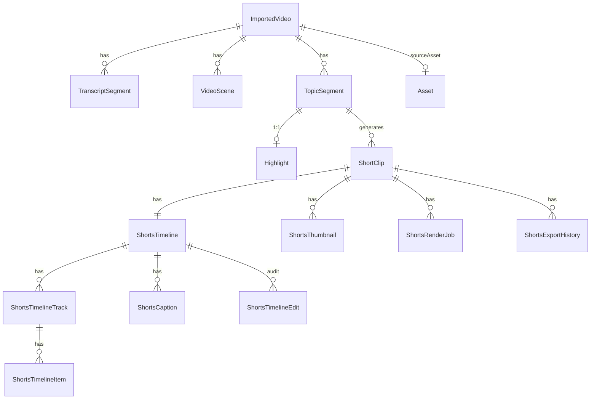

# AI Shorts Studio — Module Specification

> **As-Built Reference** — describes the system as it exists in the codebase.
> Every implementation claim is traceable to a real source file.
> "Status" badges indicate implementation depth as of 2026-07-15.

---

## Table of Contents

1. [Overview](#1-overview)
2. [YouTube Integration](#2-youtube-integration)
3. [Video Import Pipeline](#3-video-import-pipeline)
4. [AI Topic Detection](#4-ai-topic-detection)
5. [Highlight Scoring](#5-highlight-scoring)
6. [Clip Recommendation](#6-clip-recommendation)
7. [Clip Types](#7-clip-types)
8. [Interactive Timeline Editor](#8-interactive-timeline-editor)
9. [AI Editing Assistant](#9-ai-editing-assistant)
10. [Manual Editing](#10-manual-editing)
11. [Caption System](#11-caption-system)
12. [Smart Reframing](#12-smart-reframing)
13. [Thumbnail Generator](#13-thumbnail-generator)
14. [Asset Management](#14-asset-management)
15. [Agent Jobs](#15-agent-jobs)
16. [Resume Support](#16-resume-support)
17. [Database Design](#17-database-design)
18. [API Endpoints](#18-api-endpoints)
19. [Frontend Pages](#19-frontend-pages)
20. [Timeline UI](#20-timeline-ui)
21. [AI Provider Strategy](#21-ai-provider-strategy)
22. [Token Optimization](#22-token-optimization)
23. [Performance](#23-performance)
24. [Security](#24-security)
25. [Folder Structure](#25-folder-structure)
26. [Implementation Plan](#26-implementation-plan)
27. [Future Extensions](#27-future-extensions)

---

## 1. Overview

**Status: ✅ Implemented** — `apps/api/src/modules/shorts-studio/`, `apps/api/src/workers/supervisor.worker.ts`

AI Shorts Studio converts a creator's long-form YouTube video into multiple platform-ready short clips through a fully-automated AI pipeline with optional human-assisted editing.

### Workflow Diagram

```mermaid
flowchart TD
    A([User selects YouTube video]) --> B[POST /shorts-studio/videos/import]
    B --> C{Source already\ndownloaded?}
    C -- Yes --> D[Reuse SHORTS_SOURCE_VIDEO asset]
    C -- No --> E[yt-dlp download H.264 ≤1080p]
    E --> D

    D --> F[POST /videos/:id/analyze\n202 ACCEPTED + job id]
    F --> G[SHORTS_ANALYZE pipeline root\nSupervisorWorker]

    subgraph Pipeline [SHORTS_ANALYZE — sequential child jobs]
        G --> H1[VIDEO_IMPORT\nensureSourceDownloaded]
        H1 --> H2[TRANSCRIPT_ANALYSIS\nensureTranscript]
        H2 --> H3[SCENE_DETECTION\nensureScenes]
        H3 --> H4[TOPIC_SEGMENTATION\nensureTopics]
        H4 --> H5[HIGHLIGHT_DETECTION\nensureHighlights]
        H5 --> H6[CHAPTER_DETECTION\nensureChapters]
        H6 --> H7[EMBEDDING_GENERATION\nensureEmbeddings]
    end

    H7 --> I[GET /videos/:id/recommendations]
    I --> J[POST /highlights/:id/generate-clips\nclipTypes array]
    J --> K[ShortClip rows + ShortsTimeline]

    K --> L{Human edits?}
    L -- Yes --> M[PATCH /timelines/:id\nTimelineCommand ops]
    L -- No --> N

    M --> N[POST /clips/:id/captions\nCAPTION_GENERATION job]
    N --> O[POST /clips/:id/render\nSHORTS_RENDER job]
    O --> P[POST /clips/:id/export\nSHORTS_EXPORT job]
    P --> Q[POST /clips/:id/request-publish\nApproval + Compliance gate]
    Q --> R[POST /clips/:id/publish\nSHORTS_PUBLISH → YouTube Data API]
```



The pipeline is idempotent at every stage. Re-triggering `SHORTS_ANALYZE` on a video that is already fully analyzed is a safe no-op — every service checks for existing rows before running.

---

## 2. YouTube Integration

**Status: ✅ Implemented** — `apps/api/src/modules/shorts-studio/youtube-read.service.ts`

Reuses the existing OAuth tokens stored in `Channel.accessToken`/`refreshToken` via `ChannelsService.SCOPE_MANAGE`. No additional OAuth scopes are required beyond what channel-connect already grants.

### Capabilities

| Field | Source | API Part |
|---|---|---|
| Video list (paginated) | `youtube.search.list` | `snippet` |
| Title, description | `youtube.videos.list` | `snippet` |
| Duration | `youtube.videos.list` | `contentDetails` (ISO-8601 → `parseIsoDurationMs`) |
| Thumbnail URL | `snippet.thumbnails` max-res fallback chain | `snippet` |
| View / like / comment count | `youtube.videos.list` | `statistics` |
| Audio language (BCP-47) | `snippet.defaultAudioLanguage` | `snippet` |
| Published date | `snippet.publishedAt` | `snippet` |

### Auto-caption download

`VideoImportService.downloadAutoCaptions()` uses `yt-dlp --write-subs --sub-format srt` — no additional OAuth scope, works for any public video the user owns. Prioritizes the `.*-orig` language track, then English, then first available. Returns `TranscriptCueDTO[]` or `null` if captions are unavailable.

---

## 3. Video Import Pipeline

**Status: 🟡 Partial** — `video-import.service.ts`, `transcript.service.ts`, `scene-detection.service.ts`
Partial: speaker diarization and emotion detection are not yet implemented (see §27).

### Channel-first import flow

`POST /shorts-studio/videos/import` with `{ channelId, youtubeVideoId }` calls `VideoImportService.importFromChannel()`. This:

1. Resolves (or creates) a per-channel container project titled `"Shorts Studio"`.
2. Reads metadata from `LibraryVideo` if already synced; falls back to a live YouTube Data API call.
3. Upserts the `ImportedVideo` row — a re-import refreshes counts, never duplicates.

### Source media acquisition

`VideoImportService.ensureSourceDownloaded()` invokes `yt-dlp` via the `YT_DLP_PATH` env var:

- **Format selector:** `bv*[vcodec^=avc1][height<=1080]+ba[ext=m4a]/b[ext=mp4][height<=1080]+ba/b` — prefers H.264 to avoid AV1's slow decode in ffmpeg-static.
- **AV1 re-acquire:** if an existing source asset is detected as AV1 (via ffprobe), a second yt-dlp pass with `YTDLP_FORMAT_H264_ONLY` fetches a new H.264 version on the same `Asset` row.
- On success, stores as `SHORTS_SOURCE_VIDEO` asset with `contentHash` (SHA-256) in `AssetVersion.contentHash` — this hash powers the analysis cache (§16).

### Pipeline stages in order

`SHORTS_IMPORT_STAGES` (defined in `shorts-studio.service.ts`):

```
VIDEO_IMPORT → TRANSCRIPT_ANALYSIS → SCENE_DETECTION →
TOPIC_SEGMENTATION → HIGHLIGHT_DETECTION → CHAPTER_DETECTION → EMBEDDING_GENERATION
```

`SHORTS_ANALYZE` in `supervisor.worker.ts` runs each stage as a real child `AgentJob` row so the dashboard shows per-stage progress. Each child is dispatched sequentially; on failure the parent job fails at that stage and can be retried (later stages self-skip).

### Transcript resolution

`TranscriptService.ensureTranscript()`:
1. Check analysis cache (`AnalysisCacheService.copyTranscript`) — hit copies rows from a content-identical video.
2. Try YouTube auto-captions via `yt-dlp` (`VideoImportService.downloadAutoCaptions`).
3. Fall back to Whisper ASR (called via the shared AI client) if captions are absent.
4. Stores `TranscriptSegment` rows with `startMs`, `endMs`, `text`, optional `speakerId`.
5. Sets `ImportedVideo.transcriptStatus` = `YOUTUBE_CAPTIONS` or `ASR_GENERATED`.

### Scene detection

`SceneDetectionService.ensureScenes()` runs an ffmpeg `select='gt(scene,0.3)'` pass over the source video, storing `VideoScene` rows with `startMs`, `endMs`, `sceneChangeConfidence`. The scene timestamps feed the topic-segmentation window as supporting evidence.

---

## 4. AI Topic Detection

**Status: ✅ Implemented** — `apps/api/src/modules/shorts-studio/topic-segmentation.service.ts`

### Semantic windowing

`TopicSegmentationService` slices the transcript into ~2,000-token windows (`WINDOW_CHARS = 8,000` chars, `OVERLAP_CHARS = 800`) with overlap to avoid boundary artifacts. Each window is sent to the shared AI client with a system prompt that enforces **semantic discourse structure** — not fixed time intervals.

### Prompt rules

The system prompt (`TOPIC_SYSTEM`) enforces:
- Boundaries follow semantic meaning — "where one self-contained idea ends and another begins."
- Scene-change and speaker-change timestamps are provided as supporting evidence only, not as split triggers.
- Each segment must be independently comprehensible.
- Preferred duration: 15–90 seconds; degenerate segments < 5 s are dropped.
- `confidence` (0–1) represents how certain the model is the segment is clean and standalone.

### Supported topic categories (18 values in `TopicCategory` enum)

```
QUESTION_ANSWERED  STORY             TUTORIAL_STEP     FUNNY_MOMENT
IMPORTANT_STATEMENT  HOOK            PROBLEM           SOLUTION
STATISTIC          TIP               MISTAKE           WARNING
QUOTE              OPINION           LESSON            SUCCESS_STORY
FAILURE            CALL_TO_ACTION
```

### Overlap-zone deduplication

A new candidate segment overlapping an existing `TopicSegment` by > 50% of either span is treated as a duplicate from the window overlap. The higher-confidence row survives; the lower is deleted (Prisma cascade clears any attached `Highlight`).

### Partial resume

The service queries `MAX(endMs)` of existing rows for this video. Windows whose full range is already covered are skipped; only uncovered windows are re-sent to the AI. This makes a crashed mid-segmentation job resumable at the exact window boundary without schema changes.

---

## 5. Highlight Scoring

**Status: ✅ Implemented** — `apps/api/src/modules/shorts-studio/highlight-scoring.service.ts`

### Nine scoring dimensions (0–100 each)

| Dimension | What it measures |
|---|---|
| `virality` | Shareability, novelty, emotional trigger |
| `emotion` | Emotional intensity and resonance |
| `retention` | Estimated viewer drop-off resistance |
| `hookStrength` | Quality of the opening to capture attention |
| `education` | Informational value delivered per second |
| `entertainment` | Enjoyment factor independent of information |
| `confidence` | Model's certainty in the other scores |
| `trendPotential` | Alignment with current short-form trends |
| `shortSuitability` | Fit for ≤60-second vertical format |

`finalScore` = equal-weighted mean of all 9 dimensions. Per-project weight overrides are a planned future extension.

### Batch scoring

Segments are scored in batches of 8 (`BATCH_SIZE`) per AI call, bounded by prompt size. Each segment in the batch receives: all 9 scores + `reason` (1–2 sentences for the creator) + `titleSuggestion` (≤80 chars) + up to 10 `keywords`.

### Per-segment idempotency

`highlight.upsert({ where: { topicSegmentId }, create: …, update: {} })` — a segment already scored is never rescored. A crashed batch that persisted half its segments resumes cleanly at the first un-scored segment.

---

## 6. Clip Recommendation

**Status: ✅ Implemented** — `apps/api/src/modules/shorts-studio/clip-recommendation.service.ts`

`ClipRecommendationService.recommend(importedVideoId, limit)` is a pure database query over `Highlight` rows — no AI call at recommendation time (all intelligence was captured during scoring).

### Response shape (per recommendation)

```typescript
interface ClipRecommendation {
  highlightId: string;
  topicSegmentId: string;
  startMs: number;
  endMs: number;
  durationMs: number;
  confidence: number;          // from TopicSegment
  reason: string;              // LLM-written explanation
  finalScore: number;          // 0–100 mean of 9 dims
  scores: Record<string, number>; // all 9 named dimensions
  predictedPerformance: {
    viralityBand: 'low' | 'medium' | 'high';
    estimatedRetention: number;
  };
  keywords: string[];
  titleSuggestion: string;
  category: string;            // TopicCategory value
  title: string;               // segment title
}
```

`viralityBand` is derived from `virality` score: < 40 → `low`, 40–70 → `medium`, > 70 → `high`. `estimatedRetention` is `(retention / 100) * 0.8 + 0.1`.

`GET /shorts-studio/videos/:id/recommendations?limit=N` — `limit` clamps 1–20 (default 10).

---

## 7. Clip Types

**Status: ✅ Implemented** — `apps/api/src/modules/shorts-studio/clip-type-presets.ts`

All 7 values of the `ClipType` enum (Prisma) have a corresponding preset in `CLIP_TYPE_PRESETS`:

| Clip Type | Aspect | Max Duration | Safe Zone (bottom / top) |
|---|---|---|---|
| `YOUTUBE_SHORTS` | 9:16 | 60 s | 12% / 0% |
| `INSTAGRAM_REELS` | 9:16 | 90 s | 20% / 8% |
| `TIKTOK` | 9:16 | 60 s | 15% / 0% |
| `LINKEDIN_CLIPS` | 1:1 | 90 s | 0% / 0% |
| `FACEBOOK_REELS` | 9:16 | 90 s | 18% / 0% |
| `PODCAST_HIGHLIGHTS` | 16:9 | 120 s | 0% / 0% |
| `SMALL_VIDEO` | 16:9 | 600 s | 0% / 0% |

`SMALL_VIDEO` is the chapter-video type from `Ai-video edit.md §10` — horizontal, up to 10 minutes.

The preset drives the render filter (`crop + scale` to target resolution: 1080×1920 for 9:16, 1080×1080 for 1:1, 1920×1080 for 16:9) and the caption `marginV` safe-zone calculation in `ShortsRenderService`.

---

## 8. Interactive Timeline Editor

**Status: ✅ Implemented** (server side) / **🟡 Partial** (client side)
Server: `apps/api/src/modules/shorts-studio/timeline.service.ts`
Client: `apps/web/src/app/(dash)/shorts-studio/clips/[shortClipId]/edit/page.tsx`
Note: zoom/snap/undo/redo/keyboard shortcuts are client-side concerns not yet wired.

### Timeline data model

Each `ShortClip` has exactly one `ShortsTimeline`. A timeline contains:
- `ShortsTimelineTrack[]` (ordered by `orderIndex`, typed: `VIDEO | AUDIO | MUSIC | CAPTION | OVERLAY`)
- `ShortsTimelineItem[]` per track (each has `startMs`, `endMs`, `sourceAssetId`, `cropRect`, `rotationDeg`, `speed`, `volume`, `properties` JSON)
- `ShortsCaption[]` (separate from tracks — driven by `CAPTION_GENERATION`)
- `ShortsTimelineEdit[]` — immutable audit log of every command

### Supported commands (`TimelineCommand` union type from `@cf/shared`)

| Command | Operation |
|---|---|
| `TRIM` | Set `startMs`/`endMs` on a single item; source mapping auto-adjusted |
| `SPLIT` | Split one item at `atMs` into two; both get correct source mappings |
| `DELETE` | Remove an item |
| `MERGE` | Join two adjacent same-track items; left item expands to cover right |
| `DUPLICATE` | Clone an item, placed immediately after the original |
| `MOVE` | Relocate an item to a different track and/or position |
| `RESIZE` | Delta-shift the `start` or `end` edge by `deltaMs` |
| `CUT_RANGE` | **Ripple cut** across ALL tracks + captions: removes `[startMs, endMs)`, shifts everything after left. A/V/caption sync is preserved. Straddle case: item is split, right half shifts left. |

All commands are applied inside a single Prisma transaction. After each batch, `durationMs` is recalculated from `MAX(item.endMs)` across all tracks.

### Audit trail

Every applied command (manual or AI-assisted) produces a `ShortsTimelineEdit` row with `actorId` = the user's JWT sub, or `'AI_ASSISTANT'` when an AI suggestion was accepted via `POST /timelines/:id/ai-suggestions/apply`.

---

## 9. AI Editing Assistant

**Status: 🟡 Partial** — `apps/api/src/modules/shorts-studio/ai-editing-assistant.service.ts`
Implemented: silence removal, filler removal, pacing improvement.
Planned: auto B-roll, auto transitions, auto background music, auto SFX, auto CTA (§27).

### Design principle

The assistant **proposes, never applies**. `suggest(timelineId, capability)` returns a `TimelineCommand[]` array. The user reviews and submits them via `POST /timelines/:id/ai-suggestions/apply` — which calls the standard `applyCommands()`, tagged `actorId = 'AI_ASSISTANT'` in the audit log.

### Implemented capabilities

**`remove-silence`**
Runs `ffmpeg silencedetect=noise=-35dB:d=0.7` over the clip's source spans. Silence regions > 700 ms become `CUT_RANGE` commands with a 120 ms natural-breath pad at each edge.

**`remove-fillers`**
Regex `\b(um+|uh+|erm+|ah+|you know|i mean|sort of|kind of|like,)\b` against `TranscriptSegment.text`. Word timing is estimated proportionally by character offset within the segment (conservative: 40 ms pad). Produces `CUT_RANGE` commands.

**`improve-pacing`**
Builds clip-relative transcript lines (`[startMs–endMs] text`) and sends them to the shared AI client with `PacingSuggestionOutputSchema`. The model returns cuts for rambling, redundant restatements, and slow wind-ups. Returns only cuts the model is confident about; an empty array is valid if pacing is already tight.

---

## 10. Manual Editing

**Status: ✅ Implemented** — `timeline.service.ts` + standalone editor (`apps/api/src/modules/editor/`)

### Via Shorts Studio timeline

Users submit `TimelineCommand[]` arrays to `PATCH /timelines/:id`. Supported per-item properties on `ShortsTimelineItem`:

- `cropRect` (JSON: `{x, y, width, height}`)
- `rotationDeg` (float, default 0)
- `speed` (float, default 1.0)
- `volume` (float, default 1.0)
- `properties` (JSON bag for source mapping and future extensions)

### Standalone video editor

The standalone editor (`apps/api/src/modules/editor/editor.service.ts`, `apps/web/src/app/(dash)/editor/`) provides a richer editing surface validated against `EditTimelineSchema` from `@cf/shared`. It supports:

- **Effects and transitions** — per-item filter chains
- **Text overlays** — font, size, color, position, keyframed
- **Keyframe animation** — position, scale, opacity over time
- **Audio mix** — per-track volume envelopes
- **Export** — MP4 (libx264 CRF) and WebM (libvpx-vp9 CRF) via `EditorService`

The editor renders via the `RENDER` job type in `supervisor.worker.ts` (distinct from `SHORTS_RENDER`).

---

## 11. Caption System

**Status: 🟡 Partial** — `apps/api/src/modules/shorts-studio/caption-generation.service.ts`
Implemented: sentence-level captions, keyword emphasis, emoji insertion, `speakerColor` and `templateId` fields.
Planned: word-by-word timing (requires forced alignment / word-level ASR).

### Generation

`CaptionGenerationService.ensureCaptions()`:
1. Finds the clip's VIDEO track items to determine source span (`[srcStart, srcEnd]`).
2. Queries `TranscriptSegment` rows that overlap that span.
3. Maps segments to clip-relative cues via `sourceRangeToTimeline()` (handles trimmed/split spans correctly). Cues < 200 ms are dropped.
4. Sends all cue texts in a single `callAIStructured` call with `CaptionStylingOutputSchema`.

### AI styling

The `STYLING_SYSTEM` prompt marks each cue with:
- `emphasis: boolean` — true for lines carrying the key message (≤30% of lines)
- `emoji: string | null` — single fitting emoji where it adds energy; never on consecutive lines

### Stored fields on `ShortsCaption`

```
startMs  endMs  text  emphasis  emoji  speakerColor?  templateId?
```

`speakerColor` and `templateId` are schema-ready for future multi-speaker coloring and brand template selection but are not yet populated by the generator.

### Burn-in at render time

`ShortsRenderService` builds an SRT file from `ShortsCaption` rows (text + emoji appended), passes it to ffmpeg `subtitles` filter with `force_style='FontSize=14,Bold=1,Alignment=2,MarginV=…'`. `MarginV` is derived from the clip-type preset's `safeZone.bottom` to avoid platform UI overlap.

---

## 12. Smart Reframing

**Status: 🟡 Partial** — `apps/api/src/modules/shorts-studio/smart-reframe.service.ts`
Implemented: static center-crop keyframe strategy; interface is designed for dynamic tracking.
Planned: face detection, active-speaker tracking (§27).

### Current strategy

`SmartReframeService.ensureKeyframes()` computes a single keyframe `[{ ms: 0, cx: 0.5, cy: 0.5 }]` — center crop. The keyframe is cached in `ShortClip.reframeKeyframes` (JSON) so re-renders skip re-computation.

### Render integration

`ShortsRenderService` reads `reframeKeyframes[0].cx` and applies it as the horizontal crop offset in the ffmpeg filter:

```
crop='min(iw,ih*W/H)':'ih':'(iw-min(iw,ih*W/H))*cx':'0',scale=W:H
```

For 16:9 clips, a `scale + pad` filter is used instead (no crop).

### Extension path

The `ReframeKeyframe` interface (`{ ms, cx, cy }`) matches the spec for face/speaker tracking output. Replacing `computeKeyframes()` with a detector that yields a time-varying keyframe array requires no changes to the renderer.

---

## 13. Thumbnail Generator

**Status: ✅ Implemented** — `apps/api/src/modules/shorts-studio/thumbnail-generation.service.ts`

`ThumbnailGenerationService.ensureThumbnails()` runs automatically at the end of every `SHORTS_RENDER` job (failure is non-fatal — the render still succeeds).

### 4 variations

Frames are extracted at 15%, 38%, 61%, and 84% of clip duration (skipping intro/outro). Alternate variations place the title overlay at top (8% from top) and bottom (78% from top).

### Title overlay

If a system font (`arialbd.ttf` on Windows, `DejaVuSans-Bold.ttf` on Linux) is found, the highlight's `titleSuggestion` (max 60 chars) is burned in via `ffmpeg drawtext` with white text and a semi-transparent black border.

### Storage

Each variation is stored as a `SHORTS_THUMBNAIL` asset + `ShortsThumbnail` row. The first variation (`i === 0`) is marked `isPrimary = true` until the user picks another via `POST /thumbnails/:id/set-primary`.

---

## 14. Asset Management

**Status: ✅ Implemented** — `apps/api/prisma/schema.prisma` (`AssetKind` enum)

Every generated artifact is stored as an `Asset` + one or more `AssetVersion` rows. The `contentHash` (SHA-256) on `AssetVersion` is the key for the analysis cache (§16).

### Shorts-Studio asset kinds (`AssetKind` enum values)

| Kind | Description |
|---|---|
| `SHORTS_SOURCE_VIDEO` | yt-dlp downloaded source MP4 |
| `SHORTS_TRANSCRIPT` | Reserved for VTT/SRT export of transcript |
| `SHORTS_SCENE_MANIFEST` | Reserved for scene metadata export |
| `SHORTS_CLIP_RENDER` | Final rendered MP4 from `ShortsRenderService` |
| `SHORTS_CAPTION_TRACK` | Reserved for standalone SRT caption file |
| `SHORTS_MUSIC` | Background music for clip (future) |
| `SHORTS_SFX` | Sound effects (future) |
| `SHORTS_VOICE` | Voice-over for clip (future) |
| `SHORTS_THUMBNAIL` | JPEG thumbnail variation |
| `SHORTS_PREVIEW` | Low-resolution preview (future) |
| `SHORTS_FINAL_EXPORT` | Platform-ready export package |

`AssetVersion.provenance` (JSON) stores provider metadata (e.g. `{ source: 'youtube', youtubeVideoId, importedAt }`). This satisfies the CLAUDE.md golden rule on provenance metadata.

---

## 15. Agent Jobs

**Status: ✅ Implemented** — `apps/api/src/workers/supervisor.worker.ts`, `apps/api/prisma/schema.prisma` (`JobType` enum)

All Shorts Studio job types registered in the `JobType` Prisma enum:

| JobType | Dispatched by | Service called |
|---|---|---|
| `SHORTS_ANALYZE` | `ShortsStudioService.enqueueAnalysis()` | Pipeline root — dispatches child jobs sequentially |
| `VIDEO_IMPORT` | SHORTS_ANALYZE child | `VideoImportService.ensureSourceDownloaded()` |
| `TRANSCRIPT_ANALYSIS` | SHORTS_ANALYZE child | `TranscriptService.ensureTranscript()` |
| `SCENE_DETECTION` | SHORTS_ANALYZE child | `SceneDetectionService.ensureScenes()` |
| `TOPIC_SEGMENTATION` | SHORTS_ANALYZE child | `TopicSegmentationService.ensureTopics()` |
| `HIGHLIGHT_DETECTION` | SHORTS_ANALYZE child | `HighlightScoringService.ensureHighlights()` |
| `CHAPTER_DETECTION` | SHORTS_ANALYZE child | `ChapterDetectionService.ensureChapters()` |
| `EMBEDDING_GENERATION` | SHORTS_ANALYZE child (last) | `EmbeddingGenerationService.ensureEmbeddings()` |
| `SHORTS_GENERATION` | Reserved (schema only) | — |
| `AUTO_EDIT` | Reserved (schema only) | — |
| `CAPTION_GENERATION` | Controller → `JobsService.enqueue()` | `CaptionGenerationService.ensureCaptions()` |
| `SHORTS_RENDER` | Controller → `JobsService.enqueue()` | `ShortsRenderService.renderClip()` |
| `SHORTS_EXPORT` | Controller → `JobsService.enqueue()` | `ShortsExportService.exportClip()` |
| `SHORTS_PUBLISH` | Controller → `JobsService.enqueue()` | `ShortsExportService.publishClip()` |
| `CHAPTER_DETECTION` | Controller → `JobsService.enqueue()` | `ChapterDetectionService.ensureChapters()` |
| `EMBEDDING_GENERATION` | Controller → `JobsService.enqueue()` | `EmbeddingGenerationService.ensureEmbeddings()` |
| `CHURCH_PACK_GENERATION` | Controller → `JobsService.enqueue()` | `ChurchPackService.ensureChurchPack()` |
| `SOCIAL_CONTENT_GENERATION` | Controller → `JobsService.enqueue()` | `SocialContentService` |

Every job runs inside `SupervisorWorker.processJob()` which enforces: trial limits, credit reserve/settle, correlation ID propagation, AI cost accumulation, Sentry error capture, and `EventsGateway` WebSocket progress events.

---

## 16. Resume Support

**Status: ✅ Implemented** — `apps/api/src/modules/shorts-studio/analysis-cache.service.ts` + per-service checks

### Content-hash cache (`AnalysisCacheService`)

When a video's `SHORTS_SOURCE_VIDEO` `AssetVersion.contentHash` matches a previously-analyzed video owned by the same user, all derived rows are **copied** (not shared) instead of recomputed:

- `copyTranscript()` — copies `TranscriptSegment` rows + sets `transcriptStatus`
- `copyScenes()` — copies `VideoScene` rows
- `copyTopics()` — copies `TopicSegment` rows

A cache hit skips Whisper ASR, the full ffmpeg scene pass, and all AI topic-segmentation windows. Highlights are per-segment idempotent (§5) so they benefit automatically.

Rows are copied per-user (not shared across tenants) so access control and cascade deletes remain trivially auditable.

### Per-stage resume rules

| Stage | Resume condition | Skip check |
|---|---|---|
| `VIDEO_IMPORT` | Source asset exists on disk | `storage.exists(existingKey)` |
| `TRANSCRIPT_ANALYSIS` | `transcriptStatus != PENDING` | Checked first in `ensureTranscript` |
| `SCENE_DETECTION` | `VideoScene` rows exist | `count > 0` check |
| `TOPIC_SEGMENTATION` | `MAX(endMs)` of existing rows ≥ window end | Partial-window resume |
| `HIGHLIGHT_DETECTION` | `Highlight` exists for segment | `upsert({ update: {} })` |
| `CAPTION_GENERATION` | `timeline.captions.length > 0` | Skip entire job |
| `SHORTS_RENDER` | Render asset newer than `timeline.updatedAt` | Timestamp comparison |
| `SHORTS_RENDER` (per-segment) | Segment temp file exists and `size > 0` | File stat check |

---

## 17. Database Design

**Status: ✅ Implemented** — `apps/api/prisma/schema.prisma`

### Entity-Relationship diagram (key relations)



### Key model snippets (from schema.prisma)

**ImportedVideo**
```prisma
model ImportedVideo {
  id                    String           @id @default(cuid())
  projectId             String
  youtubeVideoId        String
  title                 String
  description           String?          @db.Text
  durationMs            Int
  thumbnailUrl          String?
  originalAudioLanguage String?
  viewCount             BigInt?
  likeCount             BigInt?
  commentCount          BigInt?
  sourceAssetId         String?
  transcriptStatus      TranscriptStatus @default(PENDING)
  chaptersSyncedAt      DateTime?
  notes                 String?          @db.Text
  createdAt             DateTime         @default(now())
  updatedAt             DateTime         @updatedAt
  // Relations: project, sourceAsset, transcriptSegments, scenes, topicSegments, chapters
}
```

**Highlight** (1:1 with TopicSegment)
```prisma
model Highlight {
  id               String   @id @default(cuid())
  topicSegmentId   String   @unique
  virality         Float
  emotion          Float
  retention        Float
  hookStrength     Float
  education        Float
  entertainment    Float
  confidence       Float
  trendPotential   Float
  shortSuitability Float
  finalScore       Float
  reason           String   @db.Text
  titleSuggestion  String
  keywords         String[] @default([])
  createdAt        DateTime @default(now())
  @@index([finalScore])
}
```

**ShortsCaption**
```prisma
model ShortsCaption {
  id           String  @id @default(cuid())
  timelineId   String
  startMs      Int
  endMs        Int
  text         String
  speakerColor String?
  emphasis     Boolean @default(false)
  emoji        String?
  templateId   String?
  @@index([timelineId, startMs])
}
```

### Supporting enums

```prisma
enum ShortsTrackType { VIDEO AUDIO MUSIC CAPTION OVERLAY }
enum ShortsRenderStatus { QUEUED RUNNING CHECKPOINTED COMPLETE FAILED }
enum TranscriptStatus { PENDING YOUTUBE_CAPTIONS ASR_GENERATED FAILED }
enum TopicCategory { QUESTION_ANSWERED STORY TUTORIAL_STEP FUNNY_MOMENT
                     IMPORTANT_STATEMENT HOOK PROBLEM SOLUTION STATISTIC
                     TIP MISTAKE WARNING QUOTE OPINION LESSON
                     SUCCESS_STORY FAILURE CALL_TO_ACTION }
enum ShortClipStatus { CANDIDATE IN_EDITING RENDERING RENDERED EXPORTED PUBLISHED }
enum ClipType { YOUTUBE_SHORTS INSTAGRAM_REELS TIKTOK LINKEDIN_CLIPS
                FACEBOOK_REELS PODCAST_HIGHLIGHTS SMALL_VIDEO }
```

---

## 18. API Endpoints

**Status: ✅ Implemented** — `apps/api/src/modules/shorts-studio/shorts-studio.controller.ts`

All routes mount under `/api/v1/shorts-studio`. All require `JwtAuthGuard`. Every route that accesses a resource asserts ownership before proceeding.

### 18.1 Import

| Method | Path | Description |
|---|---|---|
| `GET` | `/channels/:channelId/videos` | List channel videos (paginated, `?pageToken`) |
| `GET` | `/videos/:youtubeVideoId/metadata?channelId=` | Single video metadata |
| `POST` | `/videos/import` | Import video (body: `{ channelId?, projectId?, youtubeVideoId }`) |
| `GET` | `/projects/:projectId/videos` | List imported videos for project |
| `GET` | `/channels/:channelId/imported` | List imported videos for channel |
| `PATCH` | `/videos/:importedVideoId/notes` | Update free-form user notes (max 5000 chars) |

**Example: Import a video**

```http
POST /api/v1/shorts-studio/videos/import
Authorization: Bearer <jwt>
Content-Type: application/json

{ "channelId": "clz...", "youtubeVideoId": "dQw4w9WgXcQ" }
```

```json
{
  "id": "clz...",
  "youtubeVideoId": "dQw4w9WgXcQ",
  "title": "Example Video",
  "durationMs": 213000,
  "transcriptStatus": "PENDING"
}
```

### 18.2 Analyze

| Method | Path | Description |
|---|---|---|
| `POST` | `/videos/:importedVideoId/analyze` | Enqueue `SHORTS_ANALYZE` pipeline. Returns `202` + job id |
| `GET` | `/videos/:importedVideoId/analysis-status` | Poll analysis progress |
| `GET` | `/videos/:importedVideoId/transcript` | Transcript segments |
| `GET` | `/videos/:importedVideoId/scenes` | Scene detection rows |
| `GET` | `/videos/:importedVideoId/topics` | Topic segments |
| `GET` | `/videos/:importedVideoId/highlights` | Highlight scores |
| `GET` | `/videos/:importedVideoId/clips` | ShortClip rows for this video |
| `GET` | `/videos/:importedVideoId/search?q=&limit=` | Semantic search (vector) over transcript |
| `GET` | `/search?q=` | Cross-library semantic search |
| `POST` | `/videos/:importedVideoId/generate-embeddings` | Enqueue `EMBEDDING_GENERATION` |
| `GET` | `/videos/:importedVideoId/chapters` | Chapter rows |
| `POST` | `/videos/:importedVideoId/detect-chapters` | Enqueue `CHAPTER_DETECTION` |
| `POST` | `/videos/:importedVideoId/church-pack` | Enqueue `CHURCH_PACK_GENERATION` |
| `POST` | `/videos/:importedVideoId/small-videos` | Generate chapter-based Small Videos |
| `GET` | `/videos/:importedVideoId/social-content` | List generated social posts |
| `POST` | `/videos/:importedVideoId/social-content` | Enqueue `SOCIAL_CONTENT_GENERATION` |
| `POST` | `/social-content/:id/render-quote-card` | Render a quote card image |
| `POST` | `/videos/:importedVideoId/sync-chapters` | Push chapters to YouTube description |
| `PATCH` | `/chapters/:chapterId` | Edit chapter title/summary |

**Example: Trigger analysis**

```http
POST /api/v1/shorts-studio/videos/clz.../analyze
Authorization: Bearer <jwt>
```

```json
{ "jobId": "clz...", "status": "QUEUED", "type": "SHORTS_ANALYZE" }
```

### 18.3 Generate clips

| Method | Path | Description |
|---|---|---|
| `GET` | `/videos/:importedVideoId/recommendations?limit=` | Top-N recommendations (max 20) |
| `POST` | `/highlights/:highlightId/generate-clips` | Create `ShortClip` rows for selected platforms |
| `GET` | `/projects/:projectId/clips` | List all clips for a project |

**Example: Generate clips**

```http
POST /api/v1/shorts-studio/highlights/clz.../generate-clips
Authorization: Bearer <jwt>
Content-Type: application/json

{ "clipTypes": ["YOUTUBE_SHORTS", "INSTAGRAM_REELS"] }
```

```json
[
  { "id": "clz...", "clipType": "YOUTUBE_SHORTS", "status": "CANDIDATE", "sourceStartMs": 120000, "sourceEndMs": 175000 },
  { "id": "clz...", "clipType": "INSTAGRAM_REELS", "status": "CANDIDATE", "sourceStartMs": 120000, "sourceEndMs": 175000 }
]
```

### 18.4 Timeline / Editor

| Method | Path | Description |
|---|---|---|
| `GET` | `/clips/:shortClipId/timeline` | Full timeline with tracks, items, captions |
| `PATCH` | `/timelines/:timelineId` | Apply `TimelineCommand[]` (body: `{ commands: [...] }`) |
| `POST` | `/timelines/:timelineId/ai-suggestions` | Get AI suggestions for `capability` |
| `POST` | `/timelines/:timelineId/ai-suggestions/apply` | Accept and apply AI suggestions |
| `GET` | `/timelines/:timelineId/history` | Audit log (last 200 edits) |
| `POST` | `/clips/:shortClipId/captions` | Enqueue `CAPTION_GENERATION` |

### 18.5 Render

| Method | Path | Description |
|---|---|---|
| `POST` | `/clips/:shortClipId/render` | Enqueue `SHORTS_RENDER` |
| `GET` | `/clips/:shortClipId/render-status` | Poll render progress |
| `GET` | `/clips/:shortClipId/thumbnails` | List thumbnail variations |
| `POST` | `/thumbnails/:thumbnailId/set-primary` | Pick primary thumbnail |

### 18.6 Export and 18.7 Publish

| Method | Path | Description |
|---|---|---|
| `POST` | `/clips/:shortClipId/export` | Enqueue `SHORTS_EXPORT` |
| `GET` | `/clips/:shortClipId/exports` | List export history |
| `POST` | `/clips/:shortClipId/request-publish` | Create approval request |
| `POST` | `/clips/:shortClipId/publish` | Enqueue `SHORTS_PUBLISH` (requires approval) |
| `GET` | `/clips/:shortClipId/publish-status` | Poll publish state |

---

## 19. Frontend Pages

**Status: ✅ Implemented** — `apps/web/src/app/(dash)/shorts-studio/`

| Route | File | Purpose |
|---|---|---|
| `/shorts-studio` | `page.tsx` | Library — channel picker, imported video list, import button |
| `/shorts-studio/videos/[importedVideoId]` | `videos/[importedVideoId]/page.tsx` | Analysis — transcript, scenes, topics, highlights, recommendations |
| `/shorts-studio/clips/[shortClipId]/edit` | `clips/[shortClipId]/edit/page.tsx` | Timeline editor — track view, AI assistant panel, caption editor |
| `/shorts-studio/clips/[shortClipId]/export` | `clips/[shortClipId]/export/page.tsx` | Export/publish — thumbnail picker, metadata review, approval, publish |
| `/editor` | `(dash)/editor/page.tsx` | Standalone editor — create a new edit session |
| `/editor/[editId]` | `(dash)/editor/[editId]/page.tsx` | Standalone editor — open an existing `EditProject` |

---

## 20. Timeline UI

**Status: 🟡 Partial** — `apps/web/src/app/(dash)/shorts-studio/clips/[shortClipId]/edit/page.tsx`
Server-side command model is complete. Client-side zoom, waveform rendering, snap, undo/redo, and keyboard shortcuts are client concerns not yet fully implemented.

### Target UX model

The timeline editor is modeled on professional tools (CapCut / DaVinci Resolve concept) adapted for vertical short-form:

- **Multi-track lanes** — VIDEO, AUDIO, MUSIC, CAPTION, OVERLAY tracks rendered as horizontal swimlanes
- **Playhead** — draggable time cursor that drives the preview player position
- **Zoom** — timeline pixels-per-second is adjustable (client state, does not persist)
- **Snap** — items snap to item edges and scene-change markers (planned)
- **Markers** — scene-change timestamps shown as vertical tick marks on the ruler
- **Waveform** — audio waveform visualization on AUDIO track items (planned)
- **Keyboard shortcuts** — `Space` (play/pause), `S` (split at playhead), `Delete` (delete selected), `Cmd/Ctrl+Z` (undo via command-array inversion), `Cmd/Ctrl+Shift+Z` (redo) — planned

All destructive mutations are submitted as `TimelineCommand[]` arrays to `PATCH /timelines/:id` — the client sends the full intent, the server applies it transactionally and returns the updated timeline state.

---

## 21. AI Provider Strategy

**Status: ✅ Implemented** — `packages/shared/src/ai/index.ts`

### Shared AI client (`callAIStructured`)

All Shorts Studio AI calls (topic segmentation, highlight scoring, caption styling, pacing suggestions) go through `callAIStructured()` from `@cf/shared`. No service hardcodes a model name or provider.

### Provider selection

Three providers are configured: `anthropic` (claude-sonnet-4-6 default), `openai` (gpt-4o default), `gemini` (gemini-2.5-flash default, served via the OpenAI-compatible Gemini endpoint). Defaults are overridable via environment variables only — never in code.

### Fallback and health scoring

Each provider carries a `ProviderHealth` record (`score 0–100`, `cooldownUntil`, `consecutiveFailures`). On a 429/502/503/504 response, the provider's score is reduced and it enters a cooldown. The next AI call automatically routes to the highest-scoring available provider. The selection order within a tie is Anthropic → OpenAI → Gemini.

### Rate limiting and concurrency

A global in-process semaphore caps concurrent provider calls at `AI_CONCURRENCY` (default 2). A token-bucket rate limiter enforces `AI_RPM_LIMIT` (default 60) and `AI_TPM_LIMIT` (default 100,000). All values are env-var-configurable.

### Response cache

A Redis-backed `AICacheAdapter` caches identical requests (`sha256(system + payload)`) for `AI_CACHE_TTL_MS` (default 24 h). Cache hits emit `fromCache: true` on the `AIUsageEvent` and are attributed $0 cost. The Shorts Studio scoring/segmentation prompts benefit heavily from this when the same video is re-analyzed.

---

## 22. Token Optimization

**Status: ✅ Implemented** — `analysis-cache.service.ts`, `highlight-scoring.service.ts`, `topic-segmentation.service.ts`

### Content-hash deduplication (§16)

The primary cache layer. A video whose `sourceAsset.contentHash` matches a previous import never re-runs Whisper ASR, ffmpeg scene detection, or topic-segmentation AI windows.

### Per-segment idempotency

Highlight scoring uses `upsert({ update: {} })` — a scored segment is never re-scored. Re-running `HIGHLIGHT_DETECTION` on a video that is 90% scored costs only the tokens for the 10% remaining segments.

### Windowed processing

Topic segmentation and embedding generation process the transcript in windows rather than sending the entire transcript in a single call. This:
- Keeps each prompt within the 2,000-token target window
- Enables partial resume at the window level
- Allows early termination when all windows are covered

### AI response cache (§21)

Redis-backed response caching ensures that identical AI prompts (e.g., topic segmentation of the same transcript window) return cached responses across jobs and restarts.

### Caption styling: single combined call

`CaptionGenerationService` sends all caption lines in a single AI call for styling — one call per clip regardless of caption count, rather than per-caption calls.

---

## 23. Performance

**Status: ✅ Implemented** — `supervisor.worker.ts`, `shorts-render.service.ts`

### Parallel processing

- `SupervisorWorker` runs at concurrency 2 — two Shorts Studio jobs can process simultaneously.
- The AI semaphore inside `callAI` is separate from the BullMQ worker concurrency — slow AI calls don't block video processing.

### GPU encoding

`ShortsRenderService.pickEncoder()` probes FFmpeg for `h264_nvenc` once on first render. If available, all encode passes use NVENC. On runtime NVENC failure (e.g., insufficient GPU memory), the service falls back to `libx264 preset veryfast CRF 21` automatically — transparent to the caller.

### Checkpoint-per-segment rendering

Pass 1 of `SHORTS_RENDER` processes one segment at a time and writes a `CHECKPOINTED` status with `{ segmentsDone, total }` to `ShortsRenderJob.checkpointData` after each segment. Existing temp files are stat-checked and reused, making interrupted renders restartable without re-encoding completed segments.

### Streaming and chunked processing

- Source video download via `yt-dlp` is streamed to a temp file; no full-file buffering.
- Transcript windowing processes the full transcript in 8,000-char windows — memory-bounded.
- Highlight scoring batches 8 segments per AI call — avoids token-limit errors on long videos.

### Storage

`StorageService` resolves R2 keys to local absolute paths (or cloud URLs depending on configuration). The render pipeline writes to OS temp directories and copies the final output to storage — no in-memory video buffering.

---

## 24. Security

**Status: ✅ Implemented** — `shorts-studio.service.ts`, `shorts-export.service.ts`, `timeline.service.ts`

### Ownership isolation

Every controller route calls an `assert*Ownership()` method before any data access:

- `assertVideoOwnership(importedVideoId, userId)` — `WHERE project.userId = userId`
- `assertProjectOwnership(projectId, userId)`
- `assertChannelOwnership(channelId, userId)`
- `assertHighlightOwnership(highlightId, userId)`
- `assertClipOwnership(shortClipId, userId)`
- `assertTimelineOwnership(timelineId, userId)`

All return `NotFoundException` (not `ForbiddenException`) to avoid leaking the existence of other users' resources.

### Compliance gate before publish

`ShortsExportService.publishClip()` is double-gated (CLAUDE.md golden rules 1 & 2):

1. **Human approval** — `assertPublishable()` checks that an `Approval` row on the clip's export job has `status = APPROVED`. If missing or not approved, publish is blocked.
2. **Compliance** — `ComplianceService.enforce()` is called on the clip's title + description + caption text inside the publish job. No bypass path exists in the code.

### Audit trail

`ShortsTimelineEdit` records every timeline mutation with `actorId` (user UUID or `'AI_ASSISTANT'`) and the full command JSON. The last 200 edits are accessible via `GET /timelines/:id/history`. This satisfies CLAUDE.md section 24 audit requirements.

### Asset URLs

Asset keys are stored as R2 paths (`r2Key`). URL signing for client-side access is a planned extension (§27). Currently, assets are served via the API proxy which enforces the same ownership checks.

### JWT enforcement

All routes are behind `JwtAuthGuard`. The `@CurrentUser()` decorator extracts the `sub` claim and passes it to ownership assertions — no route trusts a userId from the request body.

---

## 25. Folder Structure

**Status: ✅ Implemented**

```
apps/
├── api/
│   ├── prisma/
│   │   └── schema.prisma                  ← ImportedVideo, VideoScene, TopicSegment,
│   │                                          Highlight, ShortClip, ShortsTimeline,
│   │                                          ShortsTimelineTrack, ShortsTimelineItem,
│   │                                          ShortsCaption, ShortsTimelineEdit,
│   │                                          ShortsThumbnail, ShortsRenderJob,
│   │                                          ShortsExportHistory
│   └── src/
│       ├── modules/
│       │   ├── shorts-studio/
│       │   │   ├── shorts-studio.module.ts
│       │   │   ├── shorts-studio.service.ts        ← ownership guards, enqueue helpers
│       │   │   ├── shorts-studio.controller.ts     ← all REST routes
│       │   │   ├── youtube-read.service.ts         ← YouTube Data API read
│       │   │   ├── video-import.service.ts         ← yt-dlp, source asset
│       │   │   ├── transcript.service.ts           ← YouTube captions + Whisper fallback
│       │   │   ├── scene-detection.service.ts      ← ffmpeg scene filter
│       │   │   ├── topic-segmentation.service.ts   ← semantic windowing + AI
│       │   │   ├── highlight-scoring.service.ts    ← 9-dim scoring + batching
│       │   │   ├── clip-recommendation.service.ts  ← pure DB ranking
│       │   │   ├── clip-type-presets.ts            ← 7 preset definitions
│       │   │   ├── shorts-generation.service.ts    ← ShortClip + ShortsTimeline creation
│       │   │   ├── small-video-generation.service.ts ← chapter-based SMALL_VIDEO clips
│       │   │   ├── timeline.service.ts             ← 7 command ops + CUT_RANGE ripple
│       │   │   ├── timeline-map.util.ts            ← videoSpans / sourceRangeToTimeline
│       │   │   ├── ai-editing-assistant.service.ts ← remove-silence/fillers/pacing
│       │   │   ├── caption-generation.service.ts   ← sentence-level + AI styling
│       │   │   ├── smart-reframe.service.ts        ← keyframe cache (center-crop now)
│       │   │   ├── shorts-render.service.ts        ← 2-pass ffmpeg + NVENC
│       │   │   ├── shorts-export.service.ts        ← export + compliance + publish
│       │   │   ├── thumbnail-generation.service.ts ← 4 variations + drawtext
│       │   │   ├── analysis-cache.service.ts       ← content-hash dedup
│       │   │   ├── embedding-generation.service.ts ← vector embeddings for search
│       │   │   ├── semantic-search.service.ts      ← vector similarity search
│       │   │   ├── chapter-detection.service.ts    ← AI chapter boundaries
│       │   │   ├── chapter-sync.service.ts         ← push chapters to YT description
│       │   │   ├── chapter-sync.util.ts
│       │   │   ├── church-pack.service.ts          ← sermon/devotional AI pack
│       │   │   ├── social-content.service.ts       ← social post generation
│       │   │   ├── quote-card-render.service.ts    ← ffmpeg quote card image
│       │   │   └── *.spec.ts                       ← co-located unit tests
│       │   └── editor/
│       │       ├── editor.module.ts
│       │       ├── editor.service.ts               ← EditProject + multi-format render
│       │       └── editor.controller.ts
│       └── workers/
│           └── supervisor.worker.ts               ← all job dispatch including SHORTS_*
├── web/
│   └── src/app/(dash)/
│       ├── shorts-studio/
│       │   ├── page.tsx                           ← library / channel picker
│       │   ├── videos/[importedVideoId]/page.tsx  ← analysis view
│       │   ├── clips/[shortClipId]/edit/page.tsx  ← timeline editor
│       │   └── clips/[shortClipId]/export/page.tsx ← export / publish
│       └── editor/
│           ├── page.tsx                           ← new edit session
│           └── [editId]/page.tsx                  ← existing edit session
packages/
└── shared/src/
    └── ai/index.ts                               ← callAIStructured, provider health,
                                                     cache adapter, usage events
```

---

## 26. Implementation Plan

### Phase 1 — Backend Core ✅ DONE

- YouTube read service (OAuth-reuse, metadata, captions)
- `ImportedVideo` model and import pipeline
- yt-dlp source download with AV1 re-acquire
- Transcript (YouTube captions + Whisper fallback)
- ffmpeg scene detection
- Prisma schema: all Shorts Studio models

### Phase 2 — AI Intelligence ✅ DONE

- Semantic topic segmentation (windowed, 18 categories)
- 9-dimension highlight scoring (batched, per-segment idempotent)
- Clip recommendation (pure DB ranking)
- Content-hash analysis cache
- Embedding generation + semantic search

### Phase 3 — Editor ✅ DONE

- 7-command timeline mutation API (TRIM, SPLIT, DELETE, MERGE, DUPLICATE, MOVE, RESIZE, CUT_RANGE)
- AI Editing Assistant (remove-silence, remove-fillers, improve-pacing)
- Caption generation (sentence-level + AI emphasis/emoji styling)
- Smart reframe (center-crop keyframe; interface ready for tracking)
- Standalone video editor (effects, transitions, text, keyframes, audio, mp4+webm export)

### Phase 4 — Rendering ✅ DONE

- 2-pass ffmpeg render with per-segment checkpoints
- NVENC GPU encode with libx264 fallback
- Thumbnail generation (4 variations + title overlay)
- Platform preset enforcement (9 clip types, safe zones, aspect ratios)
- SRT caption burn-in with safe-zone margin

### Phase 5 — Publishing ✅ DONE

- Export pipeline (`SHORTS_EXPORT` job)
- Double-gated publish (human approval + compliance)
- Chapter detection + YouTube description sync
- Social content factory (posts, quote cards)
- Church pack generation
- Small video generation from chapters
- Channel library sync (`CHANNEL_SYNC` job)

### Phase 6 — Production Hardening ✅ DONE

- Ownership isolation on all routes
- Resume support at every pipeline stage
- Credit reserve/settle per job
- Trial limits enforcement
- WebSocket progress events (`EventsGateway`)
- Correlation ID propagation (request → worker → Sentry)
- Structured job failure logging

---

## 27. Future Extensions

**Status: ⛔ Planned**

| Extension | Description | Key dependency |
|---|---|---|
| Speaker diarization | Attribute transcript segments to named speakers; populate `TranscriptSegment.speakerId` with real diarization | pyannote.audio or similar integration |
| Emotion detection | Per-segment emotion classification (joy, surprise, anger, etc.); populate `VideoScene.emotionScores` | Multi-modal model or audio classifier |
| Face / active-speaker tracking reframe | Replace `SmartReframeService.computeKeyframes()` with a real face-detection or active-speaker model to produce time-varying `{ ms, cx, cy }` keyframes | ffmpeg DNN module or MediaPipe |
| Word-level caption timing | Forced alignment for word-by-word caption timing (removes the character-offset estimation used by filler removal) | WhisperX, faster-whisper with word timestamps |
| Signed asset URLs | Time-limited signed URLs for client-side asset access; replace API-proxy delivery | R2 presigned URL or CDN token |
| Auto B-roll suggestions | AI-recommended B-roll clips from a licensed library keyed to transcript topics | B-roll provider API + `SHORTS_ASSISTANT` job extension |
| Auto transitions | AI-applied transition effects between timeline items | ffmpeg filter chain + `TimelineCommand` extension |
| Auto background music | Music selection and mixing keyed to clip mood/energy | Suno/Udio/Stable Audio integration + `SHORTS_MUSIC` asset kind |
| Auto SFX | Sound-effect insertion at key moments | SFX library + energy detector |
| Auto CTA | AI-generated call-to-action text overlay at clip end | `TimelineCommand` OVERLAY extension |
| Speaker-color captions | Populate `ShortsCaption.speakerColor` from diarization output | Depends on speaker diarization |
| Caption templates | Brand-kit driven font/color/animation templates; populate `ShortsCaption.templateId` | Template registry + render filter |
| Multi-language dubbing | AI voice-over in target language replacing original audio | TTS + translation agent + audio track replacement |
| Auto translations | Translated captions for non-English shorts | Translation agent + per-language `ShortsCaption` rows |
| Avatar replacement | AI presenter overlay on reframed video | Video synthesis provider (Veo/D-ID) |
| Voice cloning | Creator voice profile for narrated content | ElevenLabs or similar, with provenance metadata |
| Automatic A/B testing | Post two Short variants simultaneously, measure retention, keep winner | YouTube API + analytics feedback loop |
| Trend matching | Map topic segments against current trend signals before scoring | `TrendService` integration into `HIGHLIGHT_DETECTION` |
| Auto scheduling | Post shorts at optimal time based on audience analytics | YouTube scheduling API + `AutomationService` |
| Podcast clip extraction | Dedicated preset and pipeline for audio-first long-form content | `PODCAST_HIGHLIGHTS` clip type is already defined; needs audio-only render path |
